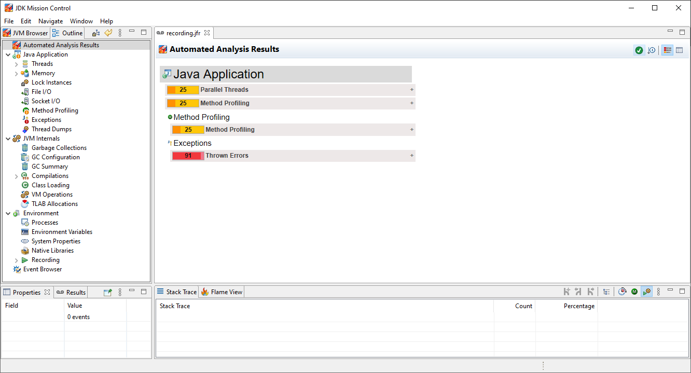
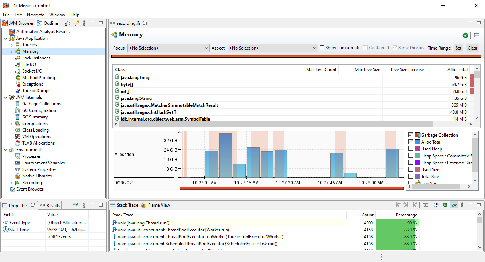
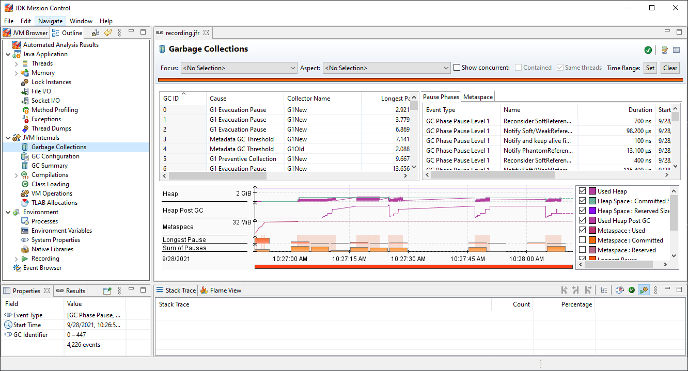
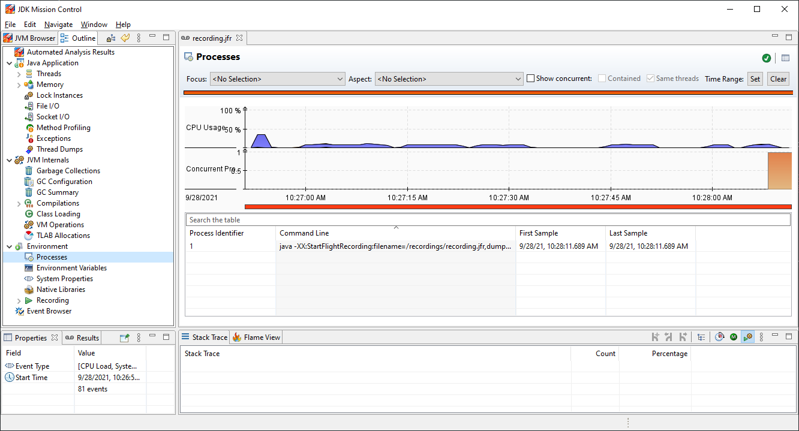
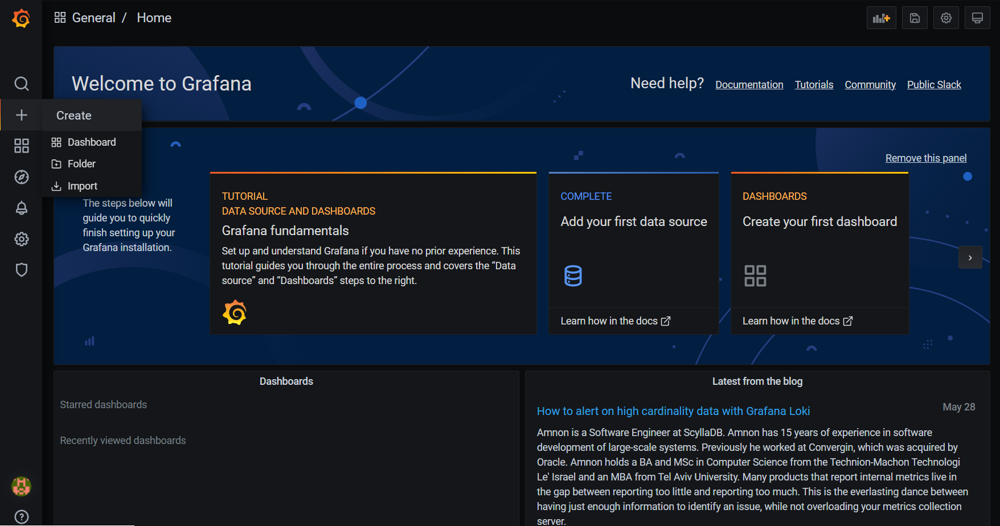
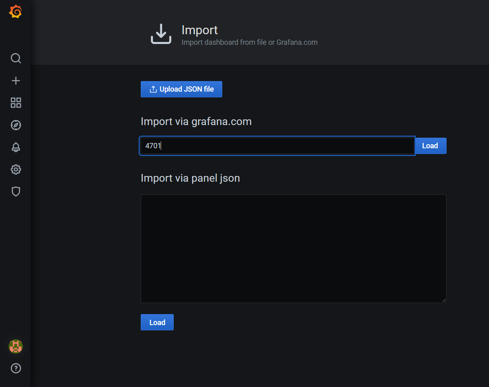
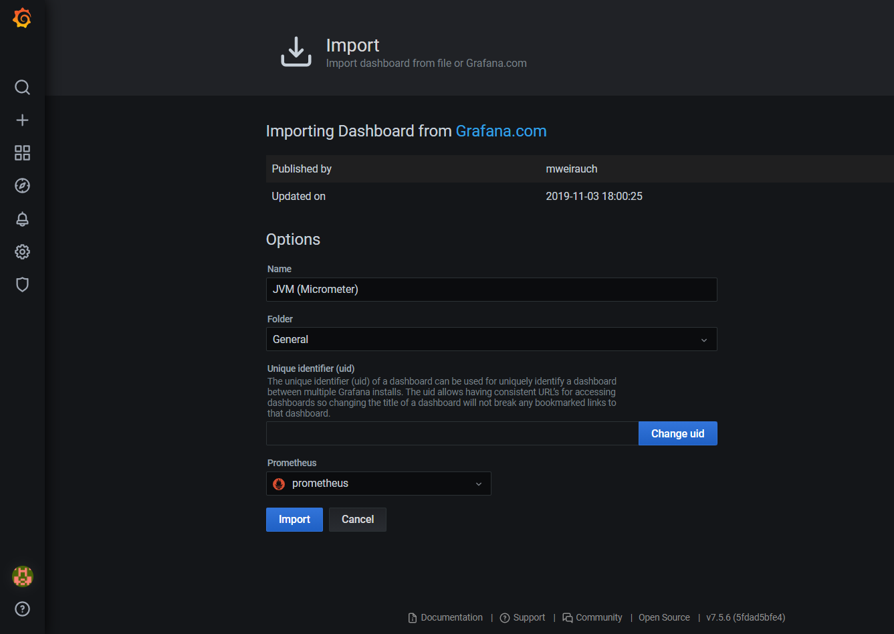
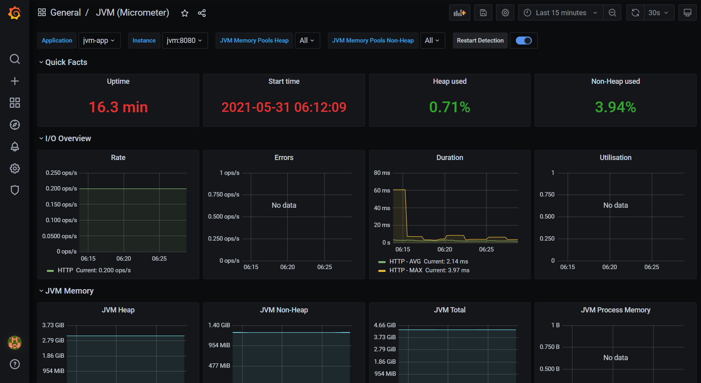
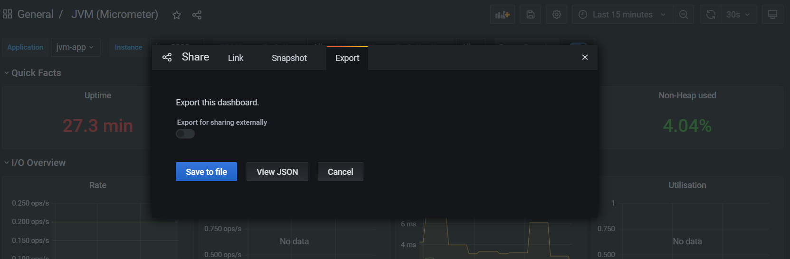


This article was originally published on [Medium](https://wkrzywiec.medium.com/how-to-set-up-monitoring-tools-for-java-application-322d14c191e4).



> Cover image by [Towfiqu barbhuiya](https://unsplash.com/@towfiqu999999) on [Unsplash](https://unsplash.com)

*In this blog post I'll show how to set up two monitoring tools that are widely used for Java applications - Java Flight Recorder with JDK Mission Control and Prometheus with Grafana.*

When your application reaches a state when it's production ready it's a good time to celebrate. Soon users will start using it, which is great, but it creates a new type of problem. How to monitor how an application behaves under the load of users traffic? How to validate if everything goes smoothly and users are not experiencing any kind of slowness or errors? The answer to these questions would be to use a performance monitoring tools. 

With this blog post I'll show how to set up two opensource monitoring tools available for JVM - *Java Flight Recorder* with *JDK Mission Control* and *Prometheus* with *Grafana*. It's a first article out of two. In this one I'll focus on installing both tools and in the second I'll explain how read the indicators that both of these tools are providing.

## Project preparation

The entire code base that will be mentioned thru the article is available on GitHub - [monitoring-sandbox](https://github.com/wkrzywiec/monitoring-sandbox). It contains a source code of a Java application and all configuration files for both monitoring tools. 

The only thing that is required is to have [Docker](https://www.docker.com) installed. Using simple Docker Compose command (`docker-compose up -d`) we can start all necessary pieces (monitored application with *JFR* enabled, *Prometheus* and *Grafana*) so you don't need to follow all my steps. They're just for explanation what's going on.

## Setting up Java Flight Recorder with JDK Mission Control

Let's now move to more practical part of the post and have a look on **JDK Flight Recorder (JFR)** and **JDK Mission Control (JMC)**.

As a name might suggest for a first one it has something in common with black box flight recorder used in airplanes. Similarly to the ones used in aircrafts their primary function is to record and save everything that is happening inside a plane, so in case of an accident specialists could rewind all the steps back to find out what was the cause to prevent from happening it again. In Java *JFR* plays similar role. It records events that occur inside JVM and application. It collects them and store e.g. in a file. Many of events are already built-in, which enables us to see what's happening inside our application, e.g. we can see how Garbage Collector is working, how Threads are used etc., but it's also possible to [define custom events](https://bell-sw.com/announcements/2021/01/29/JDK-Flight-Recorder-The-Programmatic-Way/) inside an application. It could be used for monitoring business processes and performance or whatever we would like.

As already mentioned an output from *JFR* will be a recording, usually a file. Now how to open it? It could be achieved by using `jfr` CLI which is bundled with JDK since version 11 (for open source version of Java distributions, for commercial ones it was from Java 7). It allows to list all events by the type and print them in the consol. But it's not convenient. Luckily there is a tool which was already mentioned - **JDK Mission Control (JMC)**.

*JMC* is a desktop tool that can read *JFR* recordings and visualize it in a very nice way. Similarly to *JFR* it was bundled with JDK, but now it's distributed separately and can be downloaded from [the official website](https://www.oracle.com/java/technologies/jdk-mission-control.html). 

Having this introduction let's play around with *JFR*. For demonstration I've prepared a small Java project that is available on GitHub - [monitoring-sandbox](https://github.com/wkrzywiec/monitoring-sandbox). For convenience we will be running an app using Docker. Therefore here is a **Dockerfile** located in a */app* folder:

```Dockerfile
FROM maven:3.8.2-openjdk-17-slim AS build
RUN mkdir -p /workspace
WORKDIR /workspace
COPY pom.xml /workspace
COPY src /workspace/src
RUN mvn -B -f pom.xml clean package -DskipTests

FROM openjdk:17-jdk
COPY --from=build /workspace/target/*.jar app.jar
RUN mkdir -p /recordings
EXPOSE 8080
ENTRYPOINT ["java","-jar","app.jar"]
```

It's a very simple configuration. The application is running on a recently released OpenJdk 17 from Oracle. This is very important information because depending on the distribution of JDK we can have different results as internals of each distribution might be a little different.

Another thing that is worth to mention is a line with `RUN mkdir -p /recordings`. With it we're creating a folder inside Docker container in which we will next store *JFR* recordings. 

We could run an app using `docker run` command, but let's have another approach and use Docker Compose, which will also be used in the next part when we'll be setting up Grafana. Here is the **docker-compose.yaml** from the project:

```yaml
version: '3.9'

services:

  jvm:
    build: ./app
    container_name: jvm-app
    volumes: 
      - ./recordings:/recordings
    ports:
      - 8080:8080
    entrypoint: ["java","-XX:StartFlightRecording:filename=/recordings/recording.jfr,dumponexit=true","-jar","app.jar"]
```

A service is called `jvm` and its Docker image is build using a *Dockerfile* from */app* directory. With `volumes` we're mapping a project's *recording* directory with a directory with the same name inside a Docker container. It's necessary to add it, because *JFR* recordings will be saved there and in order to use them in *JDK Mission Control* we need extract them first from a running container. Finally there is `ports` mapping provided.

Having all of that we can move on to the main course - starting an application along with *Java Flight Recorder*.

There are several ways to start recording. One of them is to enable it using the `-XX:StartFlightRecording` argument of the `java` command during application startup. This is why there is an `entrypoint` provided in the *docker-compose.yaml* file. Below there is a command that is used to bootstrap an application:

```bash
java -XX:StartFlightRecording:filename=/recordings/recording.jfr,dumponexit=true -jar app.jar
```
To tune *JFR* recording we can add some flags. In above example two of them were introduced:

* `filename` - specifies location and name of a recording, i.e. `/recordings/recording.jfr` inside of a container,
* `dumponexit` - if in an application crashes or just stop we can specify if a recording will be dumped, or in other words if *JFR* should save a recording after stopping a program. In our case a value is `true` which means it will be persisted.

More of available options can be found [here](https://docs.oracle.com/cd/E15289_01/JRCLR/optionxx.htm#JRCLR275) and [here](https://docs.oracle.com/cd/E15289_01/JRCLR/optionxx.htm#BABIECII).

Let's start an application and see what will happen. To do that just run following command:

```bash
docker-compose up -d jvm
```

Now inside `/recordings` folder there should be a *recording.jfr* file. If we want now to use *JDK Mission Control* to inspect recording file we would receive an error. The reason is that first we need to end recording, only then a file can be read. Therefore we need to stop a program:

```bash
docker-compose down
```

After that we are able to use the *recording.jfr* file in *JDK Mission Control*. 

But is it possible to get access to recording other way than "crashing" an application? Sure it is!

First of all we need to get inside the running container. We can achieve it by opening an interactive shell for a container with a name `jvm-app`:

```bash
> docker exec -it jvm-app sh

sh-4.4# 
```
As a result we're in the running container. If for example we run the `ls` command we gets an information what's inside a container (starting from now on all commands will be executed inside of the container and it's manifested by the `sh-4.4#`):

```bash
> docker exec -it jvm-app sh

sh-4.4# ls
app.jar  bin  boot  dev  etc  home  lib  lib64  media  mnt  opt  proc  recordings  root  run  sbin  srv  sys  tmp  usr  var

```

To control *JFR* we use a `jcmd` CLI which is bundled with JDK. To check what other tools are provided with JDK run the command:

```bash
sh-4.4# ls $JAVA_HOME/bin
jar        java   javadoc  jcmd      jdb        jdeps  jhsdb   jinfo  jmap  jpackage  jrunscript  jstack  jstatd   rmiregistry
jarsigner  javac  javap    jconsole  jdeprscan  jfr    jimage  jlink  jmod  jps       jshell      jstat   keytool  serialver
```

But for now let's focus on `jcmd`. By typing only the `jcmd` we will get a list of Java processes that are happening right now inside of the container:

```bash
sh-4.4# jcmd
1 app.jar
183 jdk.jcmd/sun.tools.jcmd.JCmd
```

Above we can see that there is an `app.jar` process with a `pid` (process id) which equals `1`. To check if there is an active recording for `app.jar` type following command:

```bash
sh-4.4# jcmd 1 JFR.check
1:
Recording 1: name=1 maxsize=250.0MB (running)
```

Recording is active, great! Now let's dump what has been collected so far into a separate file located in the **recordings** folder:

```bash
sh-4.4# jcmd 1 JFR.dump filename=/recordings/short-recording.jfr
1:
Dumped recording, 3.2 MB written to:

/recordings/short-recording.jfr
```

In above command first we specify a`pid`, which is `1` as we already checked, and then a `JFR.dump` command that tells to write a recording to a file located in specific directory (`filename=/recordings/short-recording.jfr`).

Let's now check a recording using `jfr` CLI which, as well as `jcmd`, is provided in JDK. 

```bash
sh-4.4# jfr summary /recordings/short-recording.jfr

 Version: 2.1
 Chunks: 1
 Start: 2021-09-26 17:26:22 (UTC)
 Duration: 1081 s

 Event Type                                   Count  Size (bytes)
==================================================================
 jdk.NativeMethodSample                       53054        635109
 jdk.JavaMonitorWait                          51660       1393022
 jdk.ThreadPark                                2489         96828
 jdk.GCPhaseParallel                           2195         53536
 jdk.CheckPoint                                1184        833801
 jdk.CPULoad                                   1079         21547
 jdk.JavaThreadStatistics                      1079         12915
 jdk.ClassLoadingStatistics                    1079         11836
 jdk.CompilerStatistics                        1079         31258
 jdk.ExceptionStatistics                       1079         15073
 jdk.ModuleExport                               946         10256
 jdk.ObjectAllocationSample                     780         11772
 jdk.BooleanFlag                                533         15762
 jdk.ActiveSetting                              355         10945
 jdk.ThreadCPULoad                              314          5311
```

We can print all events that are stored in recording, but be aware that if your recording was very long you'll get a huge amount of events:

```bash
sh-4.4# jfr print /recordings/short-recording.jfr

jdk.ActiveSetting {
  startTime = 17:26:22.702
  id = 1185
  name = "threshold"
  value = "0 ns"
  eventThread = "main" (javaThreadId = 1)
}

jdk.ActiveSetting {
  startTime = 17:26:22.702
  duration = 0.732 ms
  id = 132
  name = "period"
  value = "beginChunk"
  eventThread = "main" (javaThreadId = 1)
}

jdk.ActiveSetting {
  startTime = 17:26:22.702
  duration = 0.732 ms
  id = 132
  name = "enabled"
  value = "true"
  eventThread = "main" (javaThreadId = 1)
}
```

It might be quite overwhelming, therefore we can filter them out using `--categories` option:

```bash
sh-4.4# jfr print --categories 'GC' /recordings/short-recording.jfr

jdk.GCPhasePause {
  startTime = 17:32:37.583
  duration = 3.55 ms
  gcId = 10
  name = "GC Pause"
  eventThread = "VM Thread" (osThreadId = 14)
}

jdk.GarbageCollection {
  startTime = 17:32:37.583
  duration = 3.55 ms
  gcId = 10
  name = "G1New"
  cause = "Metadata GC Threshold"
  sumOfPauses = 3.55 ms
  longestPause = 3.55 ms
}

jdk.YoungGarbageCollection {
  startTime = 17:32:37.583
  duration = 3.55 ms
  gcId = 10
  tenuringThreshold = 15
}

jdk.G1GarbageCollection {
  startTime = 17:32:37.583
  duration = 3.55 ms
  gcId = 10
  type = "Concurrent Start"
}
```

Even if we can filter those events and as they are quite easy to read still they're pretty hard to analyze. We need to have a bigger picture. So this is why we need to use a different tool - *JDK Mission Control*, which will make for us some visualizations.

First exit from a running container, so just type `exit`. Now let's open *JMC* assuming that we have already installed it from [the official website](https://www.oracle.com/java/technologies/jdk-mission-control.html). The procedure will depends on the OS system and it's described in [instructions](https://www.oracle.com/java/technologies/javase/jmc8-install.html).

Once it has started we need to load recording file. Therefore select **File** > **Open file...** and find a recording file, which can be either a short recording or the entire one that's created when application shuts down (remember both of them are located in *recordings* folder). After that you should get similar screen:



On the left there are couple categories into which we can dive in. After clicking on one of them we can see more details, e.g. by clicking on **Memory** we can get an insight of application memory allocated and how long Garbage collection took:



We can see even more details about Garbage Collection by clicking on the **Garbage Collection** item:



Another good example of information that we can get from *JMC* is total CPU usage (**Processes** item):



But there a way more information that we can read from it, which I would encourage you to explore on your own (or check my next article on that topic ;)). For now this was everything that I would like to show and let's move on to the next section.

## Setting up JVM dashboards in Grafana

Previously discussed *JFR* is an amazing tool to get very in depth information about working JVM. But the tricky part is how to set it up so the information will be collected and stored in continuous way, without manually dumping data every time we would like to make an analysis. The solution to such inconvenience would be to make a use of something that's called [JFR Event Streaming](https://blogs.oracle.com/javamagazine/post/java-flight-recorder-and-jfr-event-streaming-in-java-14), but probably it was introduced in Java 14 it's still in very early stages and not many tools were built on top of that. Possible reason is that vast majority of an industry still sticks with the latest LTS version of Java, which is 11. With a recent release of Java 17, which is an LTS version, it will change soon as more and more companies will be migrating to it.

Until then there are other tools which might come with help. There are dozens of them some open-sourced, some commercial. Today I'll show you how to use a very popular ones - **Prometheus** and **Grafana**.

Here are all the pieces of a project that will be built:

*  [Micrometer](https://micrometer.io) - allows to expose metrics from JVM application, 
*  [Promethesu](https://prometheus.io) - scrapes and stores metrics from applications,
*  [Grafana](https://grafana.com) - visualize stored metrics.

Small remark, before we start. If you don't want to setup everything on your own, you can jump straight forward to the next part. All code is available in my *GitHub* repository - https://github.com/wkrzywiec/monitoring-sandbox.  

First step is to expose metrics by the application itself. They will be than periodically collected and stored by *Prometheus*. Exposing metrics is very easy in *Spring Boot* application. The only thing that is needed is to add `micrometer-registry-prometheus` dependency (e.g. to Maven's pom.xml file):

```xml
<dependencies>
		<dependency>
			<groupId>io.micrometer</groupId>
			<artifactId>micrometer-registry-prometheus</artifactId>
			<scope>runtime</scope>
		</dependency>
</dependencies>
```

Another thing that should be added, but it's not a must, is to include application name into exposed metrics which can be done by adding `management.metrics.tags.application` property to *application.properties* or *application.yaml* file:

```yaml
spring:
  application:
    name: jvm-app

management:
  metrics:
    tags:
      application: ${spring.application.name}
```

After running an application and entering its **/actuator/prometheus** endpoint something like this should appear:

```
# HELP jvm_gc_memory_allocated_bytes_total Incremented for an increase in the size of the (young) heap memory pool after one GC to before the next
# TYPE jvm_gc_memory_allocated_bytes_total counter
jvm_gc_memory_allocated_bytes_total{application="jvm-app",} 6.291456E7
# HELP jvm_memory_max_bytes The maximum amount of memory in bytes that can be used for memory management
# TYPE jvm_memory_max_bytes gauge
jvm_memory_max_bytes{application="jvm-app",area="nonheap",id="CodeHeap 'non-nmethods'",} 5840896.0
jvm_memory_max_bytes{application="jvm-app",area="nonheap",id="Metaspace",} -1.0
jvm_memory_max_bytes{application="jvm-app",area="heap",id="G1 Old Gen",} 3.31350016E9
jvm_memory_max_bytes{application="jvm-app",area="nonheap",id="CodeHeap 'profiled nmethods'",} 1.22908672E8
jvm_memory_max_bytes{application="jvm-app",area="heap",id="G1 Survivor Space",} -1.0
jvm_memory_max_bytes{application="jvm-app",area="nonheap",id="Compressed Class Space",} 1.073741824E9
jvm_memory_max_bytes{application="jvm-app",area="heap",id="G1 Eden Space",} -1.0
jvm_memory_max_bytes{application="jvm-app",area="nonheap",id="CodeHeap 'non-profiled nmethods'",} 1.22908672E8
```

Great! Metrics are now exposed by the application, so we can move on to building monitoring infrastructure with Docker.

Because both *Prometheus* and *Grafana* are standalone application we need first to run them. For convenience I'm using Docker Compose, therefore in the **docker-compose.yaml** file I've defined 3 services:

```yaml
version: '3.9'

services:

  jvm:
    build: ./app
    container_name: jvm-app
    ports:
      - 8080:8080

  prometheus:
    image: prom/prometheus:v2.30.0
    container_name: prometheus
    ports:
      - 2000:9090
    volumes:
      - prometheus:/prometheus
      - ./infra/prometheus/prometheus.yml:/etc/prometheus/prometheus.yml

  grafana:
    image: grafana/grafana:8.1.4
    container_name: grafana
    ports:
      - 3000:3000
    environment:
      - PROMETHEUS_URL=http://prometheus:9090
      - DS_PROMETHEUS=prometheus
    volumes:
      - ./infra/grafana/config.ini:/etc/grafana/config.ini
      - ./infra/grafana/provisioning:/etc/grafana/provisioning
      - ./infra/grafana/dashboards:/var/lib/grafana/dashboards
    depends_on:
      - prometheus

volumes:
  prometheus:
```

First service, `jvm`, is a Spring Boot application which will be monitored and it's the same appliacation that was investigated before.

Second service, `prometheus`, will be used to collect and store metrics. It's based on an official Docker image `prom/prometheus`, it's exposing `9090` port and map it to a local `2000` port. Because *Prometheus* persists metrics data over time, we need to create a *volume* so it will be saved between container startups on local disk.

But that's not enough. We need to tell *Prometheus* from where and how to collect data. Luckily, there is an easy way. We can provide a `prometheus.yml` configuration file and insert it into specific folder in a running container. 

```yaml
global:
  scrape_interval: 5s

scrape_configs:
  - job_name: 'jvm_micrometer'
    metrics_path: '/actuator/prometheus'
    scrape_interval: 5s
    static_configs:
      - targets: ['jvm:8080']
```

For one application only one scrape job is defined. It contains information about the address of scraped application and how often *Prometheus* needs to call it.

The last service, `grafana`, is used to visualize downloaded data. Like *Prometheus* it's based on an official Docker image and is exposing `3000` port. Beside that there are couple things added more for configuration purposes. With environment variables we're providing address to *Prometheus* service, data source of metrics. Next, in `volumes` section we're mapping couple of local folders into the *Grafana*'s container.  

First file is *config.ini*, with simple configs (more about it can be found in [the official docs](https://grafana.com/docs/grafana/latest/administration/configuration/)):


```ini
[paths]
provisioning = /etc/grafana/provisioning

[server]
enable_gzip = true
```

Next is a *provisioning* folder with two subfolders. First one, *datasources*, contains *datasources.yml* file, which helps to add *Prometheus* datasource:

```yaml
apiVersion: 1

datasources:
  - name: prometheus
    type: prometheus
    access: proxy
    url: ${PROMETHEUS_URL}
    is_default: true
    version: 1
    editable: true
```

In the second folder, *dashboards*, there is also one YAML file *dashboards.yml*, in which we configure from where dashboards definitions will be loaded:

```yaml
apiVersion: 1

providers:
  - name: 'default'
    org_id: 1
    folder: ''
    type: 'file'
    options:
      folder: '/var/lib/grafana/dashboards'
```

On the same level as *provisioning* folder create another one called *dashboards*. For now it will be empty, but soon we will add here a JVM dashboard definition so it will be persisted. 

All configurations files I've included in a common *infra* folder, which structure is as following (or you can just check it in GitHub repository):

```bash
.
├───grafana
│   ├───dashboards
│   └───provisioning
│       ├───dashboards
│       └───datasources
└───prometheus
```

Having all of that, we can now run the entire stack using *Docker Compose*.

```bash
> docker compose up -d

[+] Building 33.6s (14/14) FINISHED
...                                                                                         0.0s 

Use 'docker scan' to run Snyk tests against images to find vulnerabilities and learn how to fix them
[+] Running 4/4
 - Network "monitoring-sandbox_default"  Created                                                                                                     0.0s 
 - Container prometheus                  Started                                                                                                     1.2s
 - Container jvm-app                     Started                                                                                                     1.2s 
 - Container grafana                     Started                                                                                                     3.3s
```

Great, all three containers are now running. Let's go now to Grafana's UI, therefore in a web browser enter `http://localhost:3000` address so the login page will show up. Then provide a username and password which is **admin** in both cases. After successful login a main page should be visible (you will be asked to change the password, but you can go ahead and skip it).



In a meantime *Prometheus* is already collecting metrics from the *jvm-app*, but we're not yet able to visualize it in *Grafana*. To fix it we need to have a dashboard. We could create our own one, but there is already a great one available to be imported, which was prepared by the community.

To add it, from left panel select **Create**  (plus sign) and than **Import**. A new page will appear where we need to provide an ID of dashboard which we're gonna import. I want to import a very popular one - [JVM (Micrometer)](https://grafana.com/grafana/dashboards/4701) with an id = 4701. 



After providing it in an input field and clicking **Load** button a summary page will be visible. We can decide what will be the name of imported dashboard, its location, identifier and the most important, don't forget to select it, a data source from where data will be pulled for visualizations. In our case it should be available only one source - **prometheus**.



After clicking **Import** button a dashboard will be created. 



The last thing that we need to do here is to export newly created dashboard to JSON file and place it to the empty *dashboards* folder, mentioned couple lines before. To do that click on the share icon (left, near the star icon) so the pop up window will appear. Next, go to **Export** tab and click **Save to file** so a file will be downloaded.



Next copy-paste it to the empty *dashboards* folder, stop containers (using `docker compose down` command) and restart them. After that a dashboard will be persisted.

That would be it! The dashboard is set, you can check it, see what indicators it's presenting, like memory usage, CPU usage or others. Definitely there are here way less information than we could read from the *JDK Mission Control*, but they're one of the most important one.

## Conclusion

With this article I've showed how to set up two popular monitoring tools that can be used in your production system. They can offer lots of in-depth information what's happening with your application and JVM. It can be especially helpful when something mysterious is starting to happen. Information about memory allocation, Garbage collection, CPU usage etc. can than help you find a root cause. But how to make sense from all these metrics? This is a story for another article, which will be published soon. 

Until then, see you soon!

---

## References

* [Continuous Monitoring with JDK Flight Recorder (JFR)](https://www.infoq.com/presentations/monitoring-jdk-jfr/)

* [JDK Flight Recorder – a gem hidden in OpenJDK](https://bell-sw.com/announcements/2020/06/24/Java-Flight-Recorder-a-gem-hidden-in-OpenJDK/)

* [How to run Java Flight Recorder inside Docker](https://github.com/petrbouda/docker-java-flight-recorder)