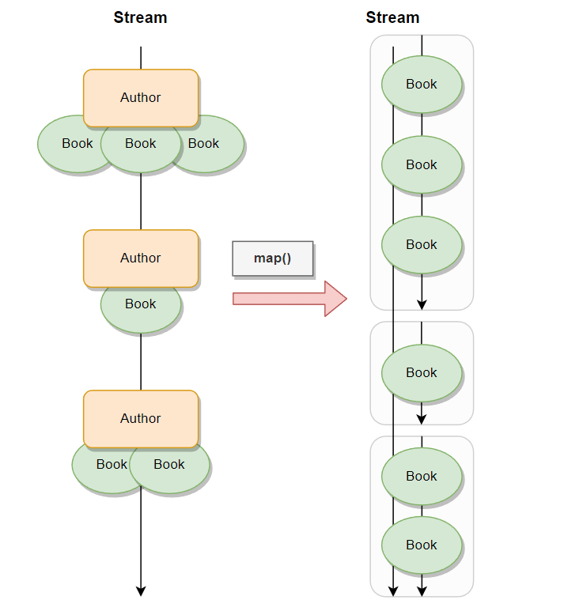
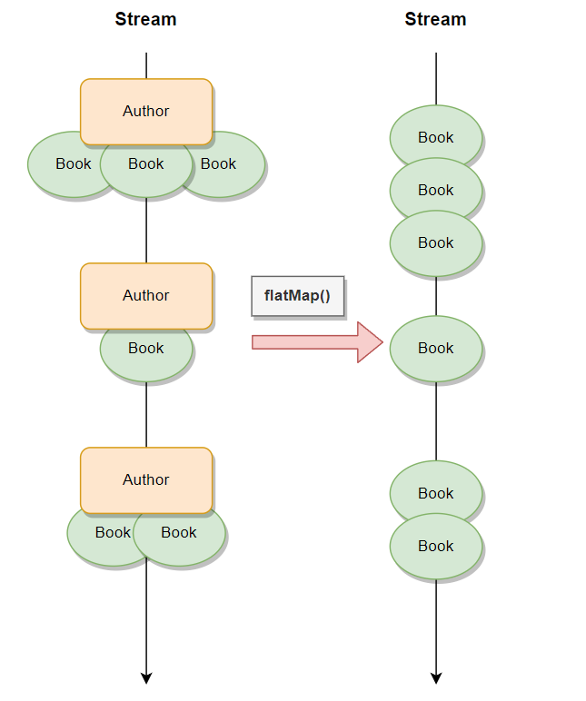


This article is part of the "Java Series", which covers useful Java functions from standard and popular libraries. More posts on that can be found [here](https://wkrzywiec.is-a.dev/tags/java-series/).



> Cover image by [Jason Leung](https://unsplash.com/@ninjason) on [Unsplash](https://unsplash.com)

*Java 8 was a great step forward toward modern programing language. One of the key features added in this release was Java streams. It provides lots of convenient operations for data processing. One of them is a `flatMap()` used very widely to unwrap and merge multiple collections into one.*

## Problem statement

Many times when we work with Java code we end up with a following Plain Old Java Object (POJO):

```java
public record Parent(List<Child> childs) {}
```
They can represent database entities or data transfer objects (DTOs). In general, they're used to structure data. Let's say that we got the list of `Parent` objects, but we want to operate on a list of all `Child` that are part of the `Parent`. How we could extract `Child` objects from all `Parent` objects and combine them into a single list? The naive approach would be to use a loop:

```java
List<Child> children = new ArrayList<>();

for (Parent parent: parents) {
    List<Child> bs = parent.childs();
    children.addAll(bs);
}
```

But it doesn't look nice and clean. Instead, we could use the Java stream:

```java
List<Child> children = new ArrayList<>();

parents.stream()
    .map(parent -> parent.Childs())
    .forEach(list -> children.addAll(list));
```

But it has a drawback too. Let's say that once we get a list of all `Child` objects we would like to modify them, aggregate, or do calculations on them. Ideally it would be good to perform those action in the same stream. Unfortunately, this is not the case, the `forEach()` method in the above example is ending the stream processing, which makes it impossible to process `Child` records in the same stream.

## Solution

Luckily Java creators foresaw this problem and introduced a `flatMap()` function that is part of a `java.util.stream.Stream` class.

The idea is pretty straightforward. It does two things with every element of a stream:

* maps - transforms one element from a stream into a new stream, so as a result we would get a stream of streams,
* flattens - results of a previous operation are merged into one stream.

To visualize it consider the following situation:



Let's say that we have a stream of `Author` objects, that has a method called `books()` which returns a list of `Book` objects. And now let's say that we would like to have access to all books written by all authors to make further operations on them. If we would use the `map()` function within which we would call the `books()` method we would get a stream of lists of `Book` objects. This is not what we want to have. 

What we would like to have is a stream of `Book` objects, not a stream of their lists. How we can overcome it? Using `flatmap()` instead:




As previously we need to invoke the `books()` method of the `Author` class to get a list of `Books`. The only difference is that input needs to be converted into multiple values represented by a Java stream. This is the requirement of the `flatMap()` method. Whatever operations we do within it needs to return a `Stream<T>` object.

The same situation can be reflected with a code:

```java
List<List<Book>> listsOfListOfBooks = authors.stream()
    .map(Author::books)
    .toList();

List<Book> listOfBooks = authors.stream()
    .flatMap(author -> author.books().stream())
    .toList();
```

To translate a list of `Book` objects the standard `Collection.stream()` method was used.


## When to use it?

### Unwrap & operate

The most common case when the `flatMap()` method might be handy is when one of the stream operations produces a collection of objects and we would like to make further actions on each one of them. 

To visualize it let's go back to the previous example with `Book` and `Author` records. Here are their definitions:


```java
public record Book(String title) {}
public record Author(String name, List<Book> books) {}
```

Now let's say that we want to create a method that takes a list of `Author` objects as input and produces the list of all book titles that these authors wrote:


```java
List<String> getAllBookTitles(List<Author> authors) {
return authors.stream()
    .flatMap(author -> author.books().stream())
    .map(Book::title)
    .toList();
}
```

After converting a list of `Author` objects into a stream the `flatMap()` operation is used first. The `books()` method is invoked to get their list and then it's changed into the stream. The `flatMap()` is then merging all resulting streams into one so next the `title()` can be called to get a String representation of a book title. Finally, the results of each element in a stream are collected into the list.

The above method can be written even better. We can split invoking `books()` and `stream()` methods into two operations - `map()` and `flatMap()` respectively - to get a nice looking code: 

```java
List<String> getAllBookTitles(List<Author> authors) {
return authors.stream()
    .map(Author::books)
    .flatMap(List::stream)
    .map(Book::title)
    .toList();
}
```

### Merge lists

Another case when `flatMap()` can be very useful is when we would like to combine two or more lists (or any other `java.util.Collection`).

```java
List<String> mergeLists(List<String> left, List<String> right) {
return Stream.of(left, right)
    .flatMap(List::stream)
    .toList();
}
```

A big plus for this approach is that after `flatMap()` we don't need to close the stream immediately. Instead, we can apply other operations on every object, like filtering, mapping, aggregating, etc. Which is cleaner and more efficient.

### Get value from nested Optional

Apart from Java streams `flatMap()` method can be invoked on an `Optional` object. It's used to unwrap an `Optional` that is nested inside another `Optional`. 

Let's say that we've got the following record:

```java
public record Address(String street, String buildingNo, Optional<String> apartmentNo) {}
```

Now suppose we would have an `Optional<Address>` and would like to extract a value of an `apartmentNo`. The code without `flatMap()` would look like this:

```java
String extractApartmentNo(Optional<Address> address) {
    if (address.isEmpty()) {
        return "";
    }

    return address.get().apartmentNo().orElse("");
}
```

The first step is to unwrap the value from the `Optional`, which might be empty. Only after checking it, we can proceed with unwrapping (and handling empty values) an apartment address. 

This approach is ok, but can be done better with `flatMap()`:

```java
String extractApartmentNo(Optional<Address> address) {
return address
        .flatMap(Address::apartmentNo)
        .orElse("");
}
```

This approach a way nicer than the previous one. Both Optionals - parent and child - are validated whether they hold a `null` value in a single expression. 

## Summary

Introducing streams into Java made Data processing easier. It brings us a lot of handy operations. `flatMap()` is one of them which gives us the possibility to merge multiple streams into one or flatten nested streams into one. It's a very common pattern and is used many times in real projects.  

## References

* [Part 2: Processing Data with Java SE 8 Streams | Oracle.com](https://www.oracle.com/java/technologies/architect-streams-pt2.html)
* [Interface Stream<T> | Docs Oracle.com](https://docs.oracle.com/javase/8/docs/api/java/util/stream/Stream.html#flatMap-java.util.function.Function-)
* [Tired of Null Pointer Exceptions? Consider Using Java SE 8's "Optional"! | Oracle.com](https://www.oracle.com/technical-resources/articles/java/java8-optional.html)
