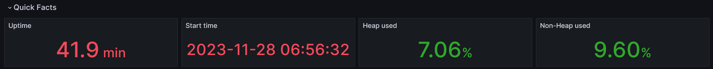
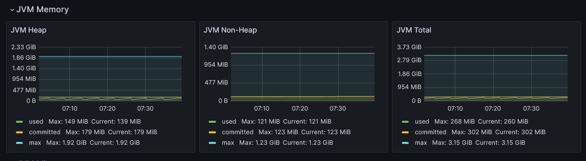
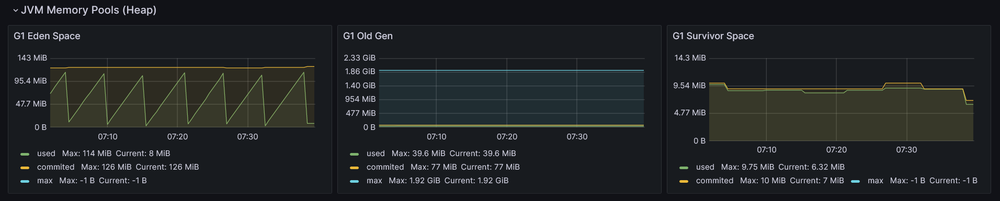
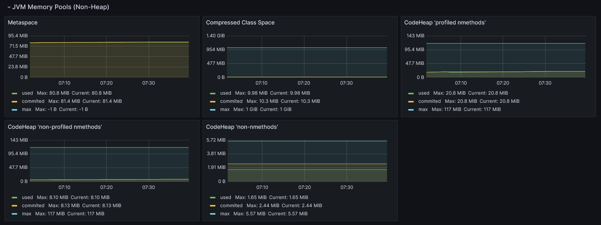
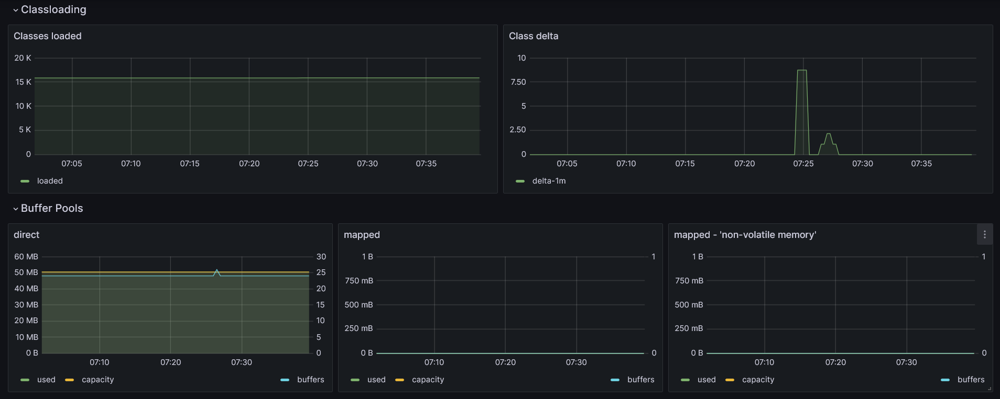
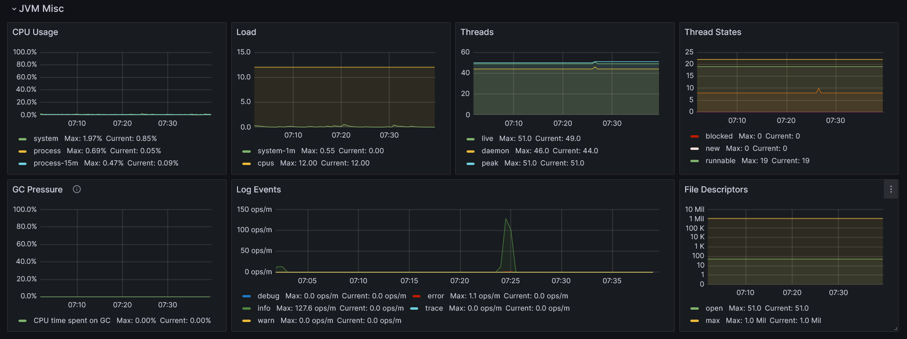
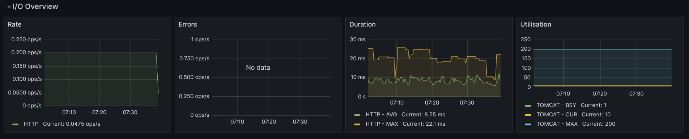

sprawdzić, co pogrubić, co wykursować, co wielką a co małą literą
ustalic czym jest dla mnie GC, collector czy collection
przejrzeć tagi
wyboldować nazwy wykresów


> Photo generated with [Leonardo Ai](https://leonardo.ai/)

*Are you a Java developer who knows the ins and outs of programming in Java but finds the world of JVM internals a bit mystifying? You're not alone. Understanding what goes on under the hood of the Java Virtual Machine (JVM) can seem like a daunting task. In this blog post, I'll demystify basic JVM internals concepts using insights from a popular Grafana dashboard. Buckle up, we're going on an adventure into the JVM world!*

## Not enough memory

Learning a programming language can be a challenging journey. First, you need to grasp the basic syntax to accomplish standard tasks. The next step involves learning one or two popular frameworks within a given ecosystem to enhance your visibility in the job market. However, once you secure that dream job, you quickly realize that having a solid foundation in a programming language and popular frameworks is not sufficient. Elements like best practices, design patterns, and system design play crucial roles in becoming a successful expert in software development.

Finally, a day arrives when you have mastered all this knowledge (or at least you think you have), and you receive a call from the operations team stating that your application is experiencing overwhelming success but struggles to handle the large influx of user requests. None of the previous steps prepared you for the skyrocketing CPU usage or memory issues. Panic sets in as you desperately try to recall why these components are essential and how they relate to your state-of-the-art application.

## Look into inside

Does it sound familiar?

How could you prevent this from happening? The first step is to come to the realization that you don't know everything about your piece of software. Yes, you have coded it, but do you know how it behaves in the wild production environment? If you received a similar call, you probably don't know. Therefore, the next step for you would be to initiate app monitoring to observe trends and receive alerts when key metrics approach dangerous thresholds. Additionally, understanding how the app responds under various types of pressure is crucial.

Numerous tools can be employed for this purpose. Some are built into the JDK, such as *Java Flight Recorder* with *Java Mission Control*, while others can be downloaded, like *JProfiler*, and some are cloud platforms, such as *Datadog*. It's easy to feel overwhelmed initially, as each tool provides different types of information, often at a very low level.

So, where do you begin with monitoring app performance? Which tool should you choose first?

## Grafana dashboard

I would recommend starting with Prometheus and Grafana. Both tools are open source and non-invasive, meaning there's no need to add any special tool/agent that may affect overall performance. They only require adding metrics libraries to a project. The setup is relatively straightforward, as I've outlined in a previous article - [How to set up monitoring tools for JVM](https://wkrzywiec.is-a.dev/posts/048_jvm-monitoring/#setting-up-jvm-dashboards-in-grafana).

The mentioned post also covers how to import one of the most popular JVM dashboards - [JVM (Micrometer)](https://grafana.com/grafana/dashboards/4701-jvm-micrometer/) - which will be the subject of this post. It will walk you through key metrics and explain when and why they're important.

The dashboard consists of sections that will be described in the following parts, which I've grouped and changed the order a little bit.

## JVM Memory



```
>> here read and check once again
```

If you ever wonder what's the first thing that you must keep eye on when monitoring Java application in most of the case it would be the memory usage. This is a vital information about the health of an app, since JVM needs it to run it.

Therefore it is not a suprise thet this is a first information that is provided by the dashboard - the percentage of how much heap and non-heap memory is fillied up (along with data about how long the app is running).

In most applications, these two metrics are the ones we should keep an eye on. They have a significant impact on its performance and can quickly explain why the app is running slow or even crashing.

Why these two metrics are that important? First of all we need to know that Java is object-oriented language. It means that every program is a set of objects which interact with each other. They have methods that are invoked by other objects and they also hold data. And in the real applications number of objects may be very large. The latter indicator is accountable for measuring memory use of non-object related things, which in some cases are also worth to monitor.



Moving on, let's read the charts above, which are showing how memory usage has changed in time. It shows the actual memory usage (`used`) in a given moment, the maximum available (`max`) and the amount memory guaranteed to be available for JVM (`committed`).

So what we can read from the chart for a Heap memory? Certainly the `used` memory can't reachout to the `max` value. The dengarous situation would be when increasing number of memory in the Heap area suggests that many objects are created and their are never destroyed (collected by the Garbage Collection, which will be mention later). If this happens an app would start to act slower and eventually it will crash and throws the `java.lang.OutOfMemoryError`.

Besides Heap data, JVM has a second data area, called Non-Heap (or Off-Heap or Native Memory). It stores various data which can be divded into following spaces:

* Metaspace (aka Method Area) - it holds class-related information about classes code, their fields and methods after being loaded by classloader (more about it in the article). It also contains information about constants (in Constant Pool).
* Code Cache - is an area where optimized native code produced by Just-In-Time compiler is stored.
* Program Counters - is pointing the address of current executed instruction (each thread it's own Program Counter), 
* Stacks - the LIFO stack of frames for each executed method, it contains primitives variables and references to the objects on the heap.

Usually it is the heap that may be too small, but we need to understand that memory problems with non-heap data could also crash an pp. Too much classes loaded into Metaspace may cause `java.lang.OutOfMemoryError` and too much frames in the Stack may end up with `java.lang.StackOverflowError` thrown.

### JVM Memory Pools (Heap)



Let's now drill down into the Heap usage. But first we need to understand how Heap is structured, because it is not a monloith. Heap divided into spaces depending on the type of Garbage Collector that is used. Above we can see 3 charts of *Eden Space*, *Survivor Space* and *Old Gen* that are used by the **G1** Garbage Collector.

But why Heap is splited into spaces? It comes from something called *weak generational hypothesis*. It presumes that a life-span of objects varies. Most of them are very short lived. They are used only once and then the memory they occupy can be freed. Others, usually the smaller fraction, are the ones that are constantly used which and can't be destroyed. Due to this fact Garbage Collector (GC) is splitting heap into generations (spaces) where short-lived objects resides in the young generation (*Eden Space* and *Survivor Space*) and long-lived objects in old generation (*Old Gen*).

The rationale is simple. To avoid doing one, long garbage collection on the entire heap GC is performing it only on subset of it at the time. Also the frequency is different in each generation - the *Eden Space* is more often cleaned than the *Old Gen*, beacuse objects located there are needed only for a short period.

The above screenshot confirms that. We can see that the plot for `used` memory in *Eden Space* is formed in the characteristic jigsaw. It quickly fills up with new objects (which is expresed as rising plot on a chart) and once it reaches a certain threshold it is emptied (which causes the plot to go down).

On the contrarory, the *Survivor Space* and *Old Gen* are much more stable. There are some changes in them, but they are very subtle.

These three charts gives us vital information about content of the heap. We can read how often new objects are created and removed. If the cleanup for them is done very often and the old objects are kept on relatively same level it is tempting to increase the ratio of young to old generation size. The larger the young generation is the cleanup will be done less often. But on the other hand, it will be bigger, so the cleanup may take a little bit longer. The same goes for old generations - the smaller it gets the most frequent it is cleaned. So we must keep balance of it.

To adjust it use `-XX:NewRatio=N` (which is a ration of a young and old generations, e.g. `N=2` means that young generation is twice as big as an old one) or `-XX:NewSize=N` (which is an initial size of the young generation - all remaining will be assigned to the old genration).

#### What if the app is consuming too much memory?

Heap is one of the most important memory area for JVM and usually it's the place that demands lots of memory. If it happens that it is close to maximum threshold the easiest way would be to change the maximu size of it. Bigger heap means all needed objects will fit it. This can be achieved by providing the `-Xmx` followed by the size number of memory that will be reserver for a heap. E.g. `-Xmx1024m` will alocated 1024 MB for heap.

Changing the maximum size of a heap may be the remedy, but it many cases it's rather covering the symptoms than treating the real cause of a problem. Increasing number of objects may suggest that there is a memory leak somewhere in an application. This place in the code needs to be found and fixed.

Other options may be that too much data has been tried to be loaded into the memory. It can be either because of inefficient data structure or simple large volume of data, which was not predicted. In the first case the solution would be to optimize how we store data in JVM and for the latter it would be to increase the heap size or think about how to chunk the large amount of data into smaller pieces.

But how to spot if we have inefficient data structure? There are couple of reasons, but one of them is using objects with lots of fields (e.g. entities) from which only a small subset is used. Limiting the number of fields per task can be beneficial here. Also we need to remember that even if fields won't be initialized they also consume memory!

Also try to avoid using objects instead of primitives. There are lots examples when objects have fields like `Boolean` instead of plain `boolean`. It doesn't look that is too much of a change but for memory it usage it has a lot. Also treating `String` objects as holders for numbers of booleans variables consumes more memory than it is needed.

Another optimization that can be done to reduce memory footprint is to avoid initilizing String variables that has same values over and over.

And finally in some situations avoiding creating immutable objects may be very beneficial. This is especially true when new objects needs to be created from as a copy of another. Of course, I'm not discouraging from using immutable objects at all. In lots of situations they are life-savers. But if you create an object that is used only within a small method once or twice, it is sometimes more beneficiar to make it mutable.

These solutions are only tip of an iceberg how to address memory increasing problem. There are lots of materials that can guide you how to make it even better.

### Garbage Collection


The previous already mentioned about the garbage collector (GC) which we will have a closer look now. It is a key part of JVM, because in contrast too languages like C++ we, developers, don't need to worry about freeing memory once an object is no longer needed. The role of the GC is to decide which objects should be destroyed and which should be preserved.

All new objects are allocated first in the *Eden Space* but during the next garbage collection they are promoted to the one of the *Survivor Space* if they are still in use. Then during next garbage collections they're again checked if they're shoud be promoted to next subspace of the *Survivor Space* or even to the *Old Gen*.

The first plot in the above screenshot tells us how often the certain type of garbage collection occurs in a second. We can see there that only one minor GC (only a young generation of the heap is cleaned) is happening, but it is also showing major GC (the objects from old generation are cleaned then). So by reading this chart we can figure out how often each GC is happening and if it's too often it may give a hint that one of the spaces is filling too quickly with a large number of objects.

But even if a number of GC is relatively high it's not always a bad situation. If each one if them takes a very short time and do not affect the overall application performance we have nothing to worry about. Hence, to make sure that it is really the case we can look into the second plot which facilities us with information about the average time of each garbage collection.

The last plot is showing us how much memory was used to allocate objects in the young generation and how much of it was promoted to older generations. This is really helpful information when we want to learn about memory load that GC needs to deal with in each cycle.

After finding an issue in one of these graphs we can do two things - tune JVM memory limits and GC behaviour or select different GC. Depending on Java version and distribution (e.g. Oracle's, Amazon Corretto, Azul Zulu or Eclipse Adoptium) the list of available GC is different, but most of them can be categorized into:

* generational vs. non-generational - some GCs may not split a heap into generations and treat it as a one memory space, however they usually are splitting it into them (but it varies how they're doing it from distribution to distribution),
* stop-the-world vs. concurrent - GCs from the first group are pausing the entire application to do the cleanup, the latter are doing it when application is running (or to be precise - they do stop the application but for a very short time),
* single- vs. multi-thread - first group is performing using only one thread, the latter is utilizing at least two,
* incremental vs. monolithic - specific for stop-the-world GCs and denotes wheather garbage collection is done only for a subset of the generation or until it's done.

Here is a list of available GCs in the Amazon Correto distribution of OpenJDK (one of the most popular distributions accordingly to the [2023 State of the
Java Ecosystem](https://newrelic.com/sites/default/files/2023-04/new-relic-2023-state-of-the-java-ecosystem-2023-04-20.pdf) for 21 version of Java:

| Garbage Collector | Generational | Concurrent          | Multi-thread | Monolithic | Purpose |
| ----------------- | ------------ | ------------------- | ------------ | ---------- | ------- |
| **G1**            | ✅ Yes       | ✅ Yes (partially) | ✅ Yes       | ✅ Yes     | Common purpose GC, default |
| **Serial**        | ✅ Yes       | ❌No               | ❌No         | ✅ Yes     | Good for apps with small heap |
| **Parallel**      | ✅ Yes       | ❌No               | ✅ Yes       | ✅ Yes     | Good for batch processing apps, where overall throughput can be traded for longer pauses |
| **Shenandoah**    | ❌No         | ✅ Yes             | ✅ Yes       | ❌No       | Reduces GC pauses |
| **Generational ZGC** | ✅ Yes    | ✅ Yes             | ✅ Yes       | ❌No       | For apps that needs short response time and large heap |  

The above table is listing all available GCs along with theur basic properties. Even though some of them look better from the other it is very important to not forget about trade offs. For instance short GC pauses of *Shenandoah* and *ZGC* comes with a cost of higher CPU usage. Therefore before selecting one make sure that you understand what price you would need to pay.

If you look for more information about each GC check the *References* section, where I've put the links to official documentation of each one of them.

### JVM Memory Pools (Non-Heap)

Apart from objects JVM needs memory to store other things. This is represented with next graphs from *JVM Memory Pools (Non-Heap)* in the discussed dashboard.



* **Metaspace (a.k.a. Method Area)** - it is a place where metadata and definitions of every class (in simplier terms - every `.class` file in the runtime representation) are stored here. Apart from that *Metasapce* holds methods counter used then by JIT compiler or constant pool - data structure to store information about references and constants associated with a class (`static final` fields). By default there are no limits how big it can get, but it can be tuned using `-XX:MaxMetaspaceSize` flag. If it's not provided it may occur that JVM will consume too much memory and slows down the machine on which application is running.
* **Compressed Class Space** - this is a subset of the *Metaspace* with classes metadata.

Remaing three graphs are showing segments of the code cache. It is used to store code optimized by already mentioned JIT (Just-In-Time) compiler. This compiler plays a vital role in JVM. It identifies and optimizes places in the code that are executed very often. Those hot spots (hence the Oracle's name of JDK distribution - HotSpot) are identified are recompiled from a bytecode to machine (native) code. Along with other optimizations, like method inlining or dead code elimination, it makes those parts of a code ultra fast to execute making Java applications really robust.

Code cache is splitted into three segments:

* **CodeHeap 'profiled nmethods'** - that has lightly optimized methods,
* **CodeHeap 'non-profiled nmethods'** - that holds fully optimized methods,
* **CodeHeap 'non-nmethods'** - the smallest segments that contains compiler buffers and bytecode interpreter.

This is all the insights that discussed dashboard is giving us about non-heap area. These are all very useful information but we need to be aware that it is not everything. All mentioned data areas, like heap and parts of non-heap, are shared amoung all application threads. There are however areas that are assigned to specific threads. Areas like stack or program counter are also vital parts of the JVM.

## Classloading

Apart from information about how much memory loaded classes are occupying the dashboard is also providing how many of them were loaded into memory and when it happened. This can be read from first two charts:



Most of the class loading is happening during the application startup (at least for solution that is using Inversion of Control) when most of objects needs to be initialized but preceded by the loading their definition to JVM process. Not all of them however. It's becauase classes that does not need to be used right away are loaded lazily. It means that some class definitions may be loaded during the runtime.

## JVM Misc

Next section available in the dashboard govers various things worth monitoring.



The name of the first chart -  **CPU Usage** - suggest that it show how CPU is utilized. It shows 3 series - system (total CPU usage of the host), process (CPU usage for all JVM processes) and process-15m which is a an average of the latter gauge from last 15 minutes.  

The next graph, **Load**, is providing more insight about the the number of proccesses (load) that are running and queued for CPU on average in 1 minute. If this indicator is below the number of available CPUs (also available on this chart) it means that there are no waiting processes due to occupied CPU, which is a good news. Because otherwise it would meant that CPU can't keep up with executing all processes.

Next two graphs are showing information about JVM threads. First one, **Threads** is showing the number of deamon threads, which are the opposite for user threads. These are two types of threads in JVM and in the essence they are almost the same. The only difference is when the program is stoped first the users threads are stoped and then the deamon threads are exited. Only after that the JVM is considered as non-running. The second difference is that deamon threads are serving the user thread. Usually they are assigned to do the garbage collection, but they also can be utilized in our code (by marking the `Thread` object with methods `setDaemon(true)`).

The second graph, **Thread States** on threads is presenting the distribution of threads divided by their state.

Next row of charts starts with **GC Pressure** - the percentage of CPU used for garbage collection. It's good to keep track on it along with other garbage collection metrics mentioned earlier.

Another metric that is worth to keep an eye on is the number of logs produces by the app grouped by the level and is called **Log Events**. This may be handy information to spot problems if number of `warn` or `error` level logs is greater than usual, which may not emerge in other metrics.

The last chart, **File Descriptors**, is showing how many files have been opened by the process.

## I/O Overview

The last section is providing data not directly connected with JVM but it's very important to keep an eye on if an provides REST API (which is the case for most Java applications nowadays).



First chart is showing how many HTTP requests per second were made. Next one is providing the same information but this time narrowed done to all 5xx responses. Their large surge may indicate that something unwanted is happening. Also in case of large user traffic (which can be indicated from the first chart) it's worth to monitor how much memory is consumed by the app, how often garbage collection is performed or other indicators mentioned earlier. All of them may be correlated and affect how fast users get response from your service.

Next indicator is the measurement of how much time on avarage and maximum HTTP requests took (with exception of 5xx). Again the rise of it may indicate that garbage collection pause is taking longer than usual, which is worth to check in that case.

The last chart is telling about Tomcat's (or Jetty's) busy and active threads. It shows how many of them are currently in use which is very important to understand the throughput of an application. On the chart there is also information about configured max number of Tomcat's thread. If the number of currently used threads is very close to this limit it should be a warning that the application may not be able to handle all incoming requests.

## Conclusion

And that's it. We went through the entire *JVM (Micrometer)* Grafana dashboard and learnt a tone of things about JVM and important indicators around it. I hope that now JVM is more approachable for you and not just a misterious black box. If you need to know more about it go check references mentioned below or learn about tools like Java Flight Recorder or profilers, which I hope that someday will be introduced on this blog.

Until then, set up Grafana dashboard for your project and start verifying how your piece of software is behaving on production environment.

## References

* [Getting Started with the G1 Garbage Collector | Oracle.com](https://www.oracle.com/technetwork/tutorials/tutorials-1876574.html)
* [Serial GC | Oracle.com](https://docs.oracle.com/en/java/javase/21/gctuning/available-collectors.html#GUID-45794DA6-AB96-4856-A96D-FDE5F7DEE498)
* [Parallel GC | Oracle.com](https://docs.oracle.com/en/java/javase/21/gctuning/parallel-collector1.html)
* [Generational ZGC | OpenJDK Wiki](https://wiki.openjdk.org/display/zgc/Main)
* [Introducing Generational ZGC | Inside Java](https://inside.java/2023/11/28/gen-zgc-explainer/)
* [Shenandoah GC | OpenJDK Wiki](https://wiki.openjdk.org/display/shenandoah/Main)
* [What is Metaspace? | stuefe.de](https://stuefe.de/posts/metaspace/what-is-metaspace/)
