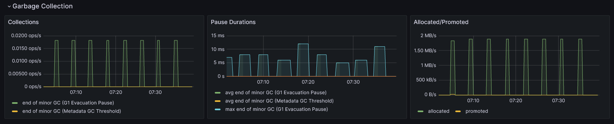

sprawdzić, co pogrubić, co wykursować, co wielką a co małą literą
ustalic czym jest dla mnie GC, collector czy collection


> Photo by [NEOM](https://unsplash.com/@neom) on [Unsplash](https://unsplash.com/photos/a-person-swimming-in-the-ocean-with-a-mountain-in-the-background-s6g6ZSxM3kQ)

*Software engineering is not only about coding. It involves selecting the appropriate solution, implementing it, and verifying its alignment with specific goals. Non-functional requirements, a category often unspoken of, encompass a range of capabilities that a system must fulfill. One of them is performence. Some systems needs to handle lots of users at the same time, while others must process a bulk amount of data within tight timeframes. Numerous factors influence this, including the code itself and how the JVM is configured in the case of JVM applications.* 

*This blog post aims to guide you through the interpretation of one of the most widely used JVM Grafana dashboards, shedding light on key elements that warrant daily monitoring.* 

## Not enough memory

Learning a programming language can be a rough road. First a basic syntax needs to be known to achieve standard tasks. But unless we don't want stop here and not pursuite the software engineer job. Otherwise the next step is to learn one or two popular frameworks in a given ecosystem to be seen in a job market. Once we land in the dream job we find out that knowing basics of a programming language and popular frameowrk is not enough. Things like best practices, design patterns or system desing are also key eleemtns to become a successful expert in software development.

And finally, a day comes when you knew all this stuff (or at least you think, you know it) you get a call from operations team that your application is way too successful and it can't keep up with a large number requests from users. None of the previous step did not prepare you for a skyrcoketing CPU usage or memory. You're panically trying to recall why all these parts are needed and what they have to do with your state of the art application.

## Look into inside

Does it sound familiar?

How can you prevent this from happening? The first step is to initiate app monitoring to observe trends and receive alerts when key metrics approach dangerous thresholds. Additionally, understanding how the app responds under various types of pressure is crucial.

Numerous tools can be employed for this purpose. Some are built into the JDK, such as *Java Flight Recorder* with *Java Mission Control*, while others can be downloaded, like *JProfiler*, and some are cloud platforms, such as *Datadog*. It's easy to feel overwhelmed initially, as each tool provides different types of information, often at a very low level.

So, where do you begin with monitoring app performance? Which tool should you choose first?

## Grafana dashboard

I recommend starting with Prometheus and Grafana. Both tools are open source and non-invasive, meaning there's no need add any special tool/agent that may affect the overall performance. They only require adding metrics libraries to a project. The setup is relatively straightforward, as I've outlined in a previous article - [How to set up monitoring tools for JVM](https://wkrzywiec.is-a.dev/posts/048_jvm-monitoring/#setting-up-jvm-dashboards-in-grafana). 

Mentioned post covers also how to import one of the most popular JVM dashboard - [JVM (Micrometer)](https://grafana.com/grafana/dashboards/4701-jvm-micrometer/) - this is will be the subject of this post. It'll walk you around key metrics and explain when and why they're important.  

The dashboard consists of sections that will be described in the following parts, which I group and change order a little bit.

## JVM Memory


```
>> here read and check once again
```

If you ever wonder what's the first thing that you must keep eye on when monitoring Java application in most of the case it would be the memory usage. This is a vital information about the health of an app, since JVM needs it to run it.

Therefore it is not a suprise thet this is a first information that is provided by the dashboard - the percentage of how much heap and non-heap memory is fillied up (along with data about how long the app is running).

In most applications, these two metrics are the ones we should keep an eye on. They have a significant impact on its performance and can quickly explain why the app is running slow or even crashing.

Why these two metrics are that important? First of all we need to know that Java is object-oriented language. It means that every program is a set of objects which interact with each other. They have methods that are invoked by other objects and they also hold data. And in the real applications number of objects may be very large. The latter indicator is accountable for measuring memory use of non-object related things, which in some cases are also worth to monitor.


Moving on, let's read the charts above, which are showing how memory usage has changed in time. It shows the actual memory usage (`used`) in a given moment, the maximum available (`max`) and the amount memory guaranteed to be available for JVM (`committed`).

So what we can read from the chart for a Heap memory? Certainly the `used` memory can't reachout to the `max` value. The dengarous situation would be when increasing number of memory in the Heap area suggests that many objects are created and their are never destroyed (collected by the Garbage Collection, which will be mention later). If this happens an app would start to act slower and eventually it will crash and throws the `java.lang.OutOfMemoryError`.

Besides Heap data, JVM has a second data area, called Non-Heap (or Off-Heap or Native Memory). It stores various data which can be divded into following spaces:

* Metaspace (aka Method Area) - it holds class-related information about classes code, their fields and methods after being loaded by classloader (more about it in the article). It also contains information about constants (in Constant Pool).
* Code Cache - is an area where optimized native code produced by Just-In-Time compiler is stored.
* Program Counters - is pointing the address of current executed instruction (each thread it's own Program Counter), 
* Stacks - the LIFO stack of frames for each executed method, it contains primitives variables and references to the objects on the heap.

Usually it is the heap that may be too small, but we need to understand that memory problems with non-heap data could also crash an pp. Too much classes loaded into Metaspace may cause `java.lang.OutOfMemoryError` and too much frames in the Stack may end up with `java.lang.StackOverflowError` thrown.

### JVM Memory Pools (Heap)


Let's now drill down into the Heap usage. But first we need to understand how Heap is structured, because it is not a monloith. Heap divided into spaces depending on the type of Garbage Collector that is used. Above we can see 3 charts of *Eden Space*, *Survivor Space* and *Old Gen* that are used by the **G1** Garbage Collector.

But why Heap is splited into spaces? It comes from something called *weak generational hypothesis*. It presumes that a life-span of objects varies. Most of them are very short lived. They are used only once and then the memory they occupy can be freed. Others, usually the smaller fraction, are the ones that are constantly used which and can't be destroyed. Due to this fact Garbage Collector (GC) is splitting heap into generations (spaces) where short-lived objects resides in the young generation (*Eden Space* and *Survivor Space*) and long-lived objects in old generation (*Old Gen*).

The rationale is simple. To avoid doing one, long garbage collection on the entire heap GC is performing it only on subset of it at the time. Also the frequency is different in each generation - the *Eden Space* is more often cleaned than the *Old Gen*, beacuse objects located there are needed only for a short period.

The above screenshot confirms that. We can see that the plot for `used` memory in *Eden Space* is formed in the characteristic jigsaw. It quickly fills up with new objects (which is expresed as rising plot on a chart) and once it reaches a certain threshold it is emptied (which causes the plot to go down).

On the contrarory, the *Survivor Space* and *Old Gen* are much more stable. There are some changes in them, but they are very subtle.

These three charts gives us vital information about content of the heap. We can read how often new objects are created and removed. If the cleanup for them is done very often and the old objects are kept on relatively same level it is tempting to increase the ratio of young to old generation size. The larger the young generation is the cleanup will be done less often. But on the other hand, it will be bigger, so the cleanup may take a little bit longer. The same goes for old generations - the smaller it gets the most frequent it is cleaned. So we must keep balance of it.

To adjust it use `-XX:NewRatio=N` (which is a ration of a young and old generations, e.g. `N=2` means that young generation is twice as big as an old one) or `-XX:NewSize=N` (which is an initial size of the young generation - all remaining will be assigned to the old genration).

#### What if the app is consuming too much memory?

Heap is one of the most important memory area for JVM and usually it's the place that demands lots of memory. If it happens that it is close to maximum threshold the easiest way would be to change the maximu size of it. Bigger heap means all needed objects will fit it. This can be achieved by providing the `-Xmx` followed by the size number of memory that will be reserver for a heap. E.g. `-Xmx1024m` will alocated 1024 MB for heap.

Changing the maximum size of a heap may be the remedy, but it many cases it's rather covering the symptoms than treating the real cause of a problem. Increasing number of objects may suggest that there is a memory leak somewhere in an application. This place in the code needs to be found and fixed.

Other options may be that too much data has been tried to be loaded into the memory. It can be either because of inefficient data structure or simple large volume of data, which was not predicted. In the first case the solution would be to optimize how we store data in JVM and for the latter it would be to increase the heap size or think about how to chunk the large amount of data into smaller pieces.

Depends on the type. If heap is increasing - too much objects, or they are too big.

heap memory best practises:

* use less memory
    * reduce object size - too much data, too much variables? maybe instead of String use boolean? instead of Object use the primitive (sprawdź prezentacje Kubryńskiego, albo książki na str 189); even null consumes space
* lazy initialization of fields (str 192)
* avoid immutable object - do not create copy if needed (if object is used only once, or in a small method, maybe make it mutable)
* avoid String that are the same


### Garbage Collection



The previous already mentioned about the garbage collector (GC) which we will have a closer look now. It is a key part of JVM, because in contrast too languages like C++ we, developers, don't need to worry about freeing memory once an object is no longer needed. The role of the GC is to decide which objects should be destroyed and which should be preserved.

All new objects are allocated first in the *Eden Space* but during the next garbage collection they are promoted to the one of the *Survivor Space* if they are still in use. Then during next garbage collections they're again checked if they're shoud be promoted to next subspace of the *Survivor Space* or even to the *Old Gen*.

The first plot in the above screenshot tells us how often the certain type of garbage collection occurs in a second. We can see there that only one minor GC (only a young generation of the heap is cleaned) is happening, but it is also showing major GC (the objects from old generation are cleaned then). So by reading this chart we can figure out how often each GC is happening and if it's too often it may give a hint that one of the spaces is filling too quickly with a large number of objects.

But even if a number of GC is relatively high it's not always a bad situation. If each one if them takes a very short time and do not affect the overall application performance we have nothing to worry about. Hence, to make sure that it is really the case we can look into the second plot which facilities us with information about the average time of each garbage collection.

The last plot is showing us how much memory was used to allocate objects in the young generation and how much of it was promoted to older generations. This is really helpful information when we want to learn about memory load that GC needs to deal with in each cycle.

After finding an issue in one of these graphs we can do two things - tune JVM memory limits and GC behaviour or select different GC. Depending on Java version and distribution (e.g. Oracle's, Amazon Corretto, Azul Zulu or Eclipse Adoptium) the list of available GC is different, but most of them can be categorized into:

* generational vs. non-generational - some GCs may not split a heap into generations and treat it as a one memory space, however they usually are splitting it into them (but it varies how they're doing it from distribution to distribution),
* stop-the-world vs. concurrent - GCs from the first group are pausing the entire application to do the cleanup, the latter are doing it when application is running (or to be precise - they do stop the application but for a very short time),
* single- vs. multi-thread - first group is performing using only one thread, the latter is utilizing at least two,
* incremental vs. monolithic - specific for stop-the-world GCs and denotes wheather garbage collection is done only for a subset of the generation or until it's done.

Here is a list of available GCs in the Amazon Correto distribution of OpenJDK (one of the most popular distributions accordingly to the [2023 State of the
Java Ecosystem](https://newrelic.com/sites/default/files/2023-04/new-relic-2023-state-of-the-java-ecosystem-2023-04-20.pdf) for 21 version of Java:

| Garbage Collector | Generational | Concurrent          | Multi-thread | Monolithic | Purpose |
| ----------------- | ------------ | ------------------- | ------------ | ---------- | ------- |
| **G1**            | ✅ Yes       | ✅ Yes (partially) | ✅ Yes       | ✅ Yes     | Common purpose GC, default |
| **Serial**        | ✅ Yes       | ❌No               | ❌No         | ✅ Yes     | Good for apps with small heap |
| **Parallel**      | ✅ Yes       | ❌No               | ✅ Yes       | ✅ Yes     | Good for batch processing apps, where overall throughput can be traded for longer pauses |
| **Shenandoah**    | ❌No         | ✅ Yes             | ✅ Yes       | ❌No       | Reduces GC pauses |
| **Generational ZGC** | ✅ Yes    | ✅ Yes             | ✅ Yes       | ❌No       | For apps that needs short response time and large heap |  

The above table is listing all available GCs along with theur basic properties. Even though some of them look better from the other it is very important to not forget about trade offs. For instance short GC pauses of *Shenandoah* and *ZGC* comes with a cost of higher CPU usage. Therefore before selecting one make sure that you understand what price you would need to pay.

If you look for more information about each GC check the *References* section, where I've put the links to official documentation of each one of them.

### JVM Memory Pools (Non-Heap)

Apart from objects JVM needs memory to store other things. This is represented with next graphs from *JVM Memory Pools (Non-Heap)* in the discussed dashboard.


* **Metaspace (a.k.a. Method Area)** - it is a place where metadata and definitions of every class (in simplier terms - every `.class` file in the runtime representation) are stored here. Apart from that *Metasapce* holds methods counter used then by JIT compiler or constant pool - data structure to store information about references and constants associated with a class (`static final` fields). By default there are no limits how big it can get, but it can be tuned using `-XX:MaxMetaspaceSize` flag. If it's not provided it may occur that JVM will consume too much memory and slows down the machine on which application is running.
* **Compressed Class Space** - this is a subset of the *Metaspace* with classes metadata.

Remaing three graphs are showing segments of the code cache. It is used to store code optimized by already mentioned JIT (Just-In-Time) compiler. This compiler plays a vital role in JVM. It identifies and optimizes places in the code that are executed very often. Those hot spots (hence the Oracle's name of JDK distribution - HotSpot) are identified are recompiled from a bytecode to machine (native) code. Along with other optimizations, like method inlining or dead code elimination, it makes those parts of a code ultra fast to execute making Java applications really robust.

Code cache is splitted into three segments:

* **CodeHeap 'profiled nmethods'** - that has lightly optimized methods,
* **CodeHeap 'non-profiled nmethods'** - that holds fully optimized methods,
* **CodeHeap 'non-nmethods'** - the smallest segments that contains compiler buffers and bytecode interpreter.

This is all the insights that discussed dashboard is giving us about non-heap area. These are all very useful information but we need to be aware that it is not everything. All mentioned data areas, like heap and parts of non-heap, are shared amoung all application threads. There are however areas that are assigned to specific threads. Areas like stack or program counter are also vital parts of the JVM.

## I/O Overview


## Classloading


## JVM Misc


## Conclusion

## References

* [Getting Started with the G1 Garbage Collector | Oracle.com](https://www.oracle.com/technetwork/tutorials/tutorials-1876574.html)
* [Serial GC | Oracle.com](https://docs.oracle.com/en/java/javase/21/gctuning/available-collectors.html#GUID-45794DA6-AB96-4856-A96D-FDE5F7DEE498)
* [Parallel GC | Oracle.com](https://docs.oracle.com/en/java/javase/21/gctuning/parallel-collector1.html) 
* [Generational ZGC | OpenJDK Wiki](https://wiki.openjdk.org/display/zgc/Main)
* [Introducing Generational ZGC | Inside Java](https://inside.java/2023/11/28/gen-zgc-explainer/)
* [Shenandoah GC | OpenJDK Wiki](https://wiki.openjdk.org/display/shenandoah/Main)
* [What is Metaspace? | stuefe.de](https://stuefe.de/posts/metaspace/what-is-metaspace/)
