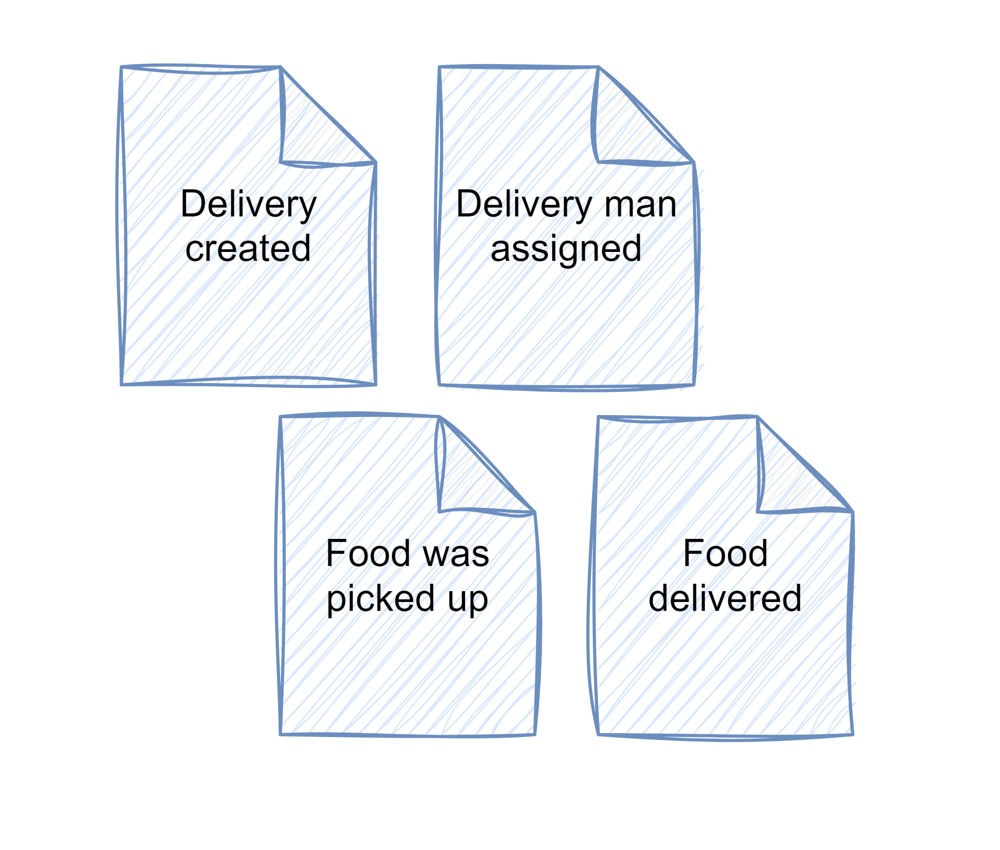
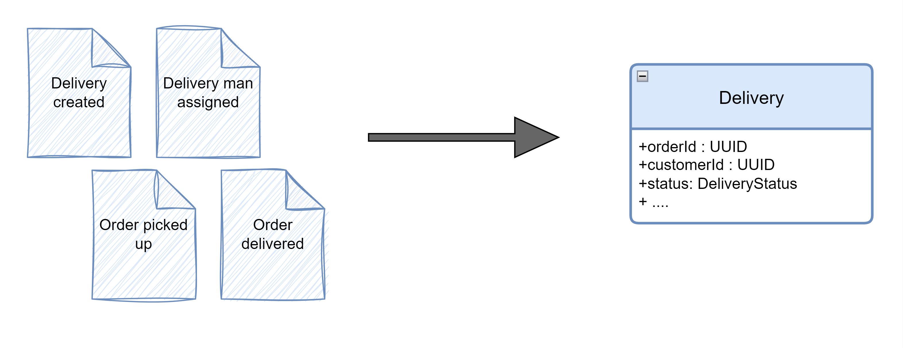

What if I told you that there is a different way of storing business entities other than as entries in relational database tables, JSONs in document key-value stores, or graphs in graph databases? Of course, people can invent anything, but the key question is: will it be usable?

And the answer is yes—there is another way that is not just a different approach to the same problem but also adds value to traditional methods of storing entities. This method is called **event sourcing** and it is gaining momentum nowadays.

This is my first article in the "Is *event sourcing* hard?" series, where I'll take a practical approach and try to implement key concepts of *event sourcing* in Java. In each article, I will tackle different aspects of it. For example, in this one, I'm focusing on explaining what *event sourcing* is and showing how it could look in code. In the next ones, I'll focus on adding additional elements connected with *event sourcing*, like an *event store* or an outbox. Moreover, I'll explore more advanced concepts such as how to version events, create snapshot events, and handle bi-temporal events. But that's not everything I have planned for this series!

My article is, of course, not the first on this topic. In fact, if you google it, you will find a plethora of great resources far more advanced and in-depth than this one. For instance, a great blog by [Oskar Dudycz - event-driven.io](https://event-driven.io/) is an excellent source of information on *event sourcing*.

With my series, I'm not trying to cover this topic exhaustively. It's just my take on it, how I understand it, and a bit of playing around with its concepts.

### What is event souring?

In essence, the concept is very simple. Instead of storing information about our models as database entries, we store facts about them. Rather than storing properties of an entity, we store all events that pertain to it.

To visualize this, let's consider an example. Suppose we want to model a delivery service that provides food to homes. Here are some business events that can occur:



Now, the idea is to store these events in an **event store**. When a new action needs to be performed on a specific delivery (e.g., it needs to be canceled), the application first needs to load all events and then process them to rebuild the current state of the delivery:



There are multiple ways in which this could be achieved in the code. Here's an example of the`Delivery` class, which includes a static factory method `from(List<Event> events)`. This method accepts a list of events and produces the domain object:

```java
@Getter  
@EqualsAndHashCode  
@ToString  
public class Delivery {  
    private String orderId;  
    private String customerId;  
    private String farmId;  
    private String deliveryManId;  
    private DeliveryStatus status;  
    private String address;  
    private List<Item> items;  
    private BigDecimal deliveryCharge = new BigDecimal(0);  
    private BigDecimal tip = new BigDecimal(0);  
    private BigDecimal total = new BigDecimal(0);  
    private Map<String, String> metadata = new HashMap<>();

    private Delivery() {};

    public static Delivery from(List<Event> events) {
        Delivery delivery = null;
        
        for (Event event: events) {
            switch (event.body()) {
                case DeliveryCreated created -> {
                    delivery = new Delivery();

                    delivery.orderId = created.orderId();
                    delivery.customerId = created.customerId();
                    delivery.farmId = created.farmId();
                    delivery.status = DeliveryStatus.CREATED;
                    delivery.address = created.address();
                    delivery.items = mapItems(created.items());
                    delivery.deliveryCharge = created.deliveryCharge();
                    delivery.total = created.total();

                    Map<String, String> metadata = new HashMap<>();
                    metadata.put("creationTimestamp", event.header().createdAt().toString());
                    delivery.metadata = metadata;
                }

                case DeliveryManAssigned deliveryManAssigned -> {
                    delivery.deliveryManId = deliveryManAssigned.deliveryManId();
                }

                case FoodWasPickedUp foodWasPickedUp -> {
                    var metadata = delivery.getMetadata();
                    metadata.put("foodPickedUpTimestamp", event.header().createdAt().toString());

                    delivery.metadata = metadata;
                    delivery.status = DeliveryStatus.FOOD_PICKED;
                }

                case FoodDelivered foodDelivered -> {
                    var metadata = delivery.getMetadata();
                    metadata.put("foodDeliveredTimestamp", event.header().createdAt().toString());

                    delivery.metadata = metadata;
                    delivery.status = DeliveryStatus.FOOD_DELIVERED;
                }

                case TipAddedToDelivery tipAddedToDelivery -> {
                    delivery.tip = tipAddedToDelivery.tip();
                    delivery.total = tipAddedToDelivery.total();
                }

                default -> throw new IllegalStateException("Failed to replay events to build delivery object. Unhandled events: " + event.body().getClass());
            }
        }
        return delivery;
    }

    private static List<Item> mapItems(List<io.wkrzywiec.fooddelivery.delivery.domain.incoming.Item> items) {
        return items.stream().map(dto -> Item.builder()
                .name(dto.name())
                .amount(dto.amount())
                .pricePerItem(dto.pricePerItem())
                .build()).toList();
    }
}
```

The idea is quite simple. The factory method iterates through the entire list of events (it's important that events are sorted by their occurrence) and creates a new object from the information stored in an event and/or the previous state of the delivery.

To understand this better, let's take a closer look. The first step of the method is to define a variable for the resulting `Delivery`, which initially is set to `null`. Then, the iteration through events begins, starting with the DeliveryCreated event that holds some data:

```java
public record DeliveryCreated (
    String orderId, String customerId,
    String farmId, String address, List<Item> items,
    BigDecimal deliveryCharge, BigDecimal total ) { }
```

Based on this event, a private constructor is used to create an empty `Delivery` object and then set all the initial fields:

```java
    public static Delivery from(List<Event> events) {
        Delivery delivery = null
        
        for (Event event: events) {
            switch (event.body()) {

                case DeliveryCreated created -> {
                    delivery = new Delivery();

                    delivery.orderId = created.orderId();
                    delivery.customerId = created.customerId();
                    delivery.farmId = created.farmId();
                    delivery.status = DeliveryStatus.CREATED;
                    delivery.address = created.address();
                    delivery.items = mapItems(created.items());
                    delivery.deliveryCharge = created.deliveryCharge();
                    delivery.total = created.total();

                    Map<String, String> metadata = new HashMap<>();
                    metadata.put("creationTimestamp", event.header().createdAt().toString());
                    delivery.metadata = metadata;
                }
            }
        }
        return delivery;
    }
```

All subsequent events will mutate the `Delivery` object, but in a very limited way. For instance, the `FoodWasPickedUp` event contains only two pieces of information: orderId and what happened from a business perspective, which is represented by the class name:

```java
public record FoodWasPickedUp(String orderId) implements DomainEventBody {}
```

Going back to the event replaying loop — if an event is of the `FoodWasPickedUp` type, the delivery status is changed to `FOOD_PICKED` and the metadata is updated:

```java
    public static Delivery from(List<Event> events) {
        Delivery delivery = // existing object recreated from previous events
        
        for (Event event: events) {
            switch (event.body()) {

                case FoodWasPickedUp foodWasPickedUp -> {
                    var metadata = delivery.getMetadata();
                    metadata.put("foodPickedUpTimestamp", event.header().createdAt().toString());

                    delivery.metadata = metadata;
                    delivery.status = DeliveryStatus.FOOD_PICKED;
                }
            }
        }
        return delivery;
    }
```

The same applies to all other events, which either change the status of a delivery or one of its properties. For instance, adding a tip to a delivery results in changing the tip value and the overall cost of the delivery:

```java
    public static Delivery from(List<Event> events) {
        Delivery delivery = // existing object recreated from previous events
        
        for (Event event: events) {
            switch (event.body()) {

                case TipAddedToDelivery tipAddedToDelivery -> {
                    delivery.tip = tipAddedToDelivery.tip();
                    delivery.total = tipAddedToDelivery.total();
                }
            }
        }
        return delivery;
    }
```

And that's it. Essentially, this is how the current state of an entity can be rebuilt from events.

Are there any other ways to achieve this? Certainly. For instance, the entire method could be extracted from a domain object and moved to a separate factory class:

```java
public class DeliveryFactory {

    public static Delivery from(List<Message> events) {
        Delivery delivery = null;
        for (Message event: events) {
            switch (event.body()) {
                case DeliveryCreated created -> {
                    delivery = new Delivery();

                    delivery.setOrderId(created.orderId());
                    delivery.setCustomerId(created.customerId());
                    delivery.setFarmId(created.farmId());
                    delivery.setStatus(DeliveryStatus.CREATED);
                    delivery.setAddress(created.address());
                    delivery.setItems(mapItems(created.items()));
                    delivery.setDeliveryCharge(created.deliveryCharge());
                    delivery.setTotal(created.total());

                    Map<String, String> metadata = new HashMap<>();
                    metadata.put("creationTimestamp", event.header().createdAt().toString());
                    delivery.setMetadata(metadata);
                }

                case DeliveryManAssigned deliveryManAssigned -> {
                    delivery.setDeliveryManId(deliveryManAssigned.deliveryManId());
                }

                // all other cases

                default -> throw new IllegalStateException("Failed to replay events to build delivery object. Unhandled events: " + event.body().getClass());
            }
        }
        return delivery;
    }
}
```

The problem with this approach is that it requires creating setters for each property of an object, which opens up the object to be modified in other parts of the code. If we want our domain object to adhere to Domain Driven Design principles, rather than being a simple Data Transfer Object, this can't happen. Modification of any property of an object must go through special business methods in Delivery that protect business rules. Methods such as:

```java
public class Delivery {  

    public void assignDeliveryMan(String deliveryManId) {
        if (this.deliveryManId != null) {
            throw new DeliveryException(format("Failed to assign delivery man to an '%s' order. There is already a delivery man assigned with an orderId %s", orderId, this.deliveryManId));
        }

        if (List.of(DeliveryStatus.CANCELED, DeliveryStatus.FOOD_PICKED, DeliveryStatus.FOOD_DELIVERED).contains(status)) {
            throw new DeliveryException(format("Failed to assign a delivery man to an '%s' order. It's not possible do it for a delivery with '%s' status", orderId, status));
        }

        this.deliveryManId = deliveryManId;
    }
}
```

Alright, so now that you know how to implement *event sourcing* and have an idea of what the implementation could look like, it might seem like the logical next step to select the approach you like the most, code it, and push it to production, right? I mean, with so many software engineering gurus advocating for it, what possibly could go wrong?

### When not to use it?

While *event sourcing* may sound great, there are certain aspects of it that need to be carefully considered.

For example, a large number of events for a single business entity can lead to performance issues. Replaying thousands of events to obtain the current state of an entity may take a considerable amount of time, even if each event processing method is relatively fast. To address this problem, there are a couple of approaches, such as creating snapshot events (with the full state of an entity) and replaying events starting from them. Another approach involves creating a projection of the current state of an entity, where the current state is stored in a database alongside events. However, it's important to note that projections should be disposable because events should remain the source of truth.

Additionally, one reason not to use *event sourcing* is its limited adoption. Not every developer has experience with it, and in situations where the business is pushing for the addition of new capabilities to a system, it may be safer to rely on familiar tools and approaches.

Furthermore, like every tool, *event sourcing* is not a one-size-fits-all solution. While it provides valuable information for analytics and tracking system activity, it's not always necessary. For some domains, a traditional approach may suffice.

Lastly, implementing *event sourcing* requires specific tools to function properly. While the database layer may seem simple in theory, it needs to meet certain criteria, such as supporting concurrent writes and maintaining an append-only storage model. This introduces various challenges, such as handling different versions of the same events, compensating for incorrect events, and managing the removal of personal information (the right to be forgotten). These complexities may deter some from adopting *event sourcing*.

### And when to use it?

So far, I've covered what *event sourcing* is and discussed a few reasons why you might hesitate to use it. But let's turn things around because there are plenty of compelling reasons to embrace it.

One major advantage of *event sourcing* is its ability to store the time of a business event. This data, often overlooked in traditional approaches, can be invaluable for advanced analytics. Events not only drive the processing part of a system but also serve as a goldmine for analytics. For instance, they can answer important business questions like how long a customer waited for a delivery or which step of an order process took the most time. Such insights can lead to better user experiences and informed decision-making.

Moreover, events can be a game-changer in highly regulated industries such as healthcare and finance. They allow the construction of a comprehensive log of actions, enabling auditors to identify malicious activities within the system. However, it's essential to exercise caution with this capability, as events should strike a balance between granularity and providing sufficient context for auditors.

Keeping a log of events also benefits operational teams by facilitating error detection and resolution. When an issue arises, such as a broken order, a quick review of the events log can often pinpoint the actions that led to the problem. Furthermore, teams can easily revert malicious events to restore an entity to its previous state.

From a development perspective, *event sourcing* offers flexibility and agility. Storing only facts about entities eliminates the need to adhere strictly to a specific business model. If the initial domain model doesn't align with business needs and requires changes, there's no need for extensive data migration. Simply adjust how events are replayed to rebuild the entity. Additionally, the same set of events can serve as the foundation for building different projects, such as distinct views of an order from the perspectives of customers and sellers.

Another boon for development teams is the aid *event sourcing* provides in debugging. A continuous stream of events allows developers to navigate back and forth, enabling what is often referred to as "time travel" debugging. This capability provides invaluable insights for identifying and fixing bugs efficiently.

#### Example of Event sourcing systems

*Event sourcing* proves valuable across a wide range of use cases. For instance:

* **Account ledger** - This is a classic and natural application of *event sourcing*. An account ledger maintains a log of all incoming and outgoing transactions, forming the basis for calculating the account balance. Some banks even leverage event data to provide insights into spending habits, categorizing expenses into groups such as rent, food, or entertainment. All of it are different projections and are based on the same data - transaction events.

* **Hospital inventory** - Hospitals rely on meticulous inventory management to ensure patients receive correct medication dosages at the right times. Additionally, maintaining control over drug supplies is crucial for regulatory compliance and legal purposes. *event sourcing* facilitates this by recording events of medical consumption, detailing which patient took which medication, when, and by whom it was dispensed.

* **Ordering system** - *Event sourcing* finds extensive application in e-commerce ordering systems. By logging events related to order processing and fulfillment, businesses can not only reconstruct the order's state but also derive insights for optimizing the ordering and delivery processes. Essentially, any system operating as a state machine stands to benefit from *event sourcing*.

### Event sourcing in application

Now that we understand *event sourcing*, let's delve into its implementation in application code. The basic flow for each use case can be straightforwardly encapsulated within a `Service` class responsible for handling it. The essence of each method's flow can be summarized into a few key steps:

1. Accept incoming arguments, typically in the form of a command.
2. Retrieve events for an entity from an *event store*.
3. Replay events to rebuild the entity's state.
4. Invoke a business method on the entity.
5. Create the resulting event.
6. Store the resulting event.

This general approach can be translated into code as follows:

```java
class Service {

    private final EventStore eventStore;

    public void handle(Command command) {

        List<Event> storedEvents = retrieveEvents(command.entityId)
        Entity entity = Entity.from(storedEvents);

        entity.handle(command.newState);

        Event resultingEvent = new NewEntityStateEvent(entity.id);
        eventStore.store(resultingEvent);
    }

    private List<Event> retrieveEvents(String streamId) {
        var storedEvents = eventStore.getEventsFor(streamId);
        if (storedEvents.size() == 0) {
            throw new EventStoreException("There are no events for stream: ", streamId);
        }
        return storedEvents;
    }
}
```

Let's consider a more concrete example of a `DeliveryService` responsible for handling a `PickUpFood` command:

```java
class DeliveryService {

    private final EventStore eventStore;

    public void handle(PickUpFood pickUpFood) {

        List<Event> storedEvents = retrieveEvents(pickUpFood.orderId())
        var delivery = Delivery.from(storedEvents);

        delivery.pickUpFood();

        Event resultingEvent = new FoodWasPickedUp(delivery.orderId());
        eventStore.store(resultingEvent);
    }

    private List<Event> retrieveEvents(String orderId) {
        var storedEvents = eventStore.getEventsFor(orderId);
        if (storedEvents.size() == 0) {
            throw new EventStoreException("There are no events for order: ", orderId);
        }
        return storedEvents;
    }
}
```

If we aim to ensure that every invocation of a business method on a domain object results in the generation of an event, we can shift the responsibility of event generation to the domain object itself:

```java
class Delivery {

    private String orderId;

    public Event pickUpFood() {
        if (status != DeliveryStatus.FOOD_READY) {
            throw new DeliveryException(format("Failed to set food as picked up for an '%s' order. It's not possible do it for a delivery with '%s' status", orderId, status));
        }
        this.status = DeliveryStatus.FOOD_PICKED;
        return new FoodWasPickedUp(orderId);
    }
}
```

As a result, the code in the `DeliveryService` can be simplified:

```java
class DeliveryService {

    public void handle(PickUpFood pickUpFood) {

        List<Event> storedEvents = retrieveEvents(pickUpFood.orderId())
        var delivery = Delivery.from(storedEvents);

        Event resultingEvent = delivery.pickUpFood();

        eventStore.store(resultingEvent);
    }
}
```

In my opinion, this approach is far superior. By moving event creation to the domain object, which encapsulates business logic, we ensure that every action taken results in the generation of an event—a factual statement of what just occurred. If event creation were to remain in the service layer, there's a risk of forgetting to create the corresponding event. Additionally, there are situations where event creation requires information from private fields within the domain object, which may not be accessible to the service.

Another approach, similar to the previous one, involves temporarily storing resulting events within the domain object itself. Again, the events would be created within the domain object, but instead of being returned after the method is invoked, they would be added to a list of events maintained by the domain object:

```java
class Delivery {

    private String orderId;
    List<Event> changes = new ArrayList<Event>(); 

    public void pickUpFood() {
        if (status != DeliveryStatus.FOOD_READY) {
            throw new DeliveryException(format("Failed to set food as picked up for an '%s' order. It's not possible do it for a delivery with '%s' status", orderId, status));
        }
        this.status = DeliveryStatus.FOOD_PICKED;
        changes.add(new FoodWasPickedUp(orderId));
    }

    public List<Event> uncommittedChanges() {
        return changes;
    }
}
```

In that case, the flow of the handling method in the `DeliveryService` might resemble the following:

```java
class DeliveryService {

    public void handle(PickUpFood pickUpFood) {

        List<Event> storedEvents = retrieveEvents(pickUpFood.orderId())
        var delivery = Delivery.from(storedEvents);

        delivery.pickUpFood();

        eventStore.store(delivery.uncommittedChanges());
    }
}
```

This flow can prove beneficial, especially when multiple business methods of the domain object are invoked within a single service method. By deferring the collection of events until the end of the method, we streamline the process and commit them in one go.

Now, let's introduce the last component: the `EventStore`. Since this article revolves around *event sourcing*, here's a simple definition of the `EventStore` interface:

```java
public interface EventStore {

    List<Event> getEventsFor(String streamId);
    
    void store(Event event);
    
    default void store(List<Event> events) {
        events.forEach(this::store);
    }
}
```

And a simple in-memory implementation:

```java
public class InMemoryEventStore implements EventStore {

    Map<String, List<Event>> store = new ConcurrentHashMap<>();

    @Override
    public void store(Event event) {
        var stream = store.getOrDefault(event.orderId(), new ArrayList<>());
        stream.add(event);
        store.put(event.orderId(), stream);
    }

    @Override
    public List<Event> getEventsFor(String streamId) {
        return store.getOrDefault(streamId, List.of());
    }
}
```

In real-world scenarios, the implementation of an *event store* can vary widely. Events may be persisted in relational or non-relational databases, each offering its own set of advantages and trade-offs. In one of my upcoming posts, I'll delve into the implementation of an *event store* using *PostgreSQL*.

### Summary

*Event sourcing* is a powerful technique that not only preserves information about domain objects but also records the time of each action that led to a given state. This additional dimension of information can be incredibly valuable for advanced analytics, improved error handling, and facilitating adjustments to the business model.

I hope this article has provided you with some insights into *event sourcing*. For further information, check out the *References* section. Additionally, if you're interested in the code mentioned in this post, you can find it in the [wkrzywiec/farm-to-table](https://github.com/wkrzywiec/farm-to-table) repository on GitHub.

### References

* [How to get the current entity state from events? | event-driven.io](https://event-driven.io/en/how_to_get_the_current_entity_state_in_event_sourcing/)
* [A Beginner’s Guide to Event Sourcing | eventstore.io](https://www.eventstore.com/event-sourcing)
* [Event Sourcing | Martin Fowler](https://martinfowler.com/eaaDev/EventSourcing.html)
* [Never Lose Data Again - Event Sourcing to the Rescue! | event-driven.io](https://event-driven.io/en/never_lose_data_with_event_sourcing/)
* [Introduction to Event Sourcing - Self Paced Kit | GitHub](https://github.com/oskardudycz/EventSourcing.JVM/tree/main/workshops/introduction-to-event-sourcing)
* [ddd-by-examples/event-source-cqrs-sample | GitHub](https://github.com/ddd-by-examples/event-source-cqrs-sample)
* [eugene-khyst/postgresql-event-sourcing | GitHub](https://github.com/eugene-khyst/postgresql-event-sourcing)
