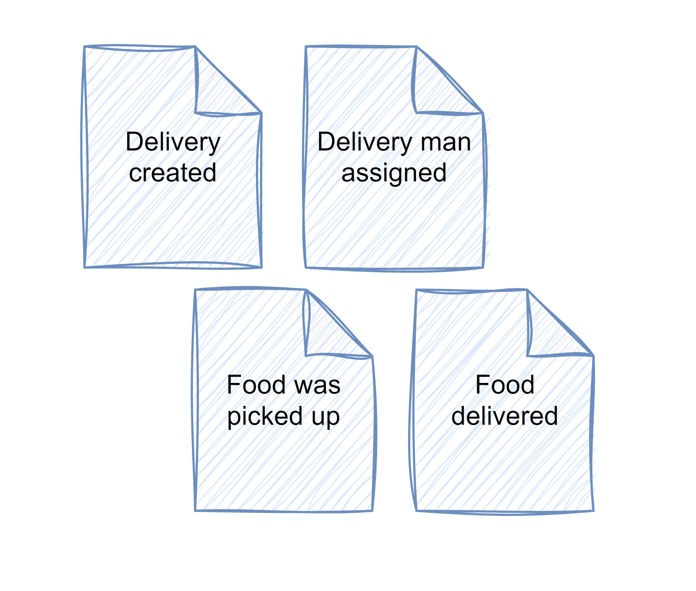
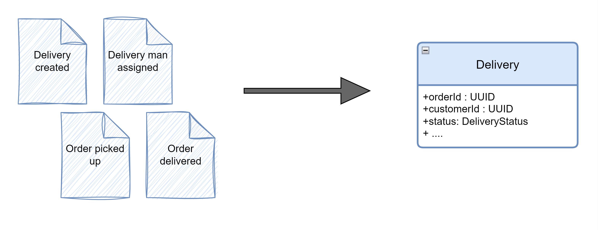

What if I told you that there is a different way of storing business entities other than as entries in tables of relationship database or JSONs in document key-values stores or graphs in graph databases? Of course people can invent anything but the key is - will it be useable?

And the answer is - yes, there is another way which is not yet another way of doing the same thing but it also adds value to "traditional" ways of storing entities. This another way is a called **event sourcing** and is getting its momentum nowadays. 

This is my first article of  "Is event sourcing hard?" series in which I'll take a practical approach and try to implement key concepts of *event sourcing* in Java. In each article I will tackle different aspect of it. E.g. in this I'm focusing on explaining what event sourcing is and show how it could look like in the code. In next ones I'll focus on adding additional elements connected with *event sourcing*, like events store or outbox. Moreover I'll explore more advanced concepts like how to version events, how to create snapshot events or how to handle bi-temporal events. But that's not everything that I have planned for this series!

My article is of course not the first on this topic. In fact if you google it you will find a plethora of great resources far more advanced and deeper into it than this one. For instance a great blog by [Oskar Dudycz - event-driven.io](https://event-driven.io/) is an awesome source of information on *event sourcing*.

With my series I'm not trying to broader this topic. It's just my take on it, on how I understand it with a little bit of playing around with its concepts.

### What is event souring?

In the essence the concept is very simple. Instead of storing information about our models as database entries we store facts about them. Instead of storing properties of an entity we're storing all events that pertain to it. 

To visualize it let's check on an example and let's say that we want to model a delivery for a service that provides food to home. Here are some business events that can occur:



Now, the idea is to store them as they are in an **events store**. When a new action needs to be performed on a specific delivery (e.g. it needs to be canceled) the application needs first to load all events and then process them to rebuild the current state of a delivery:



There are multiple ways on how it could be achieved in the code. Here is an example of the `Delivery` class which has a static factory method `from(List<Event> events)` which accepts a list of events and produces the domain object:

```java
@Getter  
@EqualsAndHashCode  
@ToString  
public class Delivery {  
    private String orderId;  
    private String customerId;  
    private String farmId;  
    private String deliveryManId;  
    private DeliveryStatus status;  
    private String address;  
    private List<Item> items;  
    private BigDecimal deliveryCharge = new BigDecimal(0);  
    private BigDecimal tip = new BigDecimal(0);  
    private BigDecimal total = new BigDecimal(0);  
    private Map<String, String> metadata = new HashMap<>();

    private Delivery() {};

    public static Delivery from(List<Event> events) {
        Delivery delivery = null;
        
        for (Event event: events) {
            switch (event.body()) {
                case DeliveryCreated created -> {
                    delivery = new Delivery();

                    delivery.orderId = created.orderId();
                    delivery.customerId = created.customerId();
                    delivery.farmId = created.farmId();
                    delivery.status = DeliveryStatus.CREATED;
                    delivery.address = created.address();
                    delivery.items = mapItems(created.items());
                    delivery.deliveryCharge = created.deliveryCharge();
                    delivery.total = created.total();

                    Map<String, String> metadata = new HashMap<>();
                    metadata.put("creationTimestamp", event.header().createdAt().toString());
                    delivery.metadata = metadata;
                    return delivery;
                }

                case DeliveryManAssigned deliveryManAssigned -> {
                    delivery.deliveryManId = deliveryManAssigned.deliveryManId();
                }

                case FoodWasPickedUp foodWasPickedUp -> {
                    var metadata = delivery.getMetadata();
                    metadata.put("foodPickedUpTimestamp", event.header().createdAt().toString());

                    delivery.metadata = metadata;
                    delivery.status = DeliveryStatus.FOOD_PICKED;
                }

                case FoodDelivered foodDelivered -> {
                    var metadata = delivery.getMetadata();
                    metadata.put("foodDeliveredTimestamp", event.header().createdAt().toString());

                    delivery.metadata = metadata;
                    delivery.status = DeliveryStatus.FOOD_DELIVERED;
                }

                case TipAddedToDelivery tipAddedToDelivery -> {
                    delivery.tip = tipAddedToDelivery.tip();
                    delivery.total = tipAddedToDelivery.total();
                }

                default -> throw new IllegalStateException("Failed to replay events to build delivery object. Unhandled events: " + event.body().getClass());
            }
        }
        return delivery;
    }

    private static List<Item> mapItems(List<io.wkrzywiec.fooddelivery.delivery.domain.incoming.Item> items) {
        return items.stream().map(dto -> Item.builder()
                .name(dto.name())
                .amount(dto.amount())
                .pricePerItem(dto.pricePerItem())
                .build()).toList();
    }
}
```

The idea is quite simple. The factory method iterates through the entire list of events (it's important that events are sorted by they occurence) and creates a new object from information stored in an event and/or previous state of a delivery.

To understand it better let's have a closer look. First step of a method is to define the variable for a resulting `Delivery` which at begining is pointing to a `null`. Then interation through events begins which starts from the `DeliveryCreated` event which holds all necessary data:

```java
public record DeliveryCreated (
    String orderId, String customerId,
    String farmId, String address, List<Item> items,
    BigDecimal deliveryCharge, BigDecimal total ) { }
```

based on which a private constructor is used to create an empty `Delivery` object and then set all initial fields:

```java
    public static Delivery from(List<Event> events) {
        Delivery delivery = null
        
        for (Event event: events) {
            switch (event.body()) {

                case DeliveryCreated created -> {
                    delivery = new Delivery();

                    delivery.orderId = created.orderId();
                    delivery.customerId = created.customerId();
                    delivery.farmId = created.farmId();
                    delivery.status = DeliveryStatus.CREATED;
                    delivery.address = created.address();
                    delivery.items = mapItems(created.items());
                    delivery.deliveryCharge = created.deliveryCharge();
                    delivery.total = created.total();

                    Map<String, String> metadata = new HashMap<>();
                    metadata.put("creationTimestamp", event.header().createdAt().toString());
                    delivery.metadata = metadata;
                    return delivery;
                }
            }
        }
        return delivery;
    }
```

All following events will be mutating the `delivery` object but in a very limited way. For instance `FoodWasPickedUp` event contains only two information `orderId` and what happened business wise which is represented by the class name:

```java
public record FoodWasPickedUp(String orderId) implements DomainEventBody {}
```

Going back to the event replaying loop - if an event is of the `FoodWasPickedUp` type the delivery status is changed to `FOOD_PICKED` and the metadata is updated:

```java
    public static Delivery from(List<Event> events) {
        Delivery delivery = // existing object recreated from previous events
        
        for (Event event: events) {
            switch (event.body()) {

                case FoodWasPickedUp foodWasPickedUp -> {
                    var metadata = delivery.getMetadata();
                    metadata.put("foodPickedUpTimestamp", event.header().createdAt().toString());

                    delivery.metadata = metadata;
                    delivery.status = DeliveryStatus.FOOD_PICKED;
                }
            }
        }
        return delivery;
    }
```

And the same goes with all other events which either change the status of a delivery or one of its property, for instance adding a tip to a delivery results in changing tip value and overall cost of a delivery:

```java
    public static Delivery from(List<Event> events) {
        Delivery delivery = // existing object recreated from previous events
        
        for (Event event: events) {
            switch (event.body()) {

                case TipAddedToDelivery tipAddedToDelivery -> {
                    delivery.tip = tipAddedToDelivery.tip();
                    delivery.total = tipAddedToDelivery.total();
                }
            }
        }
        return delivery;
    }
```

And this is it. In the essence this is how the current state of an entity can be rebuild from events.

Are there any other ways than this? Sure they are. For instance the entire method could be extracted from a domain object and moved to a separate factory class:

```java
public class DeliveryFactory {

    public static Delivery from(List<Message> events) {
        Delivery delivery = null;
        for (Message event: events) {
            switch (event.body()) {
                case DeliveryCreated created -> {
                    delivery = new Delivery();

                    delivery.setOrderId(created.orderId());
                    delivery.setCustomerId(created.customerId());
                    delivery.setFarmId(created.farmId());
                    delivery.setStatus(DeliveryStatus.CREATED);
                    delivery.setAddress(created.address());
                    delivery.setItems(mapItems(created.items()));
                    delivery.setDeliveryCharge(created.deliveryCharge());
                    delivery.setTotal(created.total());

                    Map<String, String> metadata = new HashMap<>();
                    metadata.put("creationTimestamp", event.header().createdAt().toString());
                    delivery.setMetadata(metadata);
                    return delivery;
                }

                case DeliveryManAssigned deliveryManAssigned -> {
                    delivery.setDeliveryManId(deliveryManAssigned.deliveryManId());
                }

                // all other cases

                default -> throw new IllegalStateException("Failed to replay events to build delivery object. Unhandled events: " + event.body().getClass());
            }
        }
        return delivery;
    }


}
```

The problem with this approach is that it enforces to create setters for each property of an object, which opens up the object to be modified in other parts of a code. And if we want to have our domain object written in the Domain Driven Design fashion, not as a simple Data Transfer Object, this can't happen. Modification of any property of an object must go thrugh special business methods in `Delivery` which are protecting business rules. Methods like:

```java
public class Delivery {  

    public void assignDeliveryMan(String deliveryManId) {
        if (this.deliveryManId != null) {
            throw new DeliveryException(format("Failed to assign delivery man to an '%s' order. There is already a delivery man assigned with an orderId %s", orderId, this.deliveryManId));
        }

        if (List.of(DeliveryStatus.CANCELED, DeliveryStatus.FOOD_PICKED, DeliveryStatus.FOOD_DELIVERED).contains(status)) {
            throw new DeliveryException(format("Failed to assign a delivery man to an '%s' order. It's not possible do it for a delivery with '%s' status", orderId, status));
        }

        this.deliveryManId = deliveryManId;
    }
}
```

Ok, so you now know how to implement event sourcing, you know what implementation could look like, therefore select the approach you like the most, code it and push it to production, right? What possibly could go wrong if so many people says that event sourcing is such great techique? Lots of software engineering gurus are advocating for it, so why not to try it?

### When not to use it?

Even though event sourcing might sounds great there are certain aspects of it that needs to be took care of. 

For instance a large number of events for a single business entity may cause performance problems. Replaying thousands of events in order to get current state of an entity may take a while even if each method is relatively fast. There are couple ways to handle this problem, e.g. creating a snapshot events (with full state of an entity) and replaying events strating from it. Another approach would be to create projection of a current state of an entity which would mean that besides events the disposal current state of an object would be stored in a database (disposable because events should be source of truth and a project is only the derivative of it). All these techniques I'll cover in details in my upcoming posts.  

Another reason why not to use event sourcing is the fact that it is not wide-spread yet. Not every developer had worked with it and is familiar with it. In situations when business part of a project is pushing for adding new capabilities to a system it's sometimes safer to relay on a things that are known.

Moreover like every tool, event souricing is not a silver bullet. We don't need to apply it to every problem we have. Event sourcing gives a ton of information for analytics, to get information what and when is something happening in the system but it's not always needed. For some domains a regular approach is more than enough.

A final argument for opting out from event sourcing is that it requires certain tools work properly. In theory the database layer is quite simple. After all there is no need to create lots of tables - only one is needed to store events. However it needs to come with certain properties, e.g. it needs to support concurrent writes and prevents from adding new events at the same time. Also the storage must be append-only, meaning whatever will be stored in it must stay this way. This comes with all sorts of problems to solve like handling different versions of a same events, compensating incorrect events, or removing personal information (the right to be forgotten). All these topics are not starightforward to solve and may be a major factor to not use event sourcing.

### And when to use it?

I've already described what event sourcing is and written couple of words why not use it. Till this point you may think that I'm the worst technology salesman of the year :D But let me fix it, because there are plenty of good things that comes with it.

The first benefit for using it is that it stores the time of a business event. This information is usually lost in the "classic" approach but can be beneficial for advanced analytics. They can not only be used in processing part of a system, but also in analytics. For instance based on events we can answer to many important business questions like - how long a customer was waiting for a delivery, which step of an order took the most time (e.g. finding a delivery man, deliverying food), etc. Or it can help to developer better UX.

Another gain is that events may be used in highly regulated industries (e.g. medical, finance). Based on them a log of actions can be constructed to allow auditors to find malacious actions in the system. But this capability in particular should be treated with causion, since events should be as small as they must be and auditors usually wants have more context (e.g. who made a chnage).

Keeping events is also beneficial for operation team to find errors in a processes. For instance if an order seems to be broken a quick look into the events log may bring answer to a question what actions brought the entity to a broken state. The operation team can also get rid of the malacious events to fix an entity to the state before the error.

Also the development teams may benefit from using event sourcing. First of all storing only facts about entites does not enforce to use specific business model. If an initial domain model is not fitting a business needs and must be change there is no need to do any data migration of the entire database. The only thing to change is to how replay events to rebuild the entity. Moreover based on the same events different projects can be build (e.g. a view of an order from the perspective of a customer and a seller).

Another benefit for development team is it helps with debugging the problem. Having a stream of consecutive events allows to move back and forth between them. This enables the "time travel" between events giving a greate insights to fix any bug.

#### Example of event sourcing systems

There are various of use cases when using event sourcing is beneficial. For instance:

* account ledger - this is a classic example of using event sourcing. This is actually one of the most "natural" examples. After all the account ledger is a log of all incoming and outgoing money. Based on it the account balance is calculated. Some banks may also provide insights about spendings per month grouped into categories (like rent, food, entertainment, etc.).

* hospital inventory - it's very important for hospital to keep track if patients are receiving proper medicine dosages in correct timespans. Also making sure that drugs are not stolen is very important for regulatory and law. These two things can be achieved by storing events about medical consumption by which patient, when and by whom it was taken from a hospital magazynu.

* ordering system - keep tracking of a state of an order in an e-commerce business is another classic example for utlizing event sourcing. Based on events we can not only rebuild state of an order but also build analytics which would help in optimizing the overall process of ordering and deliverying goods. Basically any system that is a state machine is a good candidate for event sourcing.

### Event sourcing in application

We know what event sourcing is, so let's try to put it in the application code. The basic flow of each use case is pretty straightforward if we use event sourcing. Let's say we hava a `Service` class that is responsible for covering it. The basic flow of each method is very similar and can be sumed up into couple points:

1. Accept incoming arguments (e.g. in a form of command).
2. Retrieve events for an entitiy from an events store.
3. Replay events to rebuild an entitiy.
4. Invoke a business method on an entity.
5. Create resulting event.
6. Store resulting event.

general approach
The generic podejście can manifests in code as:

```java
class Service {

    private final EventStore eventStore;

    public void handle(Command command) {

        var storedEvents = retrieveEvents(command.entityId)
        var entity = Event.from(storedEvents);

        entity.handle(command.newState);

        var resultingEvent = new NewEntityStateEvent(entity.id);
        eventStore.store(resultingEvent);
    }

    private List<Event> retrieveEvents(String streamId) {
        var storedEvents = eventStore.getEventsFor(streamId);
        if (storedEvents.size() == 0) {
            throw new EventStoreException("There are no events for stream: ", streamId);
        }
        return storedEvents;
    }

}
```

And or more concreate example of `DeliveryService`:

```java

```
events can be generated in domain object

events from method invokation
events in service
events as separate list inside

troszkę o event storze, na razie, że jest in memory

Event Sourcing is a pattern for storing data as events in an append-only log. This simple definition misses the fact that by storing the events, you also keep the context of the events; you know an invoice was sent and for what reason from the same piece of information. In other storage patterns, the business operation context is usually lost, or sometimes stored elsewhere.

sealed interface

### What event sourcing is not?

events streaming 
events storing
events storming


### Summary

do not jump into the hype train, check if it fits your project; be aware of introduced complexity

* https://github.com/oskardudycz/EventSourcing.JVM
    * https://github.com/oskardudycz/EventSourcing.JVM/tree/main/workshops/introduction-to-event-sourcing - wyjaśnienie tego workshopa
* https://event-driven.io/en/how_to_get_the_current_entity_state_in_event_sourcing/
* https://github.com/cer/event-sourcing-examples/tree/master/java-spring
    * chris richardson - ale to jest dziwne, i że to jakaś dziwnie stara biblioteka
* https://github.com/eugene-khyst/postgresql-event-sourcing
    * odtwarzanie eventów tymi samymi metodami co biznesowa obsługa
* https://github.com/mguenther/spring-kafka-event-sourcing-sampler
    * jakieś to dziwne... 
* https://github.com/ddd-by-examples/event-source-cqrs-sample
    * wspólne użycie metod do otwarzania eventów jak i do obsługi commandów
* https://github.com/ddd-by-examples/library
* https://event-driven.io/en/this_is_not_your_uncle_java/?utm_source=Architecture_Weekly&utm_medium=email

----
refactor `Message` -> `Event` (np na liście eventów z metody statycznej)
refactor `DomainMessageBody` -> `DomainEventBody`
refactor Items z eventu oraz wewenątrz encji nie są takie same, a chyba powinny być (wprowadzić eventy integracyjne?)


* change in domain object doesn't mean that data migration is needed - it just need a different approach to replay events
* https://event-driven.io/en/never_lose_data_with_event_sourcing/
    * event sourcing prevent from losing information that usually we don't think of - when it was modified. it highly regulated market it might be very important (e.g. in fincance for money laundery) or just to understand how the system is used (what actions brings to the currecnt state - learn how users are using the - finding pesimistic scenarios), create analytics based on that for better ux or turn over the product selling - 
    * events gives an extra dimension - change in time
* audit, time travel (All state changes are kept, so it is possible to move systems backward and forwards in time which is extremely valuable for debugging and “what if” analysis.), Root cause analysis
* events are facts, only needed info, projecttions and how we shape data can be changed, without any data migrations (models can be changed)
* fault tolleratn - if an event is bad, replay state from before the bad event occurs
* https://event-driven.io/en/audit_log_event_sourcing/
    * What makes it unique is the multiple things that you’re getting out of the box, like:
        * easier modelling of business process,
        * not losing business data,
        * extended diagnostics both technical and business,
        * projections to interpret the same facts in multiple ways.
    * Having the needs for those scenarios can be a driver to use Event Sourcing. Just audit needs may not be enough