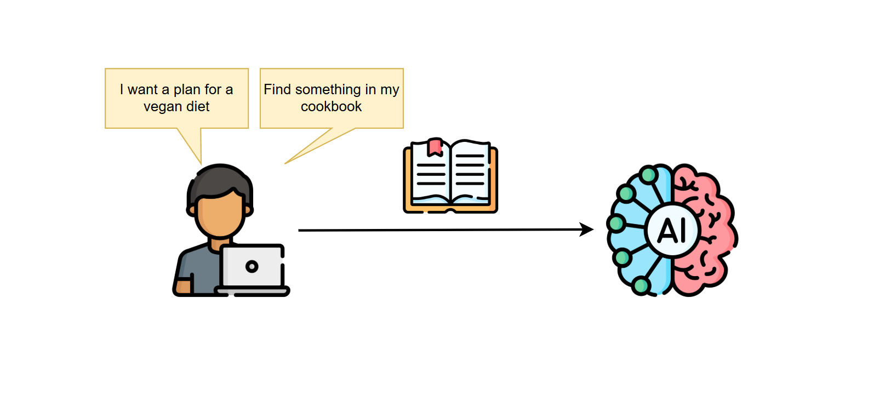
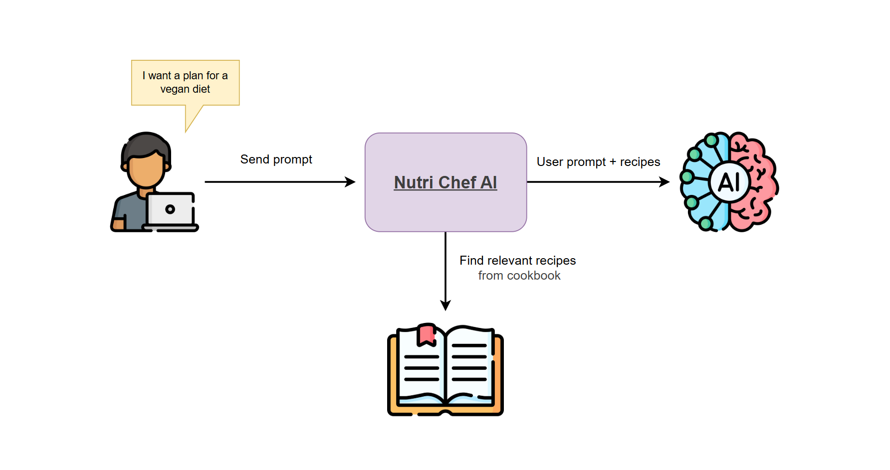
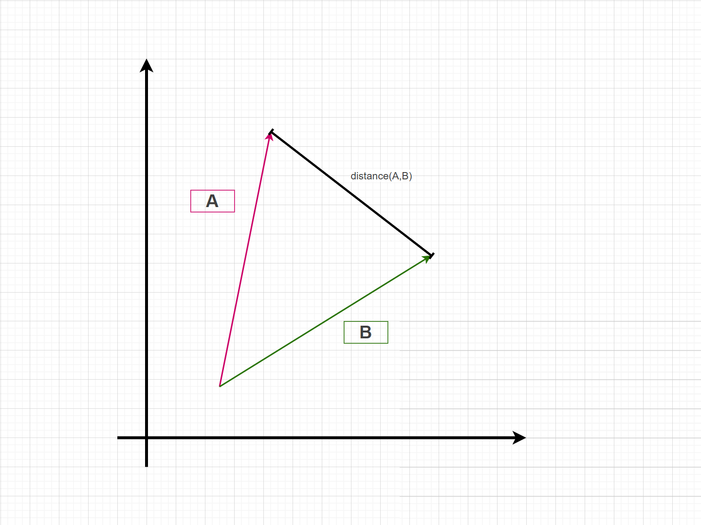
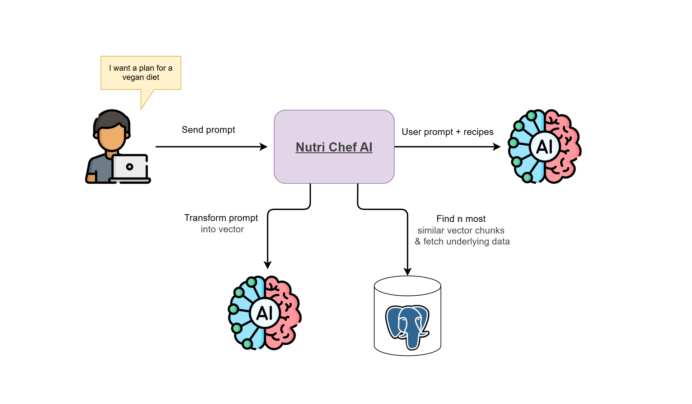
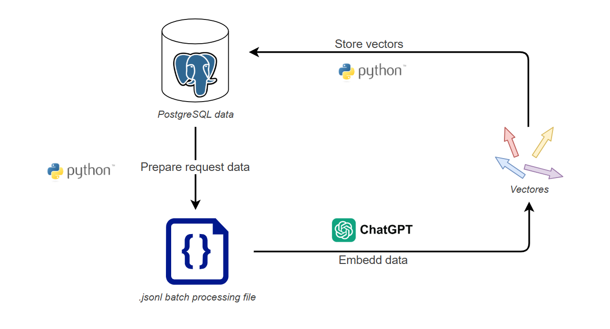

===========
WSTĘP

===========


The AI revolution is here. The release of ChatGpt in November 2022 ignited a new revolution in software, where generative AI plays a central role. New tools and patterns emerged which enables us, software engineers, to build new, exciting projects. It's so hard to keep up with it because almost every week a new thing comes up.

At least for me it is sometimes hard to keep up with all new things. Hence to fight off my fear-of-missing-out and to extend my professional toolbox I have created this series in which I will describe how to build an application that is powered by the AI. But before that keep in mind I am not an AI engineer and I have only a basic knowledge on machine learning. I am not an expert in this field but I hope that with this series it will become a little bit more clear to me and perhpaps you, the reader, will also learn something too.

(And I hope that this series won't share the fate of previous series that I abondend after one or two entries 😜🤞)


## The Project - 👨‍🍳 Nutri Chef AI

I like to learn based on close to real-life projects. Hence I've decided to built a nutrition assistance application, which will help me plan all my meals for the entire week. I want to keep my meals healthy balanced with all needed macronutrients on a good level.

Because I already has a large number of favourite recipies I don't want to really on something that is on the Internet. I want my AI nutrition assistant to plan my meals based on my prompt and cookbook.



This requirement brings us to a first problem - **how to provide my entire cookbook to the AI?**

Theoritcally we could add entire knowledge to each prompt but for several reasons it may not be good idea:

* it would increase costs - each token sent to AI costs money (no matter if you pay it with subscription or with electric power of your locally installed AI model),
* it would introduces latencies - large inputs usually requires AI to process it for much longer,
* it could result in lossing context window - it is not always good to have as big input as possible because too large inputs may cause that some parts of it will be not be taken into the account when generating an answer by the AI model, it is always a matter of balancing the size of it,
* it would be not accepted by the AI model - each AI model has an input token limit which can't be exceeded.

Instead we could use only a subset of knowledge base. We can cerafully select only the parts that are the most relevant for a task (user prompt). E.g. in the *Nutri Chef AI* app for a prompt `find all recipies with what is left in my fridge - cheese, ham, egg, paprica, flour, milk` it is not needed to attach recipies that requires other ingredients. We want to recieve only those that matches the critiria. So we need something smart eanough to get only those part of data that may be relevant before adding it to the system context.

## How Retrieval‑Augmented Generation (RAG) works

There are 2 patterns of how we could provide achieve that:

1. via Retrieval-Augmented Generation (RAG)
2. via tool calling

As you may gues, in this article is focused on the first approach (I'll do the separate blog post on the latter topic sometime in the future).

RAG is a technique in which application retrieves the most relevant pieces information from the external data source (it could a database, file or else) and attach it to the AI input with a user prompt. It is up to an application to select data that may be needed to fullfil the task by the AI agent. It is the app which builds the context specific to each user query.



**But how an application can select only relevant data?**

One way could be based on the keyworlds included in the user input. This is a way how Google Search, Elasticsearch or any other "classic" solutions works. They try to find best matches based on key terms from the input. If an input is `low-carb pasta dinner` it may found all documents that have `low-carb`, `pasta` and `dinner` terms in it. They only analyze only words included in the query and based on them prepare the results. They usually do not search for deeper meaning, so in results for the mentioned query we could get not only low-carb pasta recipies but also regular pasta recipes and low-carb but non-pasta recipes.

There is another approach that addresses this problem - embedding-based retrieval, aka semantic retrieval.

### Embedding-based retrieval

In short an embedding is a compact representation of a data in a form multidimensional vector. Those vectors represents a (semantic, underlying) meaning of the embedded text. In the embedding-based retrieval we compare a user input, represented as a vector, with the entire knowledge base also represented as a vector. If, by many measures, two vectors are similar to each other we consider that data that they represent are relevant.

To visualize it let's check a following graph of the x and y axes which presents 3 vectors:


Vector A and B are similar to each other because they are close to each other, they have similar angle with x and y axes and they are of similar length. Vector C however does not share those similarities with othe two vectors. If vectors A and B would represent two pieces of information we could say that both of them are of a similar meaning.

When we can say that 2 vectors are similar? There are couple of way to calculate if the distance metric between 2 vectors, and thus their dimilarity. Some of them you may know already from the math classes:

* l2 (Euclidean) distance
* cosine distance
* l1 distance
* hamming distance
* jaccard distance

Each distance metric has its strengths and is suitable for different data types. For instance, the Euclidean distance is a distance between two end points of position vector that is shown on a picture below



The larger differences in length and angel are between 2 vectors the larger distance is between both of them and the larger dissimilarities.

Each method focuses on a different aspects and should be depending on a case. The best approach is to try out each of them and measure which one of them bahaves the best.

### From text to vectors: producing embeddings

So the app flow is pretty straighfowrad. We need to have data prepared as vector representstion and when user prompts we need to transform it to vector snd compare with those prepared to find the nearest (the most Similarity). But how to make such converdion of user input and data?  With AI model of course!

Those models, embedding models, are different than regular chat models but they are offered by alll key AI providers. For instance Open Ai is offering 2 in the moment of writing it - .......... We can select whatever model we like but we need to keep to these rules:

* tune number of dimensions based on purpose - hugher number of dimension is usually good for capturing nuances in data, similar but still different data may have slightky different vectors and hence search may be more accurate. On the other hand higher number of parameters may require more resources to compute search and require more storage for larger vectors
* model is self hosted or consumed via api - like for lllm, we pick from mosels that we can isntall locally ofr use services exposed by ai providers
* input snd data must be converted using the same language - each model represents space in a different which makes vectors produced not compatibile if 2 different models where used. If you want to test which embedding works the best for your case (with ab testing pephaps) you need to have embedding produced by different modrls

If you would like to browse available models go check the https://huggingface.co/blog/mteb mteb, which also measures all if them how powerful they are.

#### Chunking strategies

One of the problems with data embedding is that konwlesge that we would like to embed  may be veery large and models may not handle too much of input tokens. In fact each one of them has its own limits.

Therefore we need to chunk the data into smaller segments. The simple solituon would be to split the data by character number. I.e. if model has limit of 1000 tokens we could split the input to be less than that. But it would vause that some embeddingss may lack of required context as theynwould be splitted in a middle of a sentence or sectio which would produce garbage vector. 

Another approacg to this problem could be chunking input data based on some logical fragments of it. For instance the paraghps of a blog post may be treeated as separated chunk. Or section if a paragpah is too granular. This fixes the problem with out of context but we still need to watch out for limits, which is relatively easy since there are libraries that counts how mamy tokens a given text will be translated to.

Next, more sophisticated approach could be to ligically split the data. If a data is already structured, like recipies, chunking  could be relatively easy since the data is already break out into smaller pieces. But what to do if a knowledge base is not struturized? We could use the llm for that! It could split the data based on certain parameters (e..g. not loosing context and to not exceed the certain limits), ehich of course comes with additional cost and may not be accurate (as llm may produce nondetermiestic results).

As we can see there are various ways how we can chunk our data. As always there are no silver bullet and sometimes it is better to try out various approaches ( different chunking strategy, chunk size,etc) and measure its results.

#### Storing vectors

Once we've got vectors produced by the embedding model we need to save it somewhere. There are couple options for doing that, like storing them in:

1. a file - not efficient but simple solition
2. an exisitng database with requires extensions installed. Popular solituons that are offering it are for instance , postgres,  elasticseach, redis i inni.
4. A native vector db - with AI RAG revolution new players emerges offering native vector storing and search solituons. Examples are :
5. a cloud provider IaaS - each cloud vendor has its own vector database -

Each one of them comes with pros and cons. Some of them are free to use, some of them are paid but are easy to use, more performant or doesn not require to set entite infrastructure.

### Using embeddings in applications

Feww that was a lot of knowledge to be introduced to. Let's now focus on applicatation that we're buildnig. In the *Nutri Chef AI* app I want to have 2 endpoints that would:

* search the best fitting recipes
* propose a meal plan for a day

The workflow for the second one will look like this:

1. User sends a query.
2. The query is transformed into a vector.
3. User input vector is compared with vectors stored in PostgreSQL database. The *n* most similar chunks are returned each with an id of a different recipe.
4. Full recipes are fetched from db using the recipe ids (this is where the 1st endpoint ends and returns recipes as results).
5. Recipes are formatted and added to the system prompt along with AI instructions and a user prompt.
6. The entire prompt is passed to the LLM.
7. The output is returned to the user as a string

This flow is not specific to the *Nutri Chef AI*, it is pretty generic one and could be used in various cases.



The implementration of this entire flow is described in the [Enriching prompt with recipe data](TODODODOODODOD) section of this blog post.

## Practical walkthrough

Theoretical introduction jestr juz za nami so we can move on with implementing a simple RAG in the *Nutri Chef AI* app. I've splitted this section into 2 parts:

1. creating embeddings from already stored data
2. implementing RAG flow in the app itself

### Embedding recipe data and inserting into pgvector columns

First step in building the Nutri Chef AI application is to vectorize recipe data. I already have it in the PostgreSQL database so the plan is to retrieve from it, prepare the request for the embedding process, execute it and then store the results in the the PostgreSQL database.

My data is relatively static. I don't change it too often, therefore I've decided that vectorinzing data will be a one-off job. The application will be using the OpenAI model therefore embedding I'm also using the ChatGPT API.

To achieve this task I could use [a simple endpoint for creating embeddings](https://platform.openai.com/docs/api-reference/embeddings/create) which is fast, the reply with vectors is immediate. But in my case I can wait a little bit longer for results and if it would be cheaper it would be even better. For these reasons I've decided to go with [OpenAI Batch API](https://platform.openai.com/docs/guides/batch). This API in essence is processing request in the same fashion as the standard one but it allows to combine multiple request into one. They are then executed asynchronously and the results are returned after couple of minutes or hours (depending on how large the dataset it). It may give an additional overhead to the process (because we need to monitor the async process) but it wil come with a lower price per each embeddding.

The overall process looks like this:



And the steps are:
1. Using Python script the data will be fetched from PostgreSQL database and prepared in the `.jsonl` format that is accepted by the OpenAI Batch API.
2. Prepared `.jsonl` file will be sent to OpenAI and then a process of embedding will be started.
3. Using the Python script the batch process will be monitored and once it's done the resulting file will be downloaded and vectors will be inserted to the database.

This is one of many approaches we could take. If you would like to learn what are the others, go check the ````TODOTODOTODOTODOTODOTODOTODOTODOTODOTODO```` section.

Before moving on to implementation of the scripts first we need to prepare the database. We need to install the `pgvector` extension by executing the SQL script:

```sql
CREATE EXTENSION vector;
```

Be aware that this extension is not built-in into the standard PostgreSQL version. You need to put the installation files into your PostgreSQL instance first. Or you could use the Docker image provided by creators of the extension:

```bash
docker pull pgvector/pgvector:pg17-trixie
```

More information on how to provide the installation files to the PostgreSQL instance could be found in [the GitHub repository of the pgvector extension](http://github.com/pgvector/pgvector).

#### 📦 Prepare batch input file

Database is prepared so we could start writing a script for preparing `.jsonl` file for the batch job. This format is the only accepted by the OpenAI API and it looks somethig like this:

```json
{"custom_id": "61bf11bb_name", "method": "POST", "url": "/v1/embeddings", "body": {"model": "text-embedding-3-small", "input": "Apple pie"}}
{"custom_id": "61bf11bb_ingredients", "method": "POST", "url": "/v1/embeddings", "body": {"model": "text-embedding-3-small", "input": "apples, flour, butter, sugar"}}
```

As you can see it is just a file with regular JSONs wher each line represents a separate request to the OpenAI API. We've got:

* `custom_id` - which is unique accross a file, represents the id of a request,
* `method`, `url` & `body`- which are respectively HTTP method, path and body from "regular" API,

So here is the Python script that generates it:

```python
import json
from pathlib import Path
from typing import Any, Dict, List
import psycopg2

DB_CONFIG = {
    "host": "localhost",
    "port": 5432,
    "database": "meal_planner",
    "user": "postgres",
    "password": "postgres"
}
EMBEDDING_MODEL = "text-embedding-3-small"

CHUNK_TYPES = ["name", "description", "ingredients", "instructions", "tags"]

def get_db_connection():
    return psycopg2.connect(**DB_CONFIG, client_encoding='UTF8')

def fetch_recipes(conn) -> List[Dict[str, Any]]:
    print("Fetching recipes from database...")
    with conn.cursor() as cur:
        cur.execute("SELECT id, name, description, ingredients, instructions, tags FROM recipe")
        columns = [desc[0] for desc in cur.description]
        recipes = [dict(zip(columns, row)) for row in cur.fetchall()]
        return recipes

def chunk_recipe(recipe: Dict[str, Any]) -> List[Dict[str, Any]]:
    print(f"Chunking recipe {recipe['id']}...")
    chunks = []
    for chunk_type in CHUNK_TYPES:
        content = recipe.get(chunk_type)
        if content:
            chunks.append({
                "recipe_id": recipe["id"],
                "chunk_type": chunk_type,
                "content": content
            })
    print(f"Created {len(chunks)} chunks for recipe {recipe['id']}")
    return chunks

def prepare_jsonl_file(chunks: List[Dict[str, Any]], path: str) -> str:
    record_count = 0
    with open(path, 'w', encoding='utf-8') as f:
        for chunk in chunks:
            record = {
                "custom_id": f"{chunk['recipe_id']}_{chunk['chunk_type']}",
                "method": "POST",
                "url": "/v1/embeddings",
                "body": {
                    "model": EMBEDDING_MODEL,
                    "input": str(chunk["content"])
                }
            }
            f.write(json.dumps(record, ensure_ascii=False) + '\n')
            record_count += 1
    
    print(f"Created file with {record_count} records, path: {path}")
    return path

def main():
    print("Starting embedding process...")
    
    temp_dir = Path("batch-files")
    temp_dir.mkdir(exist_ok=True)
    print(f"Created temporary directory at: {temp_dir}")
    
    try:
        conn = get_db_connection()
        recipes = fetch_recipes(conn)
        
        print("Starting recipe chunking process...")
        all_chunks = []
        for recipe in recipes:
            all_chunks.extend(chunk_recipe(recipe))
        print(f"Created total of {len(all_chunks)} chunks from {len(recipes)} recipes")
        
        base_jsonl_path = temp_dir / "recipes_for_embedding.jsonl"
        jsonl_path = prepare_jsonl_file(all_chunks, str(base_jsonl_path))

    except Exception as e:
        print(f"Error during embedding generation: {str(e)}")
        raise
    finally:
        print("Performing cleanup")
        if 'conn' in locals():
            conn.close()
        print("Database connection closed")

if __name__ == "__main__":
   main()
```

And after running it we've got an output:

```bash
Starting embedding process...
Created temporary directory at: batch-files
Fetching recipes from database...
Starting recipe chunking process...
Created total of 25 chunks from 5 recipes
Created file with 25 records, path: batch-files\recipes_for_embedding.jsonl
Performing cleanup
Database connection closed
```

Simple as that. From the script you may tell that I'm using the OpenAI API and I've picked the `text-embedding-3-small` embedding model. You can choose from different models, which varies by generation, performance and price. In the moment of writing this article there are also `text-embedding-ada-002` and `text-embedding-3-large`. A current list of supported models could be found on [the official OpenAI Models website](https://platform.openai.com/docs/models).

Going back to the script, if you look closer you may see that each recipe data was splitted into smaller chunks (name, description, ingredients, instructions and tags) to make each vector smaller.

#### 🚀Start batch job

An input file is prepared so we have nothing left but to write a script to first upload it and then start the batch job:

```python
import os
from pathlib import Path
import openai  
from datetime import datetime
from dotenv import load_dotenv


load_dotenv()

OPENAI_API_KEY = os.getenv("OPENAI_API_KEY")
file_path =  Path("batch-files")  / "recipes_for_embedding.jsonl"

def main():
    client = openai.OpenAI(api_key=OPENAI_API_KEY)
    
    file_response = client.files.create(
        file=open(file_path, "rb"),
        purpose="batch"
    )
    file_id = file_response.id
    print(f"File uploaded successfully with ID: {file_id}")
    
    descr = datetime.now().strftime("%Y%m%d_%H%M%S") + " - nutri chef embedding"
    batch_response = client.batches.create(
        input_file_id=file_id,
        endpoint="/v1/embeddings",
        completion_window="24h",
        metadata={
            "description": descr
        }
    )
    job_id = batch_response.id
    print(f"Batch job created with ID: {job_id}")
    

if __name__ == "__main__":
   main()
```

The output after running the script:

```bash
HTTP Request: POST https://api.openai.com/v1/files "HTTP/1.1 200 OK"
File uploaded successfully with ID: file-HvRA1M3
HTTP Request: POST https://api.openai.com/v1/batches "HTTP/1.1 200 OK"
Batch job created with ID: batch_68c8f2bf
```

Great! 🎉🎉🎉 The only thing we can do now is to sit and relax. The batch job is executed in the backrogund, so how we get to know when it finishes? 🤔

#### 🔍 Monitor batch job status

Depending on how large your dataset is the batch process may take from several minutes to several hours. To verify it the OpenAI API could be used:

```python
from openai import OpenAI
from dotenv import load_dotenv
import os

load_dotenv()

OPENAI_API_KEY = os.getenv("OPENAI_API_KEY")
client = OpenAI(api_key=OPENAI_API_KEY)

batch_id = "batch_68c8f2bf"

batch = client.batches.retrieve(batch_id)
print(f"Batch response:\n {batch.to_json()}")
```

This simple Python script will print out the batch job information:

```json
{
  "id": "batch_68c8f2bf",
  "completion_window": "24h",
  "created_at": 1757999807,
  "endpoint": "/v1/embeddings",
  "input_file_id": "file-HvRA1M3",
  "object": "batch",
  "status": "completed",
  "cancelled_at": null,
  "cancelling_at": null,
  "completed_at": 1757999947,
  "error_file_id": null,
  "errors": null,
  "expired_at": null,
  "expires_at": 1758086207,
  "failed_at": null,
  "finalizing_at": 1757999941,
  "in_progress_at": 1757999869,
  "metadata": {
    "description": "20250916_071647 - nutri chef embedding"
  },
  "output_file_id": "file-BhMQY4",
  "request_counts": {
    "completed": 25,
    "failed": 0,
    "total": 25
  },
  "usage": {
    "input_tokens": 3533,
    "output_tokens": 0,
    "total_tokens": 3533,
    "input_tokens_details": {
      "cached_tokens": 0
    },
    "output_tokens_details": {
      "reasoning_tokens": 0
    }
  }
}
```

The most important information for us is the `status`. Above it states that it is `completed` and we can see that it also contains information about the `output_file_id` - a file with all results.

Before completing it a batch may have various statuses, all of them are listed [here](https://platform.openai.com/docs/guides/batch#4-check-the-status-of-a-batch). Most likely you will see one of these: 

* `in_progress` - batch is running,
* `finalizing` - all requests have been executed and the results are being prepared,
* `completed` - all requests have been executed and the results are available to be downloaded.

#### 💾 Download batch job results

Having the id of an output file we can downlaod it with this simple script:

```python
from openai import OpenAI
from dotenv import load_dotenv
import os
from pathlib import Path
from datetime import datetime

load_dotenv()

OPENAI_API_KEY = os.getenv("OPENAI_API_KEY")
client = OpenAI(api_key=OPENAI_API_KEY)

file_name = "file-BhMQY4"

file_response = client.files.content(file_name)

output_dir = Path("batch-files")

output_file = output_dir / f"{file_name}.jsonl"

with open(output_file, "w", encoding='utf-8') as f:
    f.write(file_response.text)

print(f"Response saved to: {output_file}")
```

The output:

```bash
Response saved to: batch-files\file-BhMQY4.jsonl
```

After opening the resulting file we would get something like this:

```json
{"id": "batch_req_68c8f34a2aa", "custom_id": "61bf11bb_name", "response": {"status_code": 200, "request_id": "8724e1825b5baa0", "body": {"object": "list", "data": [{"object": "embedding", "index": 0, "embedding": [-0.0075121797, 0.016524209, 0.012069914, -0.032091618, ......]}], "model": "text-embedding-3-small", "usage": {"prompt_tokens": 13, "total_tokens": 13}}}, "error": null}
```

It contains a list of responses for each request, where each one of them contains a vector representation of each chunk which will be extracted and inserted into database in the next step.

#### 📥 Insert vector data into database

The last step is to insert the embeddings into the PostgreSQL database. We could use the already existing table with recipes but because each recipe was chunked into 5 pieces, let's have a new one:

```sql
CREATE TABLE recipe_embeddings (
    id                      UUID PRIMARY KEY DEFAULT gen_random_uuid(),
    recipe_id               UUID NOT NULL REFERENCES recipe(id),
    chunk_type              VARCHAR(255),
    token_count             INTEGER,
    embedding               VECTOR(1536)
);
```

where:
* `id` - is an id of a reo,
* `recipe_id` -  is an id of a recipe,
* `chunk_type` - tells kind of a chunk it is, values, like `name`, `description`, `ingredients`, `instructions`, `tags`,
* `token_count` - tells of how many tokens this chunk translates to,
* `embedding` - is a stored vector.

Having this table set we can execute a following Python script:

```python
import json
import psycopg2
import tiktoken
from typing import List, Dict, Any
from pathlib import Path

embedding_file = "file-BhMQY4.jsonl"

DB_CONFIG = {
    "host": "localhost",
    "port": 5432,
    "database": "meal_planner",
    "user": "postgres",
    "password": "postgres"
}
EMBEDDING_MODEL = "text-embedding-3-small"

_loaded_request_data = None

def get_token_count(text: Any, model: str) -> int:
    if text is None:
        text = ""
    if not isinstance(text, str):
        text = str(text)
    
    text = text.replace('\x00', '')
    
    enc = tiktoken.encoding_for_model(model)
    try:
        token_count = len(enc.encode(text))
        print(f"Token count: {token_count:,} for text of length {len(text):,}")
        return token_count
    except Exception as e:
        print(f"Error counting tokens for text: {text[:100]}... Error: {str(e)}")
        return 0

def load_request_data():
    global _loaded_request_data
    if _loaded_request_data is None:
        _loaded_request_data = []
        with open('batch-files/recipes_for_embedding.jsonl', 'r', encoding='utf-8') as file:
            for line in file:
                _loaded_request_data.append(json.loads(line))

def find_content(custom_id):
    load_request_data()
    
    for item in _loaded_request_data:
        if item.get('custom_id') == custom_id:
            return item.get('body', {}).get('input')
    
    print(f"Content not found for custom_id: {custom_id}")
    return None

def load_embeddings(file: str) -> List[Dict[str, Any]]:
    all_embeddings = []
    
    file_path = Path("batch-files") / file
    if not file_path.exists():
        print(f"Embedding file not found: {file_path}")
        return all_embeddings
    
    print(f"Loading embeddings from file: {file_path}")
    with open(file_path, "r", encoding='utf-8') as f:
        for line in f:
            try:
                record = json.loads(line.strip())
                custom_id = record.get("custom_id", {})
                recipe_id, chunk_type = custom_id.split('_', 1)

                embedding = record.get("response", []).get("body", []).get("data", [])[0].get("embedding", [])
                content = find_content(custom_id)
                token_count = get_token_count(content, EMBEDDING_MODEL)
                
                all_embeddings.append({
                    "recipe_id": recipe_id,
                    "chunk_type": chunk_type,
                    "embedding": embedding,
                    "token_count": token_count
                })
                    
            except json.JSONDecodeError as e:
                print(f"JSON parsing error in {file_path}: {str(e)}")
            except Exception as e:
                print(f"Error processing line in {file_path}: {str(e)}")
    
    print(f"Loaded total of {len(all_embeddings)} embeddings from all files")
    return all_embeddings


def get_db_connection():
    conn = psycopg2.connect(**DB_CONFIG)
    print("Database connection established successfully")
    return conn


def store_embeddings(conn, embeddings: List[Dict[str, Any]]):
    print("Starting to store embeddings in database")
    with conn.cursor() as cur:
        for idx, emb in enumerate(embeddings, 1):
            cur.execute("""
                INSERT INTO recipe_embeddings (recipe_id, chunk_type, embedding, token_count)
                VALUES (%s, %s, %s, %s)
            """, (emb["recipe_id"], emb["chunk_type"], emb["embedding"], emb["token_count"]))
        conn.commit()
    print(f"Successfully stored all {len(embeddings)} embeddings in database")

def main():
    try:

        all_embeddings = load_embeddings(embedding_file)
        conn = get_db_connection()

        if all_embeddings:
            print(f"Storing total of {len(all_embeddings)} embeddings from all files")
            store_embeddings(conn, all_embeddings)
        else:
            print("No embeddings were generated")
    
    except Exception as e:
            print(f"Error during embedding generation: {str(e)}")
            raise
    finally:
        print("Performing cleanup")
        if 'conn' in locals():
            conn.close()
            print("Database connection closed")


if __name__ == "__main__":
    main()
```

The logic of the script is simple:
1. It loads both the request and output files.
2. It iterates through each line in the output file and extracts recipe_id, chunk_type and embedding. It also retieve the content of an input in order to calculate its token count.
3. Loaded data is then inserted into the database.

Here is the exemplary output from the script:

```bash
Loading embeddings from file: batch-files\file-BhMQY4umjMy228GzgVqvgB.jsonl
Token count: 11 for text of length 28
Token count: 36 for text of length 89
Token count: 210 for text of length 509
Token count: 348 for text of length 855
....
Loaded total of 25 embeddings from all files
Database connection established successfully
Storing total of 25 embeddings from all files
Starting to store embeddings in database
Successfully stored all 25 embeddings in database
Performing cleanup
Database connection closed
```

### Utilizing embeddings in application

We have the embeddings prepared so we can move on to the actual application. I'll be writting it in Kotlin with Spring framework because I feel the most comfortable with it and since recently it also has its own AI module that I wanted to try on. If you prefer other language or framework you can still read it since I've tried to have code as simple as possible so it's easy to understand and translate to another language/framework.

#### Search best fitting recipes

First endpoint that I would like to implement and which will utilize RAG is for searching the most matching queries to the user input. It'll will be the GET `/api/recipes/search?limit=<number of recipes>&prompt=<user input>` which will return a list of recipes in well structured, JSON format. The `limit` query parameter refers to how many recipes a client wants to retrieve and the `prompt` is a user input string, which could be anything, e.g. `find low-carb options for breakfast`.

Starting from the controller, which is rather standard:

```kotlin
@RestController
@RequestMapping("/api/recipes")
class RecipeController(
    val recipeSearchFacade: RecipeSearchFacade
) {

    @GetMapping("/search")
    fun findRecipes(
        @RequestParam prompt: String?,
        @RequestParam(defaultValue = "10") limit: Int
    ): ResponseEntity<RecipeSearchResponse> {

        lateinit var matches: List<Recipe>

        val duration = measureTimeMillis {
            matches = recipeSearchFacade
                .findRecipes(prompt, limit)
        }

        val response = RecipeSearchResponse(matches = matches, totalFound = matches.size, searchTimeMs = duration)

        return ResponseEntity.ok(response)
    }
}

data class RecipeSearchResponse(
    val matches: List<Recipe> = emptyList(),
    val totalFound: Int = 0,
    val searchTimeMs: Long = 0,
)

data class Recipe(
    val id: UUID,
    val name: String,
    val description: String? = null,
    val ingredients: List<Ingredients>,
    val instructions: List<Instruction>,
    val sourceUrl: String? = null,
    val servings: String? = null,
    val tags: List<String> = emptyList(),
    val similarityScore: Double? = null,
)

data class Ingredients(val section: String, val ingredients: String)

data class Instruction(val steps: List<String>, val section: String)
```

The only think may raise an eyebrow is the `measureTimeMillis` block which I've added to measure waiting time for a result from facade which includes all the steps required to retrieve recipes. And speaking of the steps that facade implement, here is its code:

```kotlin
@Service
class RecipeSearchFacade(
    private val embeddingEngine: EmbeddingEngine,
    private val repository: RecipeRepository
) {

    companion object {
        private val log = logger {}
    }

    fun findRecipes(prompt: String?, limit: Int): List<Recipe> {
        if (prompt == null || prompt.isBlank()) return emptyList()
        log.info { "Searching for $limit recipes based on a user prompt: '$prompt'..."}

        val promptEmbedding: FloatArray = embeddingEngine.embed(prompt)
        log.info { "User input was embedded. Looking for closest recipes..." }
        return repository.findNearestRecipes(promptEmbedding, limit)
    }
}
```

The role of a facade is to orchestrate the entire process, therefore it covers first creating the embedding out of user input and then finding the most suitable recipes.

Let's check the code of the `EmbeddingEngine`:

```kotlin
import org.springframework.ai.embedding.EmbeddingModel

interface EmbeddingEngine {
    fun embed(prompt: String): FloatArray
}

@Component
class OpenAIEmbeddingEngine(
    private val embeddingModel: EmbeddingModel
): EmbeddingEngine {
    override fun embed(prompt: String): FloatArray {
        val response = embeddingModel.embedForResponse(listOf(prompt))
        return response.result.output
    }
}
```

Again, there are not that much lines of code here. With `EmbeddingModel` we can call any embedding model to get the vector representation of a user prompt which in Kotlin it is as `FloatArray` object. It's thanks to the [Spring AI](https://spring.io/projects/spring-ai) framework. The `EmbeddingModel` is Spring's interface for interacting with various embedding models. The only thing that needs to done to add it is to insert following dependency to the build tool (Gradle or Maven):

```kotlin
dependencies {
    implementation("org.springframework.ai:spring-ai-starter-model-openai:1.0.1")
    implementation("org.springframework.ai:spring-ai-autoconfigure-model-openai:1.0.1")
}
```

I've selected the OpenAI model for start so this is the reason both libs were added. Apart from that we also need to select which embedding model we want to use (it needs to be the same as it was used for embed data in PostgreSQL) and provide the API key. The simplest way to achieve it is via autoconfiguration which requires only to provide those values to the `application.yaml` file:

```yaml
spring:
  ai:
    openai:
      api-key: ${OPENAI_API_KEY}
      embedding:
        options:
          model: "text-embedding-3-small"
```

That's pretty much it that needs to be done to enable text embedding.

With `OpenAIEmbeddingEngine` the user input was transformed into vector so the only thing to do now is to pass this vector to the SQL query to find the best matching recipes. The logic of it is encapsulated in the `findNearestRecipes(promptEmbedding: FloatArray, limit: Int = 10)` method of the `RecipeRepository` class:

```kotlin
@Repository
class RecipeRepository(
    private val jdbcTemplate: NamedParameterJdbcTemplate,
) {

    fun findNearestRecipes(promptEmbedding: FloatArray, limit: Int = 10): List<Recipe> {
        val sql = """
            SELECT
              r.id AS recipe_id,
              r.name,
              r.description,
              re.similarity_score,
              r.ingredients,
              r.instructions,
              r.source_url,
              r.servings,
              r.tags
            FROM (
                SELECT
                  recipe_id,
                  MIN(embedding <=> CAST(:prompt_embedding AS vector)) AS similarity_score
                FROM recipe_embeddings
                GROUP BY recipe_id
                ORDER BY similarity_score ASC
                LIMIT :limit
            ) AS re
            JOIN recipe r ON r.id = re.recipe_id
            ORDER BY re.similarity_score ASC;
        """

        val params = MapSqlParameterSource()
            .addValue("prompt_embedding", promptEmbedding)
            .addValue("limit", limit)

        return jdbcTemplate.query(sql, params, rowMapper())
    }

    fun rowMapper() = RowMapper<Recipe> { rs, _ ->
        Recipe(
            id = UUID.fromString(rs.getString("recipe_id")),
            name = rs.getString("name"),
            description = rs.getString("description"),
            ingredients = parseFromJson<Ingredients>(rs.getString("ingredients")),
            instructions =  parseFromJson<Instruction>(rs.getString("instructions")),
            sourceUrl = rs.getString("source_url"),
            servings = rs.getString("servings"),
            tags =  parseFromJson<String>(rs.getString("tags")),
            similarityScore = rs.getDouble("similarity_score"),
        )
    }

    private inline fun <reified T> parseFromJson(jsonString: String?): List<T> {
        if (jsonString.isNullOrBlank()) return emptyList()

        return try {
            jsonString.toObject<List<T>>()
        } catch (e: Exception) {
            emptyList()
        }
    }
```

Here I'm using the `NamedParameterJdbcTemplate` to execute the raw SQL query, which finds the top `n` (10 by default) recipeIds from the `recipe_embeddings` table. The list of retrieved recipeIds is then used to get full recipe data from the `recipe` table.

The most interesting part is how vectors are compared here:

```sql
SELECT
    recipe_id,
    MIN(embedding <=> CAST(:prompt_embedding AS vector)) AS similarity_score
FROM recipe_embeddings
GROUP BY recipe_id
ORDER BY similarity_score ASC
LIMIT :limit
```

I'm using the `<=>` operator provided by the *pgvector* extenstion. This particular operator finds the shortest value of cosine distance. The results are then sorted from the smallest to the biggest value and limited to only top `n` results.

*pgvector* offers other methods of comparing vectors which are:

* `<->` - L2 distance
* `<#>` - (negative) inner product
* `<=>` - cosine distance
* `<+>` - L1 distance
* `<~>` - Hamming distance (binary vectors)
* `<%>` - Jaccard distance (binary vectors)

In order to find the best one for your case is to try out all of them, experiment and measure which one is the most suitable for you.

The `jsonString.toObject<List<T>>()` function code on the `String` object is an extension method (this is Kotlin's ability to add additional method to a class that is not part of the current codebase):

```kotlin
class ObjectMapperConfig {

    companion object {
        val objectMapper = objectMapper()
    }
}

fun objectMapper() =
    jsonMapper {
        addModule(kotlinModule())
        findAndAddModules()
        serializationInclusion(JsonInclude.Include.NON_NULL)
        defaultDateFormat(StdDateFormat())
        configure(DeserializationFeature.FAIL_ON_UNKNOWN_PROPERTIES, false)
        build()
    }

fun Any.toJson(): String = objectMapper().writeValueAsString(this)

inline fun <reified T> String.toObject(): T = objectMapper().readValue(this)
```

Everything is coded, so after starting the application and running the **GET** `/api/recipes/search?prompt=<my_prompt>` endpoint where my prompt was a simple `find low-carb options for breakfast` I got this result:

```json
{
    "totalFound": 10,
    "searchTimeMs": 873,
    "matches": [
        {
            "id": "00280180-a2ca-4d1d-930e-7a8baf6ff187",
            "name": "Scrambled Eggs with Mushrooms on Toast",
            "description": "A tasty breakfast idea. Scrambled eggs and browned small mushrooms are placed on toasts and sprinkled with chopped parsley or chives.",
            "ingredients": [
                {
                "section": "all",
                "ingredients": [
                    "4 eggs",
                    "4 tablespoons butter",
                    "1 tablespoon vegetable oil",
                    "2 cups small mushrooms",
                    "sea salt and freshly ground black pepper",
                    "4 slices of toasted baguette",
                    "2 tablespoons chopped parsley"
                ]
                }
            ],
            "instructions": [
                {
                "section": "all",
                "steps": [
                    "Prepare two small frying pans. Heat the first, add the oil and 2 tablespoons of butter and melt. Add washed and dried mushrooms and fry for a few minutes until nicely browned on each side. Season with salt and pepper.",
                    "Meanwhile, toast the bread slices in a toaster, spread them with butter and place them on two plates.",
                    "Heat the second pan and melt 2 tablespoons of butter in it, crack in the eggs and season with salt. Fry quickly, stirring only 4–5 times. As soon as the whites set, remove from the pan and place on one prepared toast. Put the mushrooms on the other toast. Sprinkle with pepper and parsley."
                ]
                }
            ],
            "sourceUrl": "https://www.kwestiasmaku.com/dania_dla_dwojga/sniadania/jajecznica_pieczarki/przepis.html",
            "servings": "2 servings",
            "tags": [
                "Mushrooms",
                "Eggs",
                "Eggs for breakfast"
            ],
            "similarityScore": 0.365850391911005
        },
        /// other recipes
    ]
}
```

Looks amazing 🤩! As you can see even with small amount of work and with out really using any LLM we can "intelligently" query our data to find best matches! Awesome!

#### Enriching prompt with recipe data

With previous success, let's built a new thing on top of that - a simple diet advisor. Let's use the LLM to act as a dietician that focuses on delivering nutritional balanced recipes based on the user prompt (assuming that user will be asking for ideas for a specific meal and giving certain boundries, like specific diet or favourite ingredients). It won't be doing the plan for the entire week or even day - this will be covered in one of the upcoming blog posts.

First thing to do is to define an endpoint and controller for that:

```kotlin
@RestController
@RequestMapping("/api/planner")
class MealPlannerController(
    private val mealPlanner: MealPlanner
) {

    @GetMapping("/single")
    fun proposeMeal(
        @RequestParam prompt: String,
    ): ResponseEntity<RecipeProposals> {
        val proposals = mealPlanner.proposeMeal(prompt)
        return ResponseEntity.ok(proposals)
    }
}
```

The `MealPlanner` is a service that takes responsiblity of orchestrating the entire process which is - finding the most relevant recipies to the user prompt (we already have that) and add them to the request made to AI model. Here is the entire code of this class:

```kotlin
import org.springframework.ai.chat.client.ChatClient

data class RawRecipeProposals(val response: String, val nextActions: List<String>, val recipes: List<RecipeIdWithRationale>)

class RecipeIdWithRationale(val rationale: String, val recipeId: UUID)

data class RecipeProposals(val response: String, val nextActions: List<String>, val recipes: List<RecipeWithRationale>)

data class RecipeWithRationale(val rationale: String, val recipe: Recipe?)

@Service
class MealPlanner(
    private val recipeSearch: RecipeSearchFacade,
    private val builder: ChatClient.Builder
) {

    companion object {
        private val log = logger {}
    }

    fun proposeMeal(userPrompt: String): RecipeProposals? {
        log.info { "Searching for best meal proposals based on user prompt... '$userPrompt'"}
        val recipes = recipeSearch.findRecipes(userPrompt, 10)

        log.info {" Found ${recipes.size} recipes with ids: ${recipes.map { it.id }} "}
        log.info { "Calling an AI agent..."}
        val answer = builder.build().prompt()
            .system(
                """
                You are a nutrition assistant that selects the best fitting recipes for meal planning.
                
                TASK: Analyze the provided recipes and select the most suitable ones based on nutritional benefits and user goals. If no specific goal is provided, assume recommendations for a regular healthy adult diet.
                
                RESPONSE FORMAT: You must respond with valid JSON in exactly this structure:
                {
                  "response": "Brief overall explanation of your selection strategy and nutritional focus",
                  "nextActions": ["suggested action 1", "suggested action 2"],
                  "recipes": [
                    {
                      "recipeId": "recipe-uuid-here",
                      "rationale": "Detailed explanation of why this recipe was selected, focusing on specific nutritional benefits"
                    }
                  ]
                }
                
                REQUIREMENTS:
                - Select 3-5 most suitable recipes from the provided list
                - Focus on nutritional balance, variety, and health benefits
                - Include specific nutritional reasons in each rationale
                - Suggest 2-3 relevant next actions for the user
                - Use the exact recipe IDs provided
                - Respond in the same language as the user's request
                - Return only valid JSON, no additional text
                
                RECIPES: ${recipes.toJson()}
                """.trimIndent()
            )
            .user { u -> u.text("USER_QUERY: \"$userPrompt\"") }
            .call()
            .content()
        log.info { "Response from AI Agent:\n $answer" }
        return answer?.let {
            mapToRawRecipeProposals(it)
        }?.let {
            mapToRecipeProposals(it, recipes)
        }
    }

    private fun mapToRawRecipeProposals(answer: String): RawRecipeProposals? {
        return answer.toObject<RawRecipeProposals>()
    }

    private fun mapToRecipeProposals(raw: RawRecipeProposals, fullRecipes: List<Recipe>): RecipeProposals? {
        return RecipeProposals(
            response = raw.response,
            nextActions = raw.nextActions,
            recipes = raw.recipes.map { RecipeWithRationale(rationale = it.rationale, recipe = fullRecipes.find { recipe -> recipe.id == it.recipeId}) }
        )
    }
}
```

In the first lines of the `fun proposeMeal(userPrompt: String)` method we're invoking the already existing recipe search code. The result of it is then transformed into JSON and added to the end of the system prompt. For now on let's do not focus that much on the prompt itself, the whole topic of how to write good prompt will be covered in another article.

In this post I want to focus on two key points - how the recipies are added to the system prompt and how to enforce AI to respond in a certain format. In the system prompt I'm adding those retrieved recipes as JSONs but in your system you can try to use different formats like XML or something less structured. Because they are added to the prompt it is always important to keep in mind the content of a each recipe should be relatively small in order to be below the limit of how many tokens can be added in the request to AI model.

The second important thing in this prompt is how the output result should be returned because further processing of AI response depends on that. This is crucial part because if we want to build a complex system with an AI in the middle of it we need to enforce returning the structured responses from ito make it easier to process it by other elements of our system (backend or UI code).

To make it work we also need to specify which AI model we want to use. It needs to be added to configuration in the `application.yaml` file. I've decided to use the OpenAI's `gpt-5-mini` model:

```yaml
spring:
  ai:
    openai:
      api-key: ${OPENAI_API_KEY}
      chat:
        options:
          model: "gpt-5-mini"
          temperature: 1
```

After rebuilding the entire project we can test the **GET** `/api/planner/single` endpoint with a prompt: `looking for a dinner ideas, i'm vegetarian and my favourite vegetable is tomato`. And here are the exemplary result:

```json
{
  "response": "I selected vegetarian dishes from the list that maximize the use of tomatoes while providing balanced nutrients: good sources of plant/animal protein (eggs, cheese, beans), healthy fats (olive oil), fiber, and vitamins and antioxidants (lycopene, vitamin C, vitamin A) from vegetables. I focus on a variety of textures and seasons (warm one-pot dish, pasta, baked cheese, cold soup) so you have options for different moods and energy needs.",
  "nextActions": [
    "Choose 1 of the following recipes for today's dinner and I'll provide a shopping list.",
    "If you want more protein, I can suggest simple modifications (e.g., more beans, addition of nuts/seeds).",
    "Do you want a vegan version of any recipe? I'll suggest substitutes for cheese and eggs."
  ],
  "recipes": [
    {
      "rationale": "Halloumi cheese in tomatoes with beans — a great combination of plant protein (beans) and protein/calcium memory from halloumi. Beans increase fiber, iron, and plant protein content, making the dish more filling and stabilizing blood glucose levels. Tomatoes and spices add lycopene and micronutrients. Note: halloumi is quite salty — if you limit sodium, use less cheese or choose less salty mozzarella/packaged cheese.",
      "recipe": {
        "id": "8fbb8ce5-8367-4660-a984-5f5756ad8780",
        "name": "Halloumi cheese in tomatoes with beans",
        "description": "Halloumi cheese can not only be fried or grilled but also baked or cooked in tomato sauce. Cooking keeps the cheese moist and pleasantly soft.",
        "ingredients": [
          {
            "section": "all",
            "ingredients": [
              "600 g fresh tomatoes (e.g., sauce variety) or 400 g canned peeled",
              "1 tablespoon olive oil",
              "2 garlic cloves",
              "1 can (400 g) white beans",
              "about 200 g halloumi cheese",
              "parsley and chives",
              "spices: 1/2 teaspoon smoked paprika, a pinch of chili flakes, 1 teaspoon oregano, salt and pepper"
            ]
          }
        ],
        "instructions": [
          {
            "section": "all",
            "steps": [
              "Peel fresh tomatoes, cut into quarters, remove stems. Dice the flesh. Cut canned tomatoes into smaller pieces, keep the sauce.",
              "In a large pan, gently fry grated garlic in olive oil. Add chopped fresh or canned tomatoes with the sauce and bring to a boil, season with salt, pepper, and other spices.",
              "Cook until the tomatoes reduce (about 10 minutes for fresh tomatoes or 6 minutes for canned tomatoes).",
              "Add canned beans with the liquid and mix. Cook for about 3 minutes.",
              "Place halloumi cheese on top and cook for another 5 minutes. Sprinkle with chopped parsley and chives."
            ]
          }
        ],
        "sourceUrl": "https://www.kwestiasmaku.com/przepis/pieczony-ser-halloumi-w-pomidorach-z-fasola",
        "servings": "2 servings",
        "tags": [
          "Gluten-free",
          "Warm dinners",
          "halloumi",
          "Greek cuisine",
          "Fit recipes",
          "Dinners",
          "Lunches",
          "Tomatoes",
          "Vegetarian",
          "Beans",
          "Hits of Kwestia Smaku"
        ],
        "similarityScore": null
      }
    },
    //other proposals
}
```

Looks amazing 🤩! As you can see even with small amount of work and with out really using any LLM we can "intelligently" query our data to find best matches! Awesome!

It returns not only the list of matched recipes but also rationale of each recipe. There is also a text summary for the entire prompt with actions that user may want to do next to get better results.

## Going deeper

That's pretty much it. With only few lines of code we have built a RAG system! It is very simple but it may already make an impact. So what's next? How we could make it even better? Oh there are a lot of things that may be done better.

For instance before providing the user prompt to the recipe search service, we could first ask another AI agent to analyze the user input an produce a better prompt that would be embeded and then used to search for a proper recipes. With this technique we could get even more precise results which are focusing on finding the most fitting but also nutritious meals possible from the cookbook.

This is only one of the many improvements that could be added to the RAG system to make it more precise, faster or cheaper. Before the suming up this blog post I want to briefly describe 2 more things that can be done with a system that we have so far.

### Indexing vectors

Another technic that could be applied here is to create an indexes for vectors in PostgreSQL

### Different ways for document embedding process

## Summary

## References

* książk ai engineering


* https://www.datacamp.com/tutorial/introduction-to-text-embeddings-with-the-open-ai-api?dc_referrer=https%3A%2F%2Fcommunity.openai.com%2F
  * podstawy czym jest embedding, czym sa vectory
  * oraz to: https://www.tigerdata.com/blog/a-beginners-guide-to-vector-embeddings
* https://www.tigerdata.com/blog/postgresql-as-a-vector-database-using-pgvector
  * długi i bardzo szczegłowy artykuł - skupia się na samych vectorach i postgresie
  * oraz https://severalnines.com/blog/vector-similarity-search-with-postgresqls-pgvector-a-deep-dive
  * oraz https://www.postgresql.fastware.com/blog/how-to-store-and-query-embeddings-in-postgresql-without-losing-your-mind?utm_source=perplexity
  * oraz https://www.tigerdata.com/learn/using-pgvector-with-python
* https://www.tigerdata.com/blog/which-rag-chunking-and-formatting-strategy-is-best?utm_source=perplexity
  * chunkowanie danych raga
  * oraz https://mastra.ai/en/docs/rag/chunking-and-embedding
* https://neptune.ai/blog/building-llm-applications-with-vector-databases
  * jak pisac apki wykorzystujące raga, ogólne
* https://github.com/openai/openai-cookbook/blob/main/examples/Question_answering_using_embeddings.ipynb
  * using embeddings in prompts