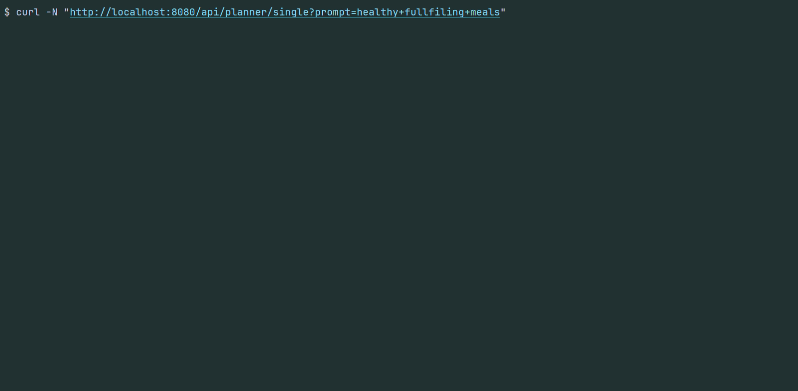
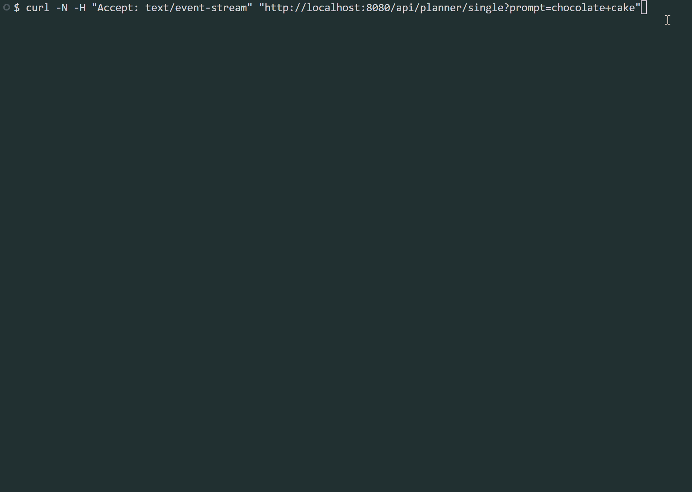
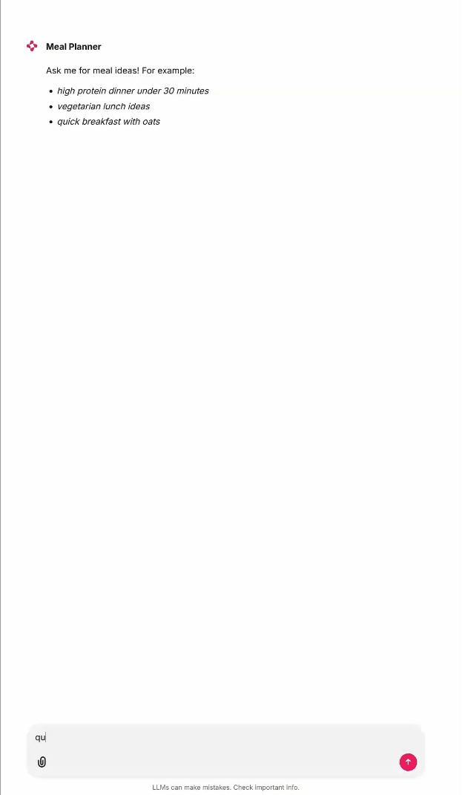

*This is the second part of the "Building AI-Powered Software" which focuses on improving the app's core user experience by returning small pieces of the response quickly. That way, users won't wonder whether the app has crashed or needs more time, because they receive constant feedback that work is progressing behind the scenes.*

## Why is it taking so long? Did it crash?

In my previous article in this series (here is a [link](https://wkrzywiec.is-a.dev/posts/054_vector-db/)) there was presented a simple endpoint that returns a list of recipes curated by an LLM based on user input. The result is a nicely structured, but to get it we sometimes have to wait a couple of seconds. Generating a response involves several slower steps, like embedding the user input or waiting for an LLM response. The more complicated the process, the longer the user may wait for the final result. For very complex processes it may even taken hours!

Here is how it looks now:



As you can see, the entire response is returned only after the whole process completes. In the meantime there is no quick feedback to the user about what's happening, so they may think the application has crashed.

It is better to notify the user about what's happening - something like "Hey, we got your input and we're working on it," followed by "We found some delicious recipes; we'll show the best ones in a moment". Moreover if a task is to return multiple items (e.g. list of recipes, rational, suggested next action) it is good return them once they are produced. There is no need to wait untill all of them are finished. This avoids the impression that the app is stuck.

## Streaming chunks

When interacting with most LLM products (ChatGPT, Gemini, etc.), we may notice that responses are returned to us like they were typed. It's not just a cosmetic effect, it's an optimization that informs the user of partial results as soon as they're available, without waiting for the full response.

There are several solutions to implement streaming chunks (sending small pieces of the entire response). Many variations exist, but they all boil down to two major decisions:

* which communication protocol to choose,
* how to structure each chunk.

### Protocols

The first decision we have to make is which communication protocol to select - in other words, how we'd like to stream chunks from server to client.

Options we have:

* standard **HTTP** - which can be realized with the following mechanisms:
  * **Server-Sent Events** - SSE
  * **Newline Delimited JSON** - NDJSON
* **Websockets**

All approaches allow a long-lived connection with the server and can send messages in chunks.

We could also consider **gRPC**, but its strengths shine in cross-agent communication within multi-agent systems, when one agent interacts with another. Therefore I'll skip it for this post.

#### Server-Sent Events

Server-Sent Events is a mechanism of unidirectional communication between server and client. That means only the server can send data to the client; the opposite direction is not supported.

To receive an SSE stream the client first needs to make a standard HTTP request with the `Accept: text/event-stream` header, after which an open connection is established. It will persist until one side (client or server) closes it. During the connection the server pushes messages in plain text; these can be JSON, but they don't have to be.

Technically there are no constraints on how messages are structured. However, conventions most clients and servers follow include:

* a double line (`"\n\n"`) between each message/chunk,
* a message in the format `data: <message>`,
* an optional `event: <event type>` field that describes the event (like `add`, `remove`, or business-centric types like `addedToCart`),
* an optional `id: <event id>` field with a message identifier

So the response, with two events, may look like this:

```sse
id: 1
event: start
data: Hello


id: 2
event: add
data: there!
```

SSE is currently the most popular mechanism for AI chats because OpenAI uses it in their streaming API. OpenAI was the first widely used LLM chat provider, and many companies and tools adopted SSE as a result - it has become the de facto standard in the AI chat industry.

Therefore SSE is a good option if you want to integrate your app with popular chat UIs, like [Open WebUI](https://openwebui.com/), [Chainlit](https://chainlit.io/), [Ollama Desktop App](https://ollama.com/) or [Jan.ai](https://www.jan.ai/).

#### NDJSON

NDJSON stands for Newline Delimited JSON. It's a format where multiple JSON objects are separated by newline characters (`\n`). Each line is a valid JSON object and can be treated as a sequence of separate objects/events. This simple format is close to a single JSON array, which makes it easier to integrate with existing tools.

Like SSE, NDJSON relies on an HTTP long-lived connection in which each line (a JSON object) is sent. Unlike SSE, the NDJSON format enforces structured data, which can make it easier to maintain and integrate.

For example, here is how an exemplary response could look (the `Content-Type` HTTP header would be `application/x-ndjson`):

```json
{ "id": 1, "event": "start", "data": "Hello"}
{ "id": 2, "event": "add", "data": "there!"}
```

The NDJSON format is a bit of a niche but it's used in some systems like Ollama and can be an alternative to SSE.

#### Websockets

Sometimes one-way communication (server to client only) is too limiting. For instance, systems where an AI agent needs to interact with a human (e.g., to ask for permission or to review plan/task progress - human-in-the-loop) require two-way communication. Such systems benefit from long-lived, bi-directional connections, which avoid a flood of HTTP requests for a single communication channel. WebSocket is useful not only for chats but also for many real-time collaboration systems like *Miro* or *Figma*.

Both HTTP and WebSockets are built on the same foundation - TCP (Transmission Control Protocol). WebSocket communication starts with an HTTP handshake in which the client asks the server to upgrade the connection to a long-lived WebSocket. If the server accepts, the same TCP channel remains open and is upgraded to a WebSocket connection; it lasts until either side closes it. In standard HTTP, the client opens a TCP connection, sends a request, and the connection is often closed after the response.


sequenceDiagram
    participant Client
    participant Server
    Client->>Server: HTTP Upgrade Request
    Server-->>Client: 101 Switching Protocols
    Note over Client,Server: WebSocket Connection Established
    Client->>Server: send("Hello")
    Server-->>Client: send("Hello back")
    Client->>Server: send("Data payload")
    Server-->>Client: send("Acknowledged")
    Client->>Server: Close Frame
    Server-->>Client: Close Frame
    Note over Client,Server: Connection Closed


WebSocket supports various data types; the most useful for us is the text type, which allows us to send structured messages (for example JSON) back and forth between client and server. Here is an example of message exchange for a chat application, with messages in JSON format.

In the AI-agent world, WebSockets are used in various products. For example, Perplexity uses WebSockets to give completion suggestions while the user is typing - when I hit a letter, Perplexity often already suggests what I might want to type.

```json
// Client -> Server
{"type":"join", "room":"general", "user":"wojtek"}

// Client -> Server
{"type":"chat", "room":"general", "user":"wojtek", "message":"hello everyone"}

// Server -> Client
{"type":"chat", "room":"general", "user":"alice", "message":"hello Wojtek", "timestamp":"2026-05-12T10:15:00Z"}

// Server -> Client
{"type":"ping"}

// Client -> Server
{"type":"pong"}
```

The `ping`/`pong` messages are heartbeats - a simple mechanism for client and server to ensure the connection is still alive. The others are the regular messages exchanged between client and server.

### Shaping response structure

Once a transport mechanism is chosen, there is one more decision: do we want to send structured responses from the agent? For a simple chat application, markdown may be sufficient. But if you want UI elements (cards, animations, or other components) you need a structured response.

In essence, this is similar to the standard approach: define a response schema (for example in OpenAPI) and the server returns the result. The trick here is how to stream such an object. In most applications the server returns the full JSON object at once; in an agentic application we may want to send only small parts of a large JSON as the LLM produces them.

But first, let's visualize it with an example. Say the final response for a meal-planner AI agent looks like this:

```json
{
    "response": "Thank you for your meal planning request for healthy and fulfilling meals.",
    "suggestedFollowUps": [
        "Prepare a shopping list for the ingredients needed for the selected recipes."
    ],
    "recipes": [
        {
            "recipe": {
                "id": "6464b6f5-17bf-4744-90f6-dbaab3af9983",
                "name": "Mexican Quinoa",
                "description": "...",
                "ingredients": [
                    {
                        "section": "all",
                        "ingredients": [...]
                    }
                ],
                "instructions": [...],
                "sourceUrl": "https://www.bbcgoodfood.com/",
                "source": "bbc_good_food",
                "imageUrl": "https://www.bbcgoodfood.com/quinoa.jpg",
                "servings": "2 portions",
                "tags": [
                    "Lunch"
                ],
                "similarityScore": 0.6430065
            }
        }
    ]
}
```

This is a large JSON with a lot of information. To provide a seamless experience, you should pick a strategy to split the response into smaller chunks that can be streamed to the client. Here are a few patterns to choose from (these names are informal):

* Snowballing raw response - each chunk re-sends the full accumulated response
* Snowballing structured object - accumulated, valid JSON is emitted token-by-token
* Full-schema delta streaming - stream deltas within a stable schema
* Structured field streaming - one complete JSON field per chunk
* Events streaming - distinguish payload kinds
* Delta patching - each chunk is a typed diff/operation applied to prior state

#### Snowballing raw response

The first, naive pattern is straightforward. The agentic system emits the response token-by-token. Every new chunk contains the previous content plus the newly added parts, so the message grows with each chunk. Here is an example (I'll stick to the SSE protocol in these examples):

```json
data: {"response":


data: {"response": "Thank you "


data: {"response": "Thank you for your"
```

As you can see, the emitted information is not structured in any meaningful way. It is sent token-by-token and it's up to the client to decide whether the received data forms a valid JSON. This doesn't differ much from a non-streamed response, since the client often has to wait for all tokens to arrive before deserializing. The next approach addresses this.

#### Snowballing structured object

> Used in: *LangGraph* (with default streaming mode - `values`)

A variation of the previous approach is to have a template JSON with empty fields. Each time the LLM generates a token it is inserted into one of the JSON fields. The app sends the accumulated response, containing the newly created parts and the previous ones. Here is an example to visualize it:

```json
data: {"response": "", "suggestedFollowUps": [], "recipes": []}


data: {"response": "Thank you ", "suggestedFollowUps": [], "recipes": []}


data: {"response": "Thank you for your", "suggestedFollowUps": [], "recipes": []}
```

This approach allows rendering on every incoming token, making the UI feel more responsive. Every chunk is a valid JSON so the UI can update as each chunk arrives. The drawback is that the same data is sent repeatedly while only a small portion changes, making it inefficient as the JSON responses grow.

#### Full-schema delta streaming

> Used in: OpenAI Chat Completions

This problem can be tackled by sending only the tokens that were just generated. Again, each message is a JSON object, but previous responses do not accumulate - only the field that is being generated contains new tokens:

```json
data: {"response": "", "suggestedFollowUps": [], "recipes": []}


data: {"response": "Thank you ", "suggestedFollowUps": [], "recipes": []}


data: {"response": "for your", "suggestedFollowUps": [], "recipes": []}
```

This way each chunk is smaller and can arrive earlier than the accumulated ones in the previous approach.

The downside is that clients need to cache every chunk and combine them on their end. This approach works well for string fields but can be tricky for complex fields like arrays or objects.

#### Structured field streaming

The problem of non-string fields can be addressed by sending the entire field content in one chunk. Each chunk contains a complete field of the larger JSON:

```json
data: {"response": "Thank you for your meal planning request for healthy and fulfilling meals."}


data: {"suggestedFollowUps": ["Prepare a shopping list for the ingredients needed for the selected recipes."]}


data: {"recipe": {"id": 1234, "name": "Mexican Quinoa", ... }}
```

A cost of this approach is that the time between chunks may increase, especially if an object or array contains a lot of data.

#### Events streaming

> Used in: Gemini Interactions API

A variation of the previous approach is to send several fields that are logically connected instead of a single one. The response time for each chunk may increase compared to the previous approach, but in return we get a more consistent response from the agent. We can treat each chunk as an event/message sent to the client, with an id and type, which makes it easier to parse on the client side and to monitor and debug on the server side:

```json
event: rationale
data: {"id": 1, "type":"rationale", "response": "Thank you for your meal planning request for healthy and fulfilling meals."}


event: suggestedFollowUps
data: {"id": 2, "type": "suggestedFollowUps", "suggestedFollowUps": ["Prepare a shopping list for the ingredients needed for the selected recipes."]}


event: recipe
data: {"id": 3, "type": "recipe", "recipe": {"id": "6464b6f5-17bf-4744-90f6-dbaab3af9983","name": "Mexican Quinoa", ... }}
```

#### Delta patching

> Used in: ChatGPT's and Perplexity's web UI

In many cases the previous approach is good enough, but for systems where we don't want users to wait for each chunk, a variation of *Full-schema delta streaming* and *Events streaming* can be applied. This is useful for applications that send a lot of data while keeping the per-chunk size minimal.

As in *Events streaming*, each chunk is a separate event, but this time the event doesn't gather related data into a single chunk. Instead, events represent which part of the JSON was generated by providing a field location and the value to add. This way string fields can be sent token-by-token as in *Full-schema delta streaming*, while complex fields can be sent in one go:

```json
data: {"type":"response.token","payload":"Thank you"}


data: {"type":"response.token","payload":"for your"}
```

It can get more complicated for operations like adding an item to a list or replacing a previous chunk (e.g., if guard rails detect an incorrect chunk after it was sent). In such cases the app builds a final response using several approaches, one of which is sending events as JSON that consist of three fields describing the operation, location and value:

* `o` - `operation`: what action should be applied to the accumulated response, e.g. `new`, `append`, `replace`, `add`, etc.
* `p` - `path`: references a location where the action should be applied (something like JSON Path), e.g. `/message/parts/0` (which may translate to the first item of the `parts` array inside the `message` object)
* `v` - `value`: the change (what should be added, replaced, removed, etc.)

Examples:

```json
data: { "o": "append", "p": "/message/content", "v": "Thank you"}


data: {"o": "add", "p": "/recipes/0", "v": "Crêpe"}


data: {"o": "replace", "p": "/token_count", "v": 1018}
```

## Solution selection

From the earlier sections we can tell there are many options to choose from, and they aren't limited to the ones described here. So which one did I choose for my meal-planner project?

My main goal is to learn how to create and tune an AI agent, not to focus on the visual aspects of the project. Of course a nice UI would make working with the plan effortless and fun, but that's additional work I don't want to focus on right now. On the other hand, I don't want to view only raw JSON - I want some visualizations.

After weighing the arguments, I decided to use [Chainlit](https://chainlit.io/) for the UI. It's an open-source app for building AI conversational solutions. It allows you to create apps similar to ChatGPT or Claude and supports customizations and custom building blocks (views, cards, elements), which mattered most to me.

To integrate with Chainlit, my meal planner had to expose an endpoint compatible with OpenAI's streaming API. Therefore I chose HTTP and SSE as the transport protocol. Most chunks are sent as whole events; simple text is streamed token-by-token.

## Implementation

### Agent Flow

Here is how the logic of my agent looks:


---
title: Agent Flow
---
flowchart TB
    id1(User sends query) --> id2(Agent acknowledges received request)
    id2(Agent acknowledges received request) --> id3(Agent searches for recipes)
    id3(Agent searches for recipes) --> id4(Agent selects best matching recipes)
    id4(Agent selects best matching recipes) --> id5(recipes are returned to user)
    id5(recipes are returned to user) --> id6(Rationale about selected recipes is returned)
    id6(Rationale about selected recipes is returned) --> id7(Suggested follow-up actions are returned)


Before searching for any recipe, the app acknowledges receipt and starts processing the request. There are two phases - one without an LLM and one with it. The first phase (without the LLM) simply notifies the user that the request was accepted and is being processed. In *nutri-chef-ai* this appears as a static chunk:

```json
data:{"type":"status","ts":"...","payload":{"phase":"start","message":"Starting meal proposal for: healthy fulfilling meals"}}
```

The next part involves the LLM in generating a more human-like answer that indicates how the request was understood. This is streamed token-by-token, so it looks like this:

```json
data:{"type":"response.token","ts":"...","payload":"Thank"}

data:{"type":"response.token","ts":"...","payload":" you"}

data:{"type":"response.token","ts":"...","payload":" for"}

data:{"type":"response.token","ts":"...","payload":" your"}

data:{"type":"response.token","ts":"...","payload":" meal"}

data:{"type":"response.token","ts":"...","payload":" planning"}

data:{"type":"response.token","ts":"...","payload":" request"}

// full answer: Thank you for your meal planning request for healthy fulfilling meals. I now search for suitable recipes.
```

Once that is returned, the agent searches for matching recipes in the RAG database and informs the user about the steps along the way.

```json
data:{"type":"status","ts":"...","payload":{"phase":"search","message":"Searching for matching recipes"}}

data:{"type":"status","ts":"...","payload":{"phase":"search","message":"Found 100 matching recipes"}}
```

Every step is sent in a single chunk, as is each recipe. The entire structure (shortened below) is sent in one go:

```json
data:{"type":"recipe.selected","ts":"...","payload":{"recipeId":"c01...","name":"Power bowl with sweet potato","ingredients":[...],"instructions":[...], "imageUrl":"https://...jpg", "similarityScore":0.6263648178902887}}

data:{"type":"recipe.selected","ts":"...","payload":{"recipeId":"646..","name":"Mexican Quinoa","ingredients":[...],"instructions":[...],"imageUrl":"https://...jpg","similarityScore":0.6429639599585675}}
```

Each recipe selection is finalized with a rationale explaining why it was chosen; again, the LLM generates this.

```json
data:{"type":"status","ts":"...","payload":{"phase":"llm","message":"Calling LLM (rationale)"}}

data:{"type":"response.token","ts":"...","payload":"These"}

data:{"type":"response.token","ts":"...","payload":" reci"}

data:{"type":"response.token","ts":"...","payload":"pies"}

data:{"type":"response.token","ts":"...","payload":" ans"}

data:{"type":"response.token","ts":"...","payload":"wer "}

data:{"type":"response.token","ts":"...","payload":"the "}

data:{"type":"response.token","ts":"...","payload":"query"}

//These recipes answer the query "healthy fulfilling meals", because they combine complete sources of protein, ...
```

The last part of the response is follow-ups - suggestions for next actions or more detailed rationale:

```json
data:{"type":"suggested.follow.ups","ts":"2026-08-06T05:27:39.451857100Z","payload":["Prepare a weekly meal plan and grocery list for a two-person household.","Check other recipes with similar ingredients to enrich my diet."]}
```

### Code structure: callback approach

How the code is organized: I keep core logic in domain services and primitives, without framework dependencies. If communication with an external system (service, database, etc.) is required, it happens via interfaces (ports) that can have multiple implementations. This approach is known as *Ports & Adapters* or *Hexagonal architecture*.

The `proposeMealStreaming(...)` method of the `MealPlanner` class defines the flow for each response. At each step it uses specialized classes to execute a specific task: agents to produce output based on input (user input or output from another agent), and facades for more complex actions such as searching the vector database.

```kotlin
data class RecipeProposals(
    val response: String,
    val suggestedFollowUps: List<String>,
    val recipes: List<RecipeEntry>,
)

data class RecipeEntry(
    val recipe: Recipe?,
)

@Service
class MealPlanner(
    private val recipeSearch: RecipeSearchFacade,
    private val acknowledgementAgent: AcknowledgementAgent,
    private val recipeSelectionAgent: RecipeSelectionAgent,
    private val rationaleAgent: RationaleAgent,
    private val suggestedFollowUpsAgent: SuggestedFollowUpsAgent,
) {
    companion object {
        private val log = logger {}
        private const val RECIPE_FETCH_LIMIT = 100
    }

    fun proposeMealStreaming(
        userPrompt: String,
        onEvent: (AiAgentEvent) -> Unit,
    ) {
        log.info { "Streaming meal proposals for prompt '$userPrompt'" }
        onEvent(AiAgentEvent.PlanningStarted(userPrompt))

        ...
    }
}
```

The crucial part of the `fun proposeMealStreaming(...)` function is the callback `onEvent: (AiAgentEvent) -> Unit`. It is used to communicate with the outer (controller) layer of the application. Whenever a certain point in the workflow is reached (e.g., recipes have been selected by an agent), the `onEvent(...)` callback is executed to signal other parts of the application. These signals can then be mapped in the controller to DTOs and sent to the user.

```kotlin
@RestController
@RequestMapping("/api/planner")
class MealPlannerController(
    private val mealPlanner: MealPlanner,
    private val mapper: AiAgentEventMapper,
) {

    @GetMapping(
        path = ["/single"],
        produces = [MediaType.TEXT_EVENT_STREAM_VALUE],
    )
    fun proposeMealSse(
        @RequestParam prompt: String,
    ): ResponseEntity<SseEmitter> {

        mealPlanner.proposeMealStreaming(prompt) { event ->
            val sseEventDto = mapper.toSseEvent(event)
            // send sseEventDto
        }

        return ResponseEntity
            .ok()
            .contentType(MediaType.TEXT_EVENT_STREAM)
            .header("Cache-Control", "no-cache")
            .header("X-Accel-Buffering", "no")
            .body(sseEmitter)
    }
}
```

This is an elegant approach for handling the asynchronous nature of the communication. This way we can send data to the client as it becomes available, without waiting for the entire workflow to finish.

### Chunks

Focusing on the heart of the *nutri-chef-ai* - the `MealPlanner` class:

```kotlin
class MealPlanner(
    private val recipeSearch: RecipeSearchFacade,
    private val acknowledgementAgent: AcknowledgementAgent,
    private val recipeSelectionAgent: RecipeSelectionAgent,
    private val rationaleAgent: RationaleAgent,
    private val suggestedFollowUpsAgent: SuggestedFollowUpsAgent,
) {

    fun proposeMealStreaming(
        userPrompt: String,
        onEvent: (AiAgentEvent) -> Unit,
    ) {
        
         log.info { "Streaming meal proposals for prompt '$userPrompt'" }

        // Step 0: stream a brief acknowledgement so the user knows the input was received
        onEvent(AiAgentEvent.PlanningStarted(userPrompt))
        acknowledgementAgent.execute(userPrompt) { token -> onEvent(AiAgentEvent.ResponseToken(token)) }

        // Step 1: fetch candidate recipes
        onEvent(AiAgentEvent.SearchingRecipes())
        val recipes = recipeSearch.findRecipes(userPrompt, RECIPE_FETCH_LIMIT)
        log.info { "Found ${recipes.size} recipes" }
        onEvent(AiAgentEvent.RecipesFound(recipes.size))

        // Step 2: LLM selects the best recipes
        val selectedRecipes = recipeSelectionAgent.execute(userPrompt, recipes)
        if (selectedRecipes.isEmpty()) {
            onEvent(AiAgentEvent.PlanFailed("Failed to find matching recipes. Please try again."))
            return
        }
        selectedRecipes.forEach { entry ->
            entry.recipe?.let { onEvent(AiAgentEvent.RecipeSelected(it.id, it)) }
        }

        // Step 3: LLM streams the rationale for the selected recipes
        val rationaleRecipes = selectedRecipes.mapNotNull { it.recipe }
        rationaleAgent.execute(userPrompt, rationaleRecipes) { token -> onEvent(AiAgentEvent.ResponseToken(token)) }

        // Step 4: LLM suggests follow-up actions
        val suggestedFollowUps = suggestedFollowUpsAgent.execute(userPrompt, rationaleRecipes)
        onEvent(AiAgentEvent.SuggestedFollowUps(suggestedFollowUps))
        onEvent(
            AiAgentEvent.PlanReady(
                RecipeProposals(
                    recipes = selectedRecipes,
                ),
            ),
        )
    }
```

As mentioned earlier, the agent response is divided into steps. Most steps reduce to:

1. an acknowledgment that indicates the next step in the agent's "thought" process,
2. executing a specialized agent or class method (e.g., recipe search),
3. sending the result of the step.

Both acknowledgements and results are sent as domain events via the `onEvent(...)` function. Each event implements the `AiAgentEvent` interface:

```kotlin
sealed interface AiAgentEvent {
    data class PlanningStarted(
        val prompt: String,
    ) : AiAgentEvent
    
    data class ResponseToken(
        val token: String,
    ) : AiAgentEvent

    class SearchingRecipes : AiAgentEvent

    data class RecipesFound(
        val count: Int,
    ) : AiAgentEvent

    data class RecipeSelected(
        val recipeId: UUID,
        val recipe: Recipe?,
    ) : AiAgentEvent

    data class SuggestedFollowUps(
        val suggestions: List<String>,
    ) : AiAgentEvent

    data class PlanReady(
        val proposals: RecipeProposals,
    ) : AiAgentEvent

    data class PlanFailed(
        val reason: String,
    ) : AiAgentEvent
}
```

They represent different responses and are sent to the controller layer, which serializes them into the appropriate format.

### Server-Sent Events & NDJSON controllers

Let's look at how events emitted with the `onEvent(...)` method are consumed and pushed to a client. Here is an implementation for the endpoint that produces SSE:

```kotlin
import org.springframework.web.servlet.mvc.method.annotation.SseEmitter
import java.util.concurrent.Executor
import java.util.concurrent.Executors

@RestController
@RequestMapping("/api/planner")
class MealPlannerController(
    private val mealPlanner: MealPlanner,
    private val mapper: AiAgentEventMapper,
    @Qualifier("mealPlannerExecutor") private val executor: Executor,
) {

    @GetMapping(
        path = ["/single"],
        produces = [MediaType.TEXT_EVENT_STREAM_VALUE],
    )
    fun proposeMealSse(
        @RequestParam prompt: String,
    ): ResponseEntity<SseEmitter> {
        val sseEmitter = SseEmitter(0L)
        executor.execute {
            try {
                mealPlanner.proposeMealStreaming(prompt) { event ->
                    sseEmitter.send(mapper.toSseEvent(event))
                }
            } catch (e: Exception) {
                log.warn(e) { "SSE stream failed" }
                try {
                    sseEmitter.send(mapper.toSseEvent(AiAgentEvent.PlanFailed(e.message ?: "Unknown error")))
                } catch (sendException: Exception) {
                    log.error(sendException) { "Failed to send SSE error event after stream failure" }
                }
            } finally {
                sseEmitter.complete()
            }
        }
        return ResponseEntity
            .ok()
            .contentType(MediaType.TEXT_EVENT_STREAM)
            .header("Cache-Control", "no-cache")
            .header("X-Accel-Buffering", "no")
            .body(sseEmitter)
    }
}
```

Every `AiAgentEvent` is consumed, mapped to an SSE event, and then sent using `SseEmitter`. `SseEmitter` is a Spring class (a subclass of `ResponseBodyEmitter`) that allows sending multiple objects. Together with `Executor.execute(...)`, which wraps the controller logic, this enables streaming to run off the HTTP request thread. Here is the `Executor` bean definition:

```kotlin
@Configuration
class ExecutorConfig {
    @Bean(destroyMethod = "shutdown")
    fun mealPlannerExecutor(): ExecutorService =
        Executors.newFixedThreadPool(Runtime.getRuntime().availableProcessors())
}
```

SSE events should include certain fields - `type`, `ts`, and `payload`. A mapper translates domain events into this envelope, represented as `AgentResponseDto`:

```kotlin
@Component
class AiAgentEventMapper(
    private val clock: Clock,
) {
    data class StatusEvent(
        val ts: Instant,
        val phase: String,
        val message: String,
    )

    private data class AgentResponseDto(
        val type: String,
        val ts: Instant,
        val payload: Any,
    )

    fun toSseEvent(event: AiAgentEvent): SseEmitter.SseEventBuilder =
        SseEmitter.event().data(toAgentResponseDto(event).toString(Charsets.UTF_8).trimEnd())

    fun toAgentResponseDto(event: AiAgentEvent): ByteArray {
        val now = clock.instant()
        val envelope =
            when (event) {
                is AiAgentEvent.PlanningStarted ->
                    AgentResponseDto(
                        "status",
                        ts = now,
                        payload = StatusEvent(ts = now, phase = "start", message = "Starting meal proposal for: ${event.prompt}"),
                    )
                is AiAgentEvent.ResponseToken -> AgentResponseDto("response.token", ts = now, payload = event.token)
                is AiAgentEvent.SuggestedFollowUps -> AgentResponseDto("suggested.follow.ups", ts = now, payload = event.suggestions)
            }
        return "${envelope.toJson()}\n".toByteArray(Charsets.UTF_8)
    }
}
```

To keep it short, I limited the number of events to a couple of examples to show how they are mapped.

Besides SSE, the app supports the NDJSON response format. Its implementation is similar to the previous endpoint. Because the application's domain communicates via domain events, it's easy to consume events the same way and change only how DTOs are sent:

```kotlin
@GetMapping(
        path = ["/single"],
        produces = ["application/x-ndjson"],
    )
    fun proposeMealNdJson(
        @RequestParam prompt: String,
    ): ResponseEntity<StreamingResponseBody> {
        val body =
            StreamingResponseBody { out: OutputStream ->
                try {
                    mealPlanner.proposeMealStreaming(prompt) { event ->
                        out.write(mapper.toAgentResponseDto(event))
                        out.flush()
                    }
                } catch (e: Exception) {
                    log.warn(e) { "NDJSON stream failed" }
                    out.write(mapper.toAgentResponseDto(AiAgentEvent.PlanFailed(e.message ?: "Unknown error")))
                    out.flush()
                }
            }
        return ResponseEntity
            .ok()
            .contentType(MediaType.parseMediaType("application/x-ndjson"))
            .header("Cache-Control", "no-cache")
            .header("X-Accel-Buffering", "no")
            .body(body)
    }
```

Unlike SSE, NDJSON is not supported out-of-the-box by Spring MVC, so there is no custom emitter. Fortunately, it can be implemented using the generic `StreamingResponseBody` interface.

## Raw response and Chainlit UI

Here is the end result of how the agent responds. Every chunk is sent to the client as it is produced, so the client doesn't have to wait for a single large JSON:



To make it nicer, I integrated with *Chainlit*, so I don't have to read raw chunks. Instead I get a polished UI that can even show recipe images.



I picked *Chainlit* because it allows easy UI customization. If you're interested in how I did it, check the project codebase (link in the *Summary* section).

## Summary

I hope this article gave you a clear idea of how to build a responsive Spring MVC endpoint suitable for an agentic application.

If you want the full project code, check my GitHub: [wkrzywiec/nutri-chef-ai](https://github.com/wkrzywiec/nutri-chef-ai). See the tag [article-streaming-55] for the code that matches this article (the main branch may have drifted since then).

## References

* [Create a model response | OpenAI API Reference](https://developers.openai.com/api/reference/resources/responses/methods/create)
* [Writing WebSocket servers | mdn_](https://developer.mozilla.org/en-US/docs/Web/API/WebSockets_API/Writing_WebSocket_servers)
* [Server-sent events | HTML: The Living Standard](https://html.spec.whatwg.org/multipage/server-sent-events.html#server-sent-events)
* [Server-Sent Events: A Comprehensive Guide | Medium](https://medium.com/@moali314/server-sent-events-a-comprehensive-guide-e4b15d147576)
* [How to Implement Server-Sent Events (SSE) in Spring Boot | Medium](https://medium.com/@AlexanderObregon/how-to-implement-server-sent-events-sse-in-spring-boot-620024272ccb)
* [Chainlit | GitHub](https://github.com/Chainlit/chainlit)

> This article was written by me. ✨ AI was used only to proofread and correct grammar, punctuation, and typos - no content was generated by AI.